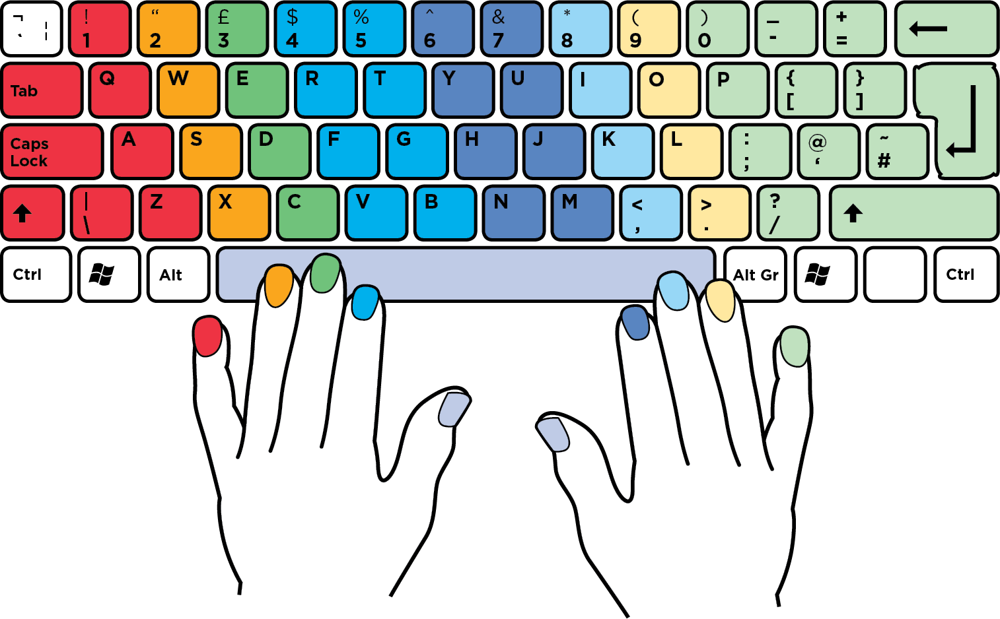
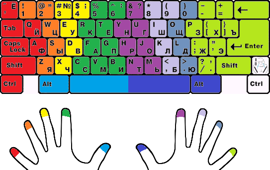

# Моя раскладка для Moonlander на QMK

## О чём этот репозиторий

В этом репозитории находится исходный код моей раскладки. В данной ридмишке написано:
1. Описание слепого десятипальцевого метода печати на клавиатуре™.
1. Попутная вводная информация.
1. История прихода к такой раскладке.
1. Физическая составляющая клавиатуры.
1. Описание раскладки с картинками и детальное объяснение каждого дизайнерского решения, которое было принято.
1. Технические детали реализации.

Для тебя эта статья может быть полезна по следующим причинам:
* Ты хочешь узнать про десятипальцевый метод печати, и почему правильные клавиатуры для него идеально подходят.
* Ты хочешь узнать что вообще можно сделать с программируемой клавиатурой.
* Ты уже имеешь программируемую клавиатуру, и хочешь начать проектировать собственную раскладку, и начинаешь вдохновляться чужими примерами.

Я человек одновременно радикальный, и стремящийся к совершенству. Так что данная раскладка является, по моему мнению, самой лучшей известной мне раскладкой в мире. Так что если ты спросишь у меня "а как мне сделать X", то мой ответ всегда будет таков: сделай как у меня. В некоторых случаях у меня есть планы как сделать, что-то лучше, но я это просто пока не реализовал. 

Я считаю что способность мыслить "для таких-то людей такое-то будет лучше, но мне это не нравится" это ложное направление мысли, и я никогда не научусь мыслить и рассуждать таким образом, чтобы в итоге получилась истина. Поэтому я и выбрал субъективный путь.

## Термины

**СК** - стандартная клавиатура.

**Десятипал** - сокращение для фразы: метод слепой десятипальцевой печати на клавиатуре™.

**Правильная** клавиатура - клавиатура, которая адекватна для десятипала, а следовательно:
* Обладает как минимум тремя клавишами для каждого большого пальца.
* Не обладает [смещением рядов (горизонтальным стаггером)](http://ibnteo.klava.org/keyboard/standard), и являются симметричной.
* Является программируемой, чтобы была возможность поместить все клавиши как можно ближе к пальцам, через слои, не раздувая клавиатуру до огромных размеров, и минимизируя движения кистей.

Я предпочитаю такой своего рода "субъективный" термин вместо термина **эргономичная** клавиатура, потому что эргономика не обязана содержать в себе те пункты, что я описал. Плюс, существуют просто **ортолинейные** клавиатуры, типо Planck, которые являются правильными, но не совсем эргономичные.

Так же я не хочу вдаваться в споры об эргономике, про которую я ничего не знаю, и которая меня не интересует.

Но в любом случае, у любой правильной клавиатуры, шансов быть эргономичной намного больше, чем у любой СК.

**Раскладка** - под этим словом понимается много чего, более подробно можно прочитать тут: http://klavarog.tk/page/термины/виды_раскладок. В данном месте я буду рассказывать о не-буквенной и немного о буквенных раскладках.

## Про Moonlander

Это **правильная**/эргономичная/ортолинейная **программируемая** клавиатура, которую можно тупо купить и получить работающий продукт из коробки. Обычно правильные клавиатуры люди паяют и собирают самостоятельно. 

Официальный сайт даной клавиатуры: https://www.zsa.io/moonlander/

Моя клавиатура на данный момент выглядит так:


## Связь между клавиатурой и раскладкой

Данная клавиатура является программируемой, то есть она обладает микроконтоллером, в который можно зашить программу (которая называется **прошивка**), которая работает со считыванием нажатых клавиш, и посылает на компьютер результат нажатия. Эта программа реализует некоторую раскладку.

Кажется, как будто клавиатура - это очень тупая вещь, и она не должна содержать у себя вообще никакого вида процессора, а отдавать полностью всю информацию на компьютер, и получать тоже всё от компьютера (чтобы, например, подсветку нарисовать). Но это не так, и внутрь клавиатуры можно и нужно засунуть много чего интересного.

Благодаря тому, что на клавиатуру можно залить произвольную программу, прямо на клавиатуре можно задавать произвольную раскладку с любой степенью автоматизации и кастомизации (если ты, конечно, умеешь программировать), будь то автозамены или автоматический пробел после препинаков (знаков препинания). Что хорошо, всё это реализуется при помощи самого стандартного протокола USB HID, так что такая программируемая клавиатура будет работать на любом компьютере (и даже телефоне) без установки драйверов.

Возможности настолько велики, что кто-то даже сделал тетрис на клавиатуре: https://github.com/danamlund/meckb_tetris.

[QMK](https://github.com/qmk/qmk_firmware) - пример библиотеки на языке программирования Си, для написания прошивки клавиатуры. Данная библиотека на данный момент является лучшей библиотекой, которую поддерживают практически все возможные клавиатуры. Главное её свойство - что можно писать собственные фичи на Си, без погружения в низкоуровневые детали протокола и сканирования матрицы.

## Картинки раскладки без объяснений

Пока что без объяснений, просто кидаюсь картинкой. Все картинки кликабельны и ведут на сайт где эта раскладка находится.

[](https://kle.klava.org/#/gists/337191ca7166c6cb93781f50f71181ca)
[](https://kle.klava.org/#/gists/9a4b993ea6bff1ff0f9b7a33bc755623)
[](https://kle.klava.org/#/gists/2c45a0b833ca272d7b94fdc66a668af7)
[](https://kle.klava.org/#/gists/91178524f9e3273d73aec89aefab0ab0)
[](https://kle.klava.org/#/gists/2e94ef1a8f6616e655bfc218fcda885e)
[](https://kle.klava.org/#/gists/b6323946c89a4dd6b0c5c29c0531132a)
[](https://kle.klava.org/#/gists/d119e7590b585c0c3a8706e953f40745)

## Как ты сделал эту раскладку?

Сначала я сделал набросок на официальном конфигураторе Oryx: https://www.zsa.io/oryx/, а затем скачал исходный код и начал модифицировать его. Текущий исходный код лежит в этом репозитории. Более подробно про код будет далее. 

Картинки я нарисовал при помощи сайта https://kle.klava.org. Чем этот сайт отличается от http://www.keyboard-layout-editor.com можно почитать здесь: https://t.me/klavaorgwork/180429.

Чтобы в итоге получить картинки, я делал скриншоты через встроенный в Firefox инструмент для снятия больших скриншотов. Для доступа к нему нужно открыть консоль (Ctrl+Shift+K), и ввести следующую команду, заменив `ИМЯ` на имя файла:
```
:screenshot ИМЯ --selector '#keyboard-bg' --dpr 3
```

`DPR` означает во сколько раз нужно увеличить картинку при создании скриншота, то есть в итоге этой команды получится картинка, которая имеет разрешение в 3 раза больше, чем то что ты сейчас видишь на экране.

## Про слепую десятипальцевую печать

Это важный пункт, потому что на основании того как работает этот метод печати, будет зависеть _очень_ много дизайнерских решений. Да и вообще, сам термин **правильная** клавиатура, завязан на этом методе.

Итак, **слепая десятипальцевая печать на клавиатуре™** - это особая техника печати, при которой:
* Пальцы стоят на "домашней" позиции `ФЫВА ОЛДЖ` или `ASDF JKL;`, при этом на СК для указательных есть рисочка на клавишах А и О, чтобы проще было целиться вслепую.
* Используется 9-10 пальцев обоих рук (и мизинцы тоже).
* У каждого пальца есть строго свои зоны, и каждый палец имеет право нажимать только клавиши из своих зон. Это называется **статические зоны**. Когда каждый палец нажимает какую придётся клавишу - это называется **динамические зоны**.
* Печать происходит без подсматривания на клавиатуру, ведь все клавиши выучены на уровне рефлексов. Отсюда и слово "слепая".
* Это не тоже самое, что просто "печатать вслепую", ведь обычно печать вслепую не подразумевает статические зоны. А большинство людей на планете, которые умеют печатать не подглядывая на клавиатуру, печатают именно с динамическими зонами.
* Я ставлю знак `™` для того, чтобы отделить именно **десятипальцевую** печать, от простой печати вслепую, и никогда не сокращаю это до слов "слепая печать", чтобы меня не misundestood'нули.

Так же иногда к слепой десятипальцевой печати относят "правило шифтов" и "правило пробелов", но я считаю эти правила бесполезными и вредными, поэтому советую вам о них прочитать и запомнить как делать не нужно. Далее эта тема будет раскрыта.

Слепой десятипальцевой печатью специально овладевают люди, которые профессионально пользуются компьютером и клавиатурой, например: программисты, транскрибаторы, рерайтеры, бухгалтеры итд. К сожалению у нас в школе не обучают слепой десятипальцевой печати, а должны, ибо это навык, который пригодится всем нам в этой жизни, учитывая темпы цифровизации.

Согласно моей внутренней статистике, ты с большой вероятностью:
* Никогда не слышал про слепую десятипальцевую печать.
* Печатаешь достаточно давно на клавиатуре, поэтому практически на неё не подглядываешь.
* Практически не используешь мизинцы, и делаешь в основном всё указательными, редко среднецами, и редко безымянцами.
* Печатаешь достаточно быстро, чтобы тебя это устраивало.
* Печатаешь динамическими зонами.

Я ориентируюсь именно на такого читателя.

Вот так выглядят стандартные зоны для слепой десятипальцевой печати™ на СК:


(Источник, наверное [это](https://tipsmake.com/practice-typing-10-fingers-to-speed-up-typing))

Можно заметить, что зоны какие-то кривые, и левой руке должно быть неудобно. Да, так и есть, и некоторые люди это замечают сразу, и делают костыли в виде таких зон:



Пример людей на клавогонках, с необычными зонами: [\_VR\_](http://klavogonki.ru/u/#/389432/), [Alkhor](http://klavogonki.ru/u/#/314554/).

Но труъ зоны считаются именно как на первой картинке, и большинство обучащихся десятипальцевому методу к сожалению знают только про первую картинку.

Да и хотелось бы чтобы зоны были симметричными. А ведь даже с костылями они довольно кривоваты, и количество букв для разных рук различается чуть ли не на всех пальцах.

Вот здесь видно, что начинается первая часть, где СК неадекватна для десятипальцевого метода печати. А теперь взглянем какие можно сделать зоны для правильной клавиатуры, а именно для моей:


Ещё необходимо описать свойства десятипальцевого метода:
* Совершается меньше ошибок, так как у пальцев строго определённое множество клавиш, которые они нажимают, в строго определённых позициях. И чем больше практика, тем меньше ошибок в итоге получается. Для динамической печати такое не выполняется по очевидным причинам.
* После определённого уровня практики нету необходимости смотреть на клавиатуру вообще. Соответственно меньше устают глаза от смены фокуса клавиатура-экран-клавиатура-экран.
* Благодаря этим двум свойствам намного проще нажимать хоткеи.
* Нажимать далёкие клавиши неудобно из-за смещения кисти.

Тут приходит ещё один пункт неадекватности СК - смещение кисти. Десятипальцевый метод строится на том, что ваши руки **всегда** находятся в `ФЫВА ОЛДЖ`, и ты привыкаешь держать руки в этом положении, и все движения делать из этого положения. Потом, конечно, руки сами научатся двигаться как надо, и маленькие смещения кистей даже будут способствовать скорости.

Возьмём, например, бэкспейс. Он находится настолько далеко, что даже не помещается в самые дальние клавиши для правого мизинца. И чем его нажимать? Да чем хочешь! Хоть средним, хоть безымянным (им чаще всего и нажимают). Кисть всё-равно смещать с домашней позиции. А раз она будет смещаться, то потом она должна вернуться обратно чтобы нажать следующие клавиши. А вот это уже представляет проблемы, особенно на скорости. Возвратить кисть обратно не так-то легко, плюс если делать это быстро, и при этом ещё хотеть нажать какую-то клавишу, то высока вероятность промахнуться. И снова придётся смещать кисть и снова нажимать бэкспейс. Замкнуный круг :)

А обучаться возвращаться в домашнюю позицию из далёких мест - это практика. А нафиг эта практика нужна, если можно без неё? Тупо поставив бэкспейс поближе.

Очевидно, что для десятипальцевого метода лучше будет, если все клавиши будут в шаговой доступности от домашней позиции, без сильных смещений руки.

Это **невероятно** печально, когда ты хочешь использовать стрелки. Стрелки находятся на два порядка дальше, чем бэкспейс. А всяким программистам, и писателям статей (но не транскрибаторам) приходится использовать стрелки во время написания текста **очень** часто. И вот скакать рукой туда-сюда только чтобы переместиться на пару символов ну просто невыносимо.

Кстати, именно из-за этого всякие вимы и емаксы придумали свои режимы, где стрелки находятся сразу на домашней позиции. Но на правильной клавиатуре, можно и без них.

То же самое относится и к нумпаду и тому что над стрелками, всё это можно засунуть под домашнюю позицию, через слои.

### Скорость и десятипальцевый метод

Хотел бы я сказать, что овладев десятипальцевым методом, ты начнёшь печатать быстрее, но я не могу дать таких гарантий.

Например, если ты - школьник 15 лет, и ты уже довольно давно печатаешь вслепую по динамическим зонам, то вероятно ты сейчас печатаешь в районе 300-500 символов в минуту. А это довольно немало. И если ты прямо сейчас, в своём молодом возрасте, зайдёшь на клавогонки, и начнёшь очень активно тренироваться, то в силу твоего возраста, ты будешь очень быстро расти. И после определённого времени можешь вообще достичь самого высочайшего ранга скорости - Тахион, достигнув 900 символов в минуту. Я наблюдал очень много таких примеров, и ещё больше я наблюдал примеров школьников, которые приходили со скорость 400, и очень быстро росли до скоростей 600-700 символов в минуту.

При этом самый быстрый печатальщик на планете - Шон Врона, печатает по динамическим зонам, и достигает на английском языке около 1200 символов в минуту. Тоже самое относится и к альтернативным раскладкам. Объективного практического преимущества у них нет. Только у стенографии.

А что тем временем десятипальцевый метод? У меня ушло больше года, чтобы достичь скорости 500. И я при этом очень очень тяжело тренировался, и начал в 17 лет. Сейчас моя максимальная скорость на клавогонках - 700 символов в минуту.

Так что если твоя цель - скорость, то придётся ресёрчить дальше, всё не так просто.

Поэтому неизвестно, является ли десятипальцевый метод истинным методом, под который должны оптимизироваться клавиатуры, и которому ты должен учиться, и себя ограничивать. Может можно придумать что-то лучше? Например, на клавогонках, [Fenex обучается ограниченной динамике](http://klavogonki.ru/u/#/82885/journal/52beafae7bf62df3458b7833) на указательных пальцах для ЙЦУКЕН - он нажимает биграммы, что находятся только в зоне указательных (а таких очень много для ЙЦУКЕН), указательным и средним. Таким образом он уменьшает нагрузку на указательные, и в целом повышает свою скорость, но это не является чистым десятипальцевым, и чистой динамикой. Об этом я подробнее поговорю во время рассказа про свою русскую раскладку.

Так же существует стенография, аккорды, автозамены и квази-режимы.

Так что я не уверен, стоит ли этот десятипальцевый метод того, и может его можно изменить. Но я ему научился, и ни капли об этом не жалею.

Так же нужно отметить, что приобретая правильную клавиатуру, скорее всего придётся переучиваться под десятипальцевый метод печати, потому что там динамика не прокатит из-за отсутствия стаггера, и иногда, разделённых половинок. Поэтому десятипальцевый метод печати неразрывно связан с правильными клавиатурами.

Далее будет раскрыто в каких ещё местах СК неадекватна для десятипальцевого метода, и как эту проблему можно решить на правильной клавиатуре. Так же будет рассказана моя история освоения десятипальцевого метода.

## С чего я начинал

### Доисторические времена, предпосылки

Изначально я печатал на клавиатуре так же как и печатают все:
* Иногда смотрел, иногда не смотрел на клавиатуру.
* Нажимал клавиши какими попало пальцами, практически не использовав мизинцы.
* Печатал вроде как быстро, и с большим числом опечаток.

Что называется "набор по динамическим зонам".

Затем после просмотра видео от Sorax'а о том ["Как освоить слепой набор?"](https://youtu.be/YirgDp-zlkM), у меня в голове засела идея что неплохо было бы научиться **Слепой Десятипальцевой Печати™**, и желательно сразу поставить раскладку Дворака для английского языка.

Ближе к концу 11 класса школы (2016 год) я начал копать эту тему чтобы начать обучаться такой печати. 

Я начал учиться такой печати именно после 11 класса, а не раньше, потому что я считал что так как я пойду учиться в университет, то я буду записывать все лекции, и лучше это делать на клавиатуре, потому что это быстрее ручной записи.

Такая идея пришла мне в голову ещё потому что у меня был положительный опыт на уроках истории, когда нам диктовали очень много материала под запись (подготовка к ЕНТ), и я не успевал писать всё ручкой, и вообще у меня был отвратительный почерк, из-за чего я не мог потом это читать. Поэтому я как-то раз притащил свою огромную беспроводную клавиатуру на урок, вставил свисток в телефон через переходник и начал печатать в телефон. Мы же это для себя делали, для подготовки к ЕНТ, так что мне никто ничего не сказал, все просто удивились. Потом учительница попросила меня скинуть все мои записи в электронном виде, чтобы она могла это немного подредачить и распечатать всем. То есть я делал это для себя, а получилось для других. Вот такое важнейшее свойство цифровой записи. Кстати, это ещё один плюс в копилку почему я не люблю писать ручкой.

Так вот, я хотел научиться слепой печати, чтобы (!) записывать лекции в университете. Сейчас вспоминаю эту причину, и только смех берёт. Такая идиотская причина, чтобы сделать такую долгую и тяжёлую вещь. Если кратко, почему это смешно, то во-первых лекции чаще всего полная фигня, и их можно заменить качественной методичкой. А во-вторых если на данном предмете нету методички, и тебе надо что-то записывать, что скорее всего что-то не так. Особенно если это предмет, который читается испокон веков, как, например, математический анализ, теория вероятности, история.

Лекции хорошо заходят, когда ты можешь смотреть их на скорости 2.0, и тебе лень читать, и хочется легко и быстро получить информацию.

Эх, слишком я тогда боялся неизвестного. Но зато благодаря этому я выучил навык, который теперь будет давать мне плюсы всю жизнь.

### Начало кастомизации, WinAPI

Так же когда-то я наткнулся на [статью про клавиатуру UHK](https://habr.com/ru/company/crowdtoolz/blog/385943/) на тогдашнем GeekTimes. И после неё я понял, что хочу эту клаву, а пока этой клавы нету, хочу иметь стрелки так же как и на ней, а именно подобным образом:


Сейчас я понимаю, что эта клавиатура не такая уж и классная, и самое главное - неправильная. Хотя статье стоит отдать должное, она очень глубоко во мне посеяла эту идею, и вообще идеи о том, что можно сделать, имея программируемую клавиатуру.

Возвращаясь к теме, я решил прежде чем научиться печатать, сделать себе такие же стрелки, чтобы вместо капс-лока у меня была какая-то такая магическая клавиша, при зажатии которой другие клавиши работают по-другом (это называется **слой**, а сама такая клавиша называется - **слоефикатор**). Для начала я попытался сделать такое через [AutoHotKey](https://www.autohotkey.com), но когда я это сделал, стрелки работали **слишком** медленно, и этим невозможно было пользоваться. Это даже вылилось в тему на CyberForum, на которую мне _никто_ не ответил. Вот эта тема, там же находится исходный скрипт: https://www.cyberforum.ru/keyboards/thread1761049.html. В те времена я не знал такого термина как "слой".

Сейчас для решения этой проблемы я могу посоветовать программу [Enhanced Keyboard](https://github.com/klavarog/enhanced-keyboard), которая, к сожалению, работает только на винде. На линуксе, я думаю ты сможешь найти какие-то способы так же сделать.

Так как в то время я про такую програму не знал, а гугление ничего не давало, единственный вариант что у меня остался - использоваться WinAPI, с которым я уже значительно поигрался, чтобы рисовать окошки и делать простенькие программы. С помощью него я решил сделать перехват всех клавиш, и соотетственно их изменение. Назвал я такую программу ModBind, где "Mod" обозначает клавишу для включения слоя, а "Bind" обозначает "забиндить" (это слово я впервые узнал из CS 1.6).

Исходники этой программы лежат здесь: [modbind](modbind) (хотя они никому не нужны, пусть лежат для истории). И раскладкой, которая выглядит следующим образом:


Как видно, здесь появилось намного больше, чем просто стрелки в слою. Здесь я:
* **Назначил шифт на правый альт.**
* **Сделал стрелки плоскими.** Где-то я слышал, что в каком-то vim'е стрелки сделаны именно так, поэтому так и сделал.
* **Добавил отдельную клавишу для запятой.**
* **Перетащил бэкспейс на место капс лока.**
* **Выделил отдельную клавишу для переключения языка.**

Ну и ещё по мелочи всякое, все эти идеи до сих пор со мной, более подробно и с широкими объяснениями я их рассмотрю далее.

Затем, когда я сделал эту идеальную раскладку на тот момент времени, я наконец начал обучаться слепой десятипальцевой печати™ через тренажёр VerseQ. После него я перешёл на клавогонки, и катал с такой модификацией раскладки долгое время под аккаунтом [optozorax](http://klavogonki.ru/u/#/451401/). Там же можно более подробно прочитать про эту раскладку.

Тут хочу остановиться по поводу VerseQ. Я случайно наткнулся на этот тренажёр, но влюбился в него за тот текст, что написан в справке, которая всплывает при его старте. А ещё в нём очень приятно печатать, как эстетически: внешний вид клавиатуры, и звук щелчка, так и концептуально: там очень короткие тексты, и они с первого запуска тренируют все буквы сразу.

Так же в VerseQ есть режим, который выдаёт текст на основе ваших ошибок, он выводится жёлтым цветом. Пропускайте его всегда, он полная чушь, и обычно он выглядит как повторение одной буквы. Пропускать можно через F11. Лучше всегда печатать только белые тексты.

И я хочу кинуть какашку в сторону тренажёров "Соло на Клавиатуре", "Стамина", и словарей "ва ол" и подобных на клавогонках. Там от вас требуют печатать сначала сто раз букву А, затем сто раз букву О, и так все буквы потихоньку. Я считаю это тупостью, и считаю, что сразу нужно печатать реальные слова, запоминать все буквы сразу, и в реальной обстановке. Ничего в этом сложнного нету.

А после достижения 150-200 символов в минуту советую вам уйти на клавогонки, начать читать форум, и смотреть как развивались другие люди, чтобы наращивать следующую скорость. 300 символов в минуту дадутся легко. Только дальше могут начаться проблемы.

Возвращаясь обратно, когда я печатал десятипальцевым методом, я заметил что левой руке как-то неудобно нажимать клавишу С, надо двигать палец в неестественном направлении. Затем я посмотрел на клавиатуру, и осознал что всю жизнь был слеп, оказывается клавиатура кривая.

Клавиатура кривая. И эта кривость может и идёт на пользу правой руке, но вот левой очень обидно. И моя любимая на тот момент UHK тоже оказывается кривая! Поэтому я погуглил и узнал об ErgoDox EZ, и пометил себе в голове обязательно купить эту клавиатуру, когда у меня появятся деньги.

### Первая слим клавиатура

До этого я печатал на мембранной клавиатуре с высокими клавишами. И хейтил плоские клавиатуры, потому что они на ощущение были отвратительны. Плюс меня бесила тенденция всё делать сенсорным и плоским, убирая тактильные ощущения. Да и сейчас бесит. Готов убить создателя сенсорной плитки, которая стоит в квартире, которую я снимаю. Минусы сенсорных штук - ложные срабатывания от пролившейся воды, и не срабатывания от нажатия вообще.

Но почему-то на клавогонках все писали что лучшая клавиатура для быстрой печати - слим-клавиатура. То есть такая, у которой плоские клавиши, ножничный механизм. И это писали даже лучшие из лучших. Особенно это актуально для русского языка, где очень много символов нажимаются одним пальцем, и чтобы это быстрее печатать слепым десятипальцевым методом, нужно использовать скольжение по клавиатуре. А такое удобно только на плоской клаве. Это стало сильным ударом для меня, и поводом проверить это на истинность.

Когда я стал достигать скоростей (400 символов в минуту), я заметил что задеваю клавиши, и виной этому их высокость, и наконец понял почему люди рекомендуют плоские клавиатуры.

Поэтому я купил дешманскую слим-клавиатуру Rapoo E9070. Первое время было неприятно, и неудобно, я частенько промахивался из-за отсутствия хоть какого-то разделения между клавишами, но на 400 символов в минуту я уже на уровне рефлексов знаю где какая клавиша, поэтому я привык.

И вот когда я привык к ней и начал печатать быстро, я понял что всё это было правдой. Плоская клавиатура действительно удобна именно для _быстрой_ слепой десятипальцевой™ печати.

Вот так я из хейтера плоских клав превратился в их любителя. 

### Покупка ErgoDox EZ

Параллельно я продолжил заниматься десятипальцевым методом печати на клавогонках: https://klavogonki.ru, и к следующему событию научился печатать со максимальной скоростью ≈550 символов в минуту.

Когда я был студентом 2-го курса, и у меня появилась стипендия и маленькие заработки на делании работ в универе другим людям, я смог себе купить б/у ErgoDox EZ.

19 февраля 2018 получил ErgoDox. Только в этот момент узнал что существует оказывается визуальный конфигуратор и прошивка написана на Си. До этого я покупал эргодокс только из-за его физического расположения кнопок, и из-за того, что на нём есть много клавиш для большого пальца.

20 дней спустя запрограммировал следующую раскладку и прошил её в клавиатуру:


Картинку нарисовал в фотошопе :D.

Уже тогда эта раскладка работала без всяких драйверов, и настройки софта, и единственное, что ей было нужно - это чтобы на компе были самые обычные раскладки QWERTY и ЙЦУКЕН.

Когда я наконец получил эту раскладку, можно было возвращаться на клавогонки, и бить рекорды.

Но для начала нужно рассказать про привыкание к клавиатуре. Это важная тема для тех, кто переходит на подобную клавиатуру.

На привыкание к прямым рядам (орто) у меня ушло две недели. Частенько не попадал, но в итоге привык, и затем понял что на прямых рядах я даже совершаю меньше ошибок, и тупо удобнее печатать. Явный пример: существует [12 упражнение Хруста](http://klavogonki.ru/vocs/13663/), которое выглядит следующим образом:
> по-любому облюбовать облюбовал любовь любой любая любви полюбив любое любимое любимая любой Любляна любая любой любви любимый любойы

Это упражнение надо тренировать и набирать на скорость, с максимум 1 ошибкой, и нужно его набрать с определённой скоростью. Будучи на обычной клавиатуре для меня это упражнение представляло трудности, и я спотыкался об него. Но при переходе на прямые ряды это упражнение стало печататься _намного_ проще, чем раньше, и я начал в нём совершать невероятные для своего уровня рекорды. 

И это при том, что упражнение в основном на правую руку, для которой СК вроде как предоставляет удобное смещение рядов. После этого я сомнительно отношусь к любому виду смещения рядов, даже как на клавиатуре Катана 60:


Хоть я и считаю эту клавиатуру правильной и в целом неплохой.

Но, оказывается переучивание под прямые ряды было не главной проблемой! Судя по тому что я писал в мессенджерах самую большую проблему для меня составил переход на высокие клавиши, с низких. Вот это да.

Знаете почему правильные клавиатуры поголовно механические? А потому что механические переключатели позволяют собрать клавиатуру по одной клавише, и тебе не нужно идти ни на какие заводы чтобы напечатать мембранную клавиатуру твоего формата. Да и не напечатают они, судя по тому, что на рынке нету мембранных правильных клавиатур. Поэтому на механике я не по собственной воле, и до сих пор скучаю по плоским клавишам.

(Конечно, есть низкопрофильные свитчи, но там надо паять, а я тратить время на обучение паянию не собираюсь.)

Так что если вы считаете высокую механику манной небесной, то по сравнению со мной, для вас переход на прямые ряды будет максимально безболезненным.

Итак, через 4 дня после введения этой раскладки я побил свой рекорд и в обычном режиме на Клавогонках сделал 559 символов в минуту. А потом сделал и 570.

Затем через 15 дней я реализовал залипающий шифт - это такой шифт, который при обычном зажатии работает как обычный, а при единоразовом нажатии и отпускании автоматически применится к следующей клавише.

А уже через месяц, 20 апреля 2018 я пришёл в чат https://t.me/klavaorgwork, где находятся люди, так же как и я, увлечённые созданием раскладок и клавиатур.

Это означает, что большинство идей что здесь находятся я придумал самостоятельно ещё до прихода в сообщество, где эти идеи накапливались постепенно.

Уже когда я пришёл в это сообщество в телеграме, у меня была примерно такая раскладка, описание которой сейчас находится здесь: https://github.com/optozorax/keyboard_layout.

Фух, на этом история заканчивается.

## Физическая реализация

В моей клавиатуре есть несколько важных физических аспектов:
* Прозрачные пустые кейкапы
* Подсветка
* Звуки
* Переключатели, их смазка
* Транспортировка

Повторю картинку, чтобы вы вспомнили как она выглядит:


### Прозрачные пустые кейкапы

Я считаю, что на правильной клавиатуре должны быть пустые кейкапы, потому что кейкапы с надписями не имеют смысла. Во-первых зачем тебе надписи, если нужно учиться слепому десятипальцевому методу печати, и ты зашёл настолько далеко, что купил себе правильную клавиатуру? 

А во-вторых, синхронизировать их с раскладкой тоже не очень приятно, и не всегда возможно. Так зачем вообще иметь эти надписи, если ты ими не будешь пользоваться, и они не будут отражать реальную картину? На твоей клавиатуре всё-равно никто не сможет печатать, так что можно отпустить. Тем более пустые клавиши выглядят солидно, сразу видно что ты не обычный смертный.

В крайнем случае можно распечатать картинку своей раскладки и таскать с собой, если кто-то захочет печатать на твоей клавиатуре.

А кейкапы у меня именно прозрачные, чтобы подсветку лучше было видно. И действительно лучше видно! Купил самые дешёвые, на алишке, по 70р за штуку.  Есть какие-то дорогие из америки, но мне пока и так норм.

Некоторые люди зачем-то полностью пишут свою раскладку на кейкапы, чтобы подглядывать. Я их никогда не пойму. Я даже свою раскладку не печатаю на бумаге, после того как её спроектировал, она уже отложилась у меня в мозгу.

Ссылка на aliexpress: [прозрачные кейкапы](https://aliexpress.ru/item/Transparent-ABS-Keycaps-Mechanical-keyboard-Keycaps-Matte-Backlit-Keycaps-10Pcs/4000628309870.html?spm=a2g0s.9042311.0.0.223733edKALEIs&_ga=2.237861000.963229042.1609590679-1301360025.1609590679&sku_id=10000004332979542).

### Подсветка

Первое время я использовал "лгбт"-подсветку, и моя клавиатура переливалась цветами радуги, и я кичился этим на работе, но потом меня это стало немного отвлекать, и я перешёл на более нейтральный вариант - подсветка только тех клавиш, которые были раннее нажаты. Вкупе с прозрачными кейкапами это выглядит замечательно.

Ещё такую подсветку ранее нажатых клавиш можно использовать при наборе паролей. Если ты почувствовал, что случайно нажал не ту клавишу - то можно быстро глянуть на клавиатуру, пока подсветка не остыла, и увидеть что именно ты нажал.

Так же у меня на месте тамб-кластера всегда светится цвет текущего слоя. На картинке это можно видеть как синюю подсветку, синий означает что сейчас включён русский язык. Белый - английский. Остальные слои называются в честь своего цвета. Это дико удобно. Раньше, на эргодоксе, я использовал маленькие светодиоды сбоку вверху клавиатуры, чтобы обозначать текущий слой, но они имели всего 3 цвета, и боковым зрением не так хорошо видны.

Так же цветом текущего слоя подсвечиваются и все нажимаемые символы. То есть если сейчас русский, то все нажимаемые символы - тоже синие. По мне так, очень красиво. Посмотреть как это выглядит вживую можно здесь: https://t.me/klavaorgwork/168706.

Ещё я зашил себе в клавиатуру режим подсветки зон, чтобы IRL показывать людям по каким зонам я печатаю.


Так же есть прикольный режим подсветки, когда текущие нажатия подсвечиваются в режиме тепловой карты, можно использовать для записи видео для клавогонок: https://t.me/klavaorgwork/161127.

Так же ещё есть видео, где при помощи подсветки я объясняю как у меня работают некоторые клавиши, связанные с шифтом:

[](http://www.youtube.com/watch?v=ImsooykMguA "")

### Звуки

В данную клавиатуру встроен простенький (похоже 8-битный) динамик, так что можно играть разные прикольные звуки при нажатии определённых клавиш.

В частности у меня стоят звуки на:
* Переключение языка
* Нажатие клавиши выключения программы в консоли, и скриншота
* Включение слоя в режиме капс-лока (TG)
* Нажатие клавиши для смены метода переключения языка

Почти все эти звуки можно увидеть здесь: https://t.me/klavaorgwork/169552.

А ещё по дефолту есть звук при включении: https://t.me/klavaorgwork/161147

На что ещё можно поставить я не придумал, но в целом очень прикольно, когда какие-то твои действия происходит звук. Я уже привык что когда я нажимаю клавиши для выключения программы в консоли (Ctrl+C, но я себе поставил Ctrl+J, чтобы можно было копипастить в консоли, если интересно, смотри в [optozorax/dots](https://github.com/optozorax/dots#terminal)).

Так же, в клавиатуре есть музыкальный режим, когда каждая клавиша издаёт звук, но я не придумал как его можно применить, так что это поиграться на один раз: https://t.me/klavaorgwork/161165

### Переключатели, их смазка

Изначально я купил клавиатуру с переключателями: Cherry MX Brown RGB. Они довольно шумные, и по ощущениям я не почувствовал никакой особой тактильности, особенно когда печатаю на скорости. Плюс мне тактильность и не нужна, ибо я предпочитаю плоские клавы.

Благо в этой клавиатуре есть хот-свап! Это означает, что переключатели можно заменить без перепайки:


Поэтому я сразу зашёл на алишку и заказал переключатели Cherry MX Silent Red RGB. Я взял 100 штук, сразу с запасом, и это обошлось мне в 5к рублей.

Тут стоит отметить, что я захотел использовать резиновые кольца, которые ставятся под кейкап, чтобы уменьшить ход, и сделать клавиатуру тише. Я использовал прозрачные кольца, которые можно поставить максимум одну штуку под кейкап. С двумя он уже нажиматься не будет. На браунах это было нормально, но на сайлентах у меня частенько стали не прожиматься клавиши. И теперь стало заметно, что всё-таки позиция активации у браунов и сайлентов разная.

Плюс, меня хейтили чуваки из мехкульта за это, типо я уничтожаю саму суть механики, её тактильность, со своими кольцами. Но мне в целом на механику насрать, как я говорил, для меня предел совершенства - слим. Но кольца мне всё-равно пришлось снять из-за сайлентов. И хочу заметить, что от того, что я теперь должен прожимать клавиши до конца, у меня уменьшилось число ошибок, и в целом ощущения стали как будто я печатаю более точно. Так же после смазки, клавиатура стала тихая, и с такой тишиной ощущается как будто ход и не такой большой, но об этом далее.

Так же дополнительно я заказал смазку и так называемый Film - штуку, которая ставится между половинками свитча, чтобы свитч был тише. Ещё купил инструмент для разборки свитча за 700р.

Когда мне пришли сайленты, я заметил что они чуть-чуть менее громкие, чем брауны. Особенно громко было слышно как скрипит пружина, это было невозможно слышать. Но затем, когда я смазал их, и потестировал как они звучат, это было невероятно! Я всю жизнь относится крайне сомнительно ко всем этим вещам типо смазки свитчей, воббла-шмоббла, тактильности итд, но смазанные свитчи по-настоящему звучат тише. Плюс этот Film даёт немнооого тишины, да.

Видео где можно увидеть как звучат смазанные свитчи по сравнению с несмазанными: https://t.me/klavaorgwork/170818.

А вот здесь я вставил парочку смазанных свитчей в клаву: https://t.me/klavaorgwork/170824.

Печать текста на полностью смазанных сайлент редах: https://t.me/klavaorgwork/171013.

Так что если вас интересует тишина при наборе на клавиатуре, то первое что вы должны сделать - это купить смазку и смазать. Готовьтесь что это будет долго.

Так же, если вы всё-равно будете покупать сайлент реды, то не советую покупать мунляндер с браунами, ведь они по сути бесполезны. Лучше купить клаву хотя бы с голубыми кликающими свитчами, чтобы можно было поиграться, и на некоторые редкие кнопочки поставить кликающие свитчи.

Плюс, я как-то давно покупал на алишке тестер свитчей, и от него осталась такая пластмассовая подставка (которую можно увидеть здесь: https://t.me/klavaorgwork/170818), куда идеально вставлять разобранные свитчи, тоже советую купить что-то подобное. Поверьте мне, собирать эти свитчи в воздухе - не самое приятное занятие, плюс есть риск погнуть контакты.


Ссылки на всё что я покупал:
* Тестер свитчей - 404, ищите новый :( Ничо не гарантирую.
* [Свитчи](https://aliexpress.ru/item/Original-Cherry-MX-Mechanical-Keyboard-Switch-Speed-silent-pink-axis-mute-shaft-RGB-SMD-switch/4000936545168.html?spm=a2g0s.9042311.0.0.223733edKALEIs&_ga=2.237861000.963229042.1609590679-1301360025.1609590679)
* [Смазка](https://aliexpress.ru/item/Advanced-Synthetic-Fluorine-Containing-Grease-Fusser-Film-Mechanical-Keyboard-Stabilizers-Switches-Gear-Grease-N15-19-Dropship/4000370062485.html?spm=a2g0s.9042311.0.0.223733edKALEIs&_ga=2.237861000.963229042.1609590679-1301360025.1609590679&sku_id=10000001511765831)
* [Открыватель свитчей](https://aliexpress.ru/item/Mechanical-Keyboard-Keycaps-Aluminum-Alloy-Metal-Switch-Opener-instantly-For-Cherry-mx-And-Kailh-Box-Gateron/4001115947996.html?spm=a2g0s.9042311.0.0.223733edKALEIs&_ga=2.237861000.963229042.1609590679-1301360025.1609590679)
* [Film](https://aliexpress.ru/item/Switch-film-for-mechanical-keyboards-DIY-cherry-mx-switch-gateron-switches/1005001365894792.html?spm=a2g0s.9042311.0.0.223733edKALEIs&_ga=2.237861000.963229042.1609590679-1301360025.1609590679&sku_id=12000015823827870)

### Транспортировка

Кидаю респект компании ZSA за то как они отнеслись к комплектации и вообще проектировке мунляндера. Если посмотреть на официальный сайт, то видно, что в комплекте идёт чехол, а подставки под руки сгибаются под клавиатуру.

Так же огромнейший плюс мунляндера - у него всего 2 ножки. В отличие от эргодокса, у которого 6 ножек. И если вы переносите эргодокс, то вам надо настраивать все 6 ножек, синхронизировать их с собой, чтобы клава не шаталась. Этим невозможно пользоваться. А на мунляндере ножку поставил и всё. Далее остаётся только поставить тамб-кластер в соотетствии с ножкой, и готово, клава идеально стоит.

Посмотреть как настраивается мунляндер можно в этом видео:

[](http://www.youtube.com/watch?v=Gs-kb3McXfU "")

Хоть мунляндер и огромной, но благодаря тому как он сделан, он крайне удобен в транспортировке. И да, так как я хожу работать в офис, мне всегда приходится его таскать с собой, на работу и обратно домой. Меня это устраивает, и я не собираюсь покупать вторую клавиатуру. Особенно я не собираюсь печатать на СК **никогда**.

## Раскладка

### Введение: что такое слой

Прежде чем вообще начать рассказывать о раскладке, нужно объяснить концепцию слоя.

Итак, вот есть у вас обычная клавиатура, и при зажатии кнопки, находящейся на месте капс-лока у вас вместо некоторых символов появляются стрелки:


При этом если вы нажимаете другие символы - то они остаются собой. Так вот, то что включается называется слоём. Клавиша, которая включает слой называется **слоефикатор**, по аналогии со словом модификатор. Слой можно включить двумя способами: 
* Чтобы он работал при зажатии клавиши - по аналогии с Shift, в терминах QMK - это обозначается как `MO(номер слоя)`.
* Чтобы он включался и выключался по нажатию определённой клавиши - по аналогии с Caps Lock, в терминах QMK - это обозначается как `TG(номер слоя)`.

[Страница документации по QMK про слои.](https://beta.docs.qmk.fm/using-qmk/software-features/feature_layers)

Вообще сама по себе клавиша Shift тоже в какой-то степени слоефикатор.

С точки зрения терминологии операционной системы слой может обзываться как "3-й уровень клавиатуры". А реализовываться слой может через клавишу AltGr. [Статья, рассказывающая об этом.](https://habr.com/ru/post/419687/)

Но мне не нравится сочетание "3-й уровень", и вообще концепция слоя куда более абстрактная и чистая.

Плюс, разработчики операционных систем не очень далеко продвинулись в раскладкостроении, поэтому вряд ли у вас получится так просто через официальные инструменты создать себе слой.

Поэтому в основном все самые продвинутые люди хранят свои слои и вообще раскладки полностью внутри клавиатуры. Там это и легче сделается, и вообще это кросс-платформенно.

### Каждому слою - своя картинка

Если вы взглянете на СК, где нанесены надписи на русском языке, то не зная клавиатуры, довольно сложно понять что при каком языке, при шифте, или слое нажимается.

Примерно такому же стилю следуют люди, которые рисуют свою раскладку для программируемой клавиатуры, где помимо двух языков может быть ещё два дополнительных слоя. Из-за этого им приходится сувать надписи в экзотические места, а иногда разукрашивать надписи разным цветом для разных клавиш.

Пример:


Взято с вики про клавиатуру [Коряга](http://klavarog.tk/page/клавиатуры/коряга). Справедливости ради стоит сказать, что автор в своей раскладке на KLE таки разделил всё на отдельные слои, я эту раскладку просто показываю как пример, как другие люди обычно делают, без разделения на слои.

Конечно, такие картинки раскладки крайне компактны, и напечатать их легко. Но мне такие картинки не нравятся совсем, потому что, во-первых нужно научиться читать что означает позиция символа с точки зрения автора картинки (а чего-то единого тут нету, все делают как хотят). Во-вторых если ты, незнакомый человек, хочешь посмотреть как выглядит конкретный слой, то у тебя будет очень много отвлекающих моментов, и ты не сможешь так просто найти то что тебе нужно.

Особенно этот подход становится неприменим, когда у тебя надо подписать комментарий к символу, или у тебя очень много слоёв. Именно поэтому я придерживаюсь философии: 

**Каждому слою - своя картинка.**

При этом, по идее, клавиши с зажатым шифтом и являются по сути отдельным слоем, но они отличаются только символом длиной 1, так что шифтовый слой можно размещать вместе со всеми остальными. Он не будет так сильно отвлекать. У меня на картинках то что нажимается при зажатом шифте показано серым цветом в правом нижнем углу клавиши. Вы можете заметить, что некоторые хоткеи при зажатом шифте нажимаются в другие хоткеи - а это уже моя хитрость, я отслеживаю шифт на этих клавишах и отменяю, чтобы хоткей нажался корректно.

Теперь, хоть у меня раскладка и будет длиною в километр, зато на ней всё будет понятно, и её можно будет оценить по отдельным составляющим.

### Зоны


Здесь цветами показаны зоны - какой палец какую клавишу должен нажимать согласно слепому десятипальцевому методу печати™. Тёмным цветом показаны клавиши домашней позиции, то есть где пальцы находятся по умолчанию.

Видно, что больше всего клавиш сначала у указательного, затем мизинца, затем большого пальца (мы его называем тамбом для краткости).

Оранжевым цветом показывается то, что нажимает тамб, и можно увидеть, что тамб нажимает не только клавиши из тамб-кластера, но ещё и две клавиши на не-тамб-кластерной части клавиатуры.

Белым цветом показываются те клавиши, которые не нажимаются из домашней позиции, и для их нажатия обязательно нужно сместить руку. Плюс эти клавиши могут нажиматься любым пальцем, будь то мизинцем, безымянцем или указательным.

Обилие клавиш с белым цветом в клавиатуре указывает на то, что клавиатура не очень удачная, ибо слишком часто надо смещать руку.

Так как я печатаю слепым десятипальцевым™ методом, то у меня каждый палец нажимает строго те зоны, что ему предназначены. И ещё раз можно видеть, что правильная клавиатура куда более подходит для десятипальцевой печати, чем СК.

### Основа

Итак, самый сложный и самый основной слой:


#### Аккорды

Здесь есть какие-то мелкие и перекрывающие друг друга клавиши, поэтому, пожалуй начну с них. И это - аккорды.

**Аккорд** - это одновременное нажатие нескольких клавиш.

Самые простые аккорды - это те что находятся на зоне указательного пальца (розовый цвет),  и с цветными точками. Та клавиша, что находится между двух клавиш является аккордом, и активируется при одновременном нажатии двух этих клавиш.

Куда более сложные аккорды находятся на тамб-кластере, и тут нужно отдельное объяснение:

[](https://kle.klava.org/#/gists/2c45a0b833ca272d7b94fdc66a668af7)

Клавиши обозначаются числами 1, 2, 3, 4, а аккорды обозначаются как сумма этих чисел. В целом, если посмотреть на картинку, логику расстановки аккордов можно понять - они находятся между всеми клавишами, что нажимаются.

Вообще к аккордам я пришёл после того как довольно долго попечатал на клавиатуре [Кладенец](https://ibnteo.github.io/kladenets/README-RU.html). Свои успехи и скорость я описывал в канале в телеграме: https://t.me/kladenets_zorax.

В Кладенце активно использовались аккорды, когда две клавиши нажимаются одним пальцем, так как там существует только две клавиши на палец, то там может нажиматься одновременно две клавиши, мы называли это двукнопием. После Кладенца я понял, что двукнопие - не такая страшная вещь, как может показаться с первого взгляда.

Так же возможно ставить аккорды на различные пальцы, например: аккорд из двух клавиш, которые нажимаются указательным и средним пальцем. По сути, эти аккорды особо никуда не поставишь, кроме как на буквы. А на буквы их лучше не ставить, потому что может быть вероятность, что в каком-то слове появится биграмма, на которую я повесил аккорд, и так как я очень быстро печатаю, я не могу контроллировать когда я нажимаю клавиши практически одновременно, поэтому у меня может быть много ложных срабатываний аккордов. Одним из решением этой проблемы - печатать изначально медленно, либо замедляться на аккордах. А так как замедляться - не вариант для меня, я предпочёл не делать аккорды на буквах, и на нескольких пальцах. Я так связываю аккорды на разных пальцах, и аккорды на буквах, потому что по сути больше разнопальцевые аккорды ставить и некуда.

Правда, сейчас, когда я пишу эту статью, я осознал, что можно поставить аккорды на символы, вверху, ибо никогда не бывает сочетания символов, например `#?`, поэтому на их аккорд можно повесить что-то отличное. Спасибо статья-уточка.

До того как я писал эту статью, я решил, что у меня все аккорды будут нажиматься одним пальцем, чтобы не было коллизий при печати букв.

А аккорды, которые нажимаются одним пальцем, требуют другого от печатающего: чётко прицелиться на середину между двумя клавишами, чтобы когда один палец нажимал, он смог прожать практически одновременно две клавиши. Поэтому аккорды на дву- и трёх-кнопия - это геометрическая проблема, а не синхронизационная. А на скорости как раз намного проще научиться целиться правильно, чем синхронизировать пальцы.

По этой же причине я не использую такую фичу QMK, под названием [Mod-Tap](https://docs.qmk.fm/#/mod_tap), потому что она как раз требует замедления и синхронизации пальцев.

Плюс, так как QMK слаб в плане аккордов, мне пришлось написать собственную библиотеку для их реализации. Об этом подробнее смотрите в папке [combo](combo).

Я использовал аккорды на тамб-кластере, чтобы уместить как можно больше полезных вещей поближе, и на основной слой, чтобы не было необходимости переключаться на какой-то слой, и синхронизировать два пальца друг с другом.

Так же я немного использую аккорды на указательном, потому что он довольно большой, и в целом неплохо справляется с их нажатием.

Вообще в целом, аккорды эти нажимать довольно удобно, ибо на мунляндере клавиши по умолчанию широкие на тамб-кластере. Самые удобные - это те что нажимаются по две штуки, конечно, и те, что поближе.

А те, что на указательном - там я поставил кейкапы друг к другу спиной, поэтому при нажатии между клавишами у меня легко нажимаются две клавиши одновременно.

Так же я пытался купить себе пружинки с грамовкой поменьше, чем мои текущие свитчи, чтобы аккорды было проще нажимать, но к сожалению они до меня не дошли... И я устал ходить на почту раз в неделю и спрашивать есть ли что-то на моё имя. Советую вам никогда не покупать товары из-за границы без трек-номера. А если не знаете будет трек-номер или нет, напишите заранее на почту. Если не отвечают, значит лучше предположить что трек-номера не будет.

Конечно, для аккордов есть огромное поле для исследований по созданию специальных кейкапов, которые позволят нажимать две клавиши одновременно куда надёжнее.

Либо есть другой вариант - чтобы свитчи стали выпускать намного более мелкими, например 30% от их текущего размера - тогда можно будет разместить очень много маленьких клавиш, которые имеют площадь той части подушечки пальца, которым мы касаемся клавиатуры. И благодаря этому можно вместо аккордов тупо разместить много клавиш между текущими клавишами. Кстати, это тоже невероятное поле для исследований. На той площади, на которой сейчас размещаются эти огроменные клавиши, можно разместить очень много маленьких клавиш, с биграммами или автозаменами. Интересно будет посмотреть насколько увеличится скорость человека, печатающего на таких клавишах. 

Вот вам пример того куда расти правильным клавиатурам, и куда **никто** не копает. Как минимум, потому что нету технической возможности.

Либо есть вариант сделать клавиши как с размерами 1x0.5 от текущих, потому что наши пальцы нажимают на клавишу не кругом, а эллипсом, и этот эллипс имеет примерно такие пропорции. С такими клавишами, цифроряд будет очень близко, и отпадёт необходимоть его убирать в клавиатурах типо Corne, Planck. Ведь при создании таких клавиатур как Corne, руководствуются логикой типо цифроряд далеко, и лучше все его клавиши засунуть в слой.

Я когда-то делал даже концепт такой идеальной клавиатуры для себя:


Видно, что тут высота клавиш составляет 80% от оригинальной, и все клавиши для мизинца - маленькие, потому что мизинец сам по себе маленький.

Плюс тогда я ещё использовал старые цвета, и в них бирюзовый цвет обозначает клавиши, которые не нажимаются из домашней позиции.

#### Один шифт на большом пальце левой руки

Это очень важный пункт. И это ещё одна **жирнющая** причина почему СК неадекватна для десятипальцевой печати.

Далее и везде предполагается, что вы держите мышь в правой руке, если это не так, то инвертируйте зеркально все инструкции.

Для начала почему именно на левой руке. Потому что очень часто вы будете пользоваться мышью, и вам нужно будет что-то выделять, и клавиша шифт для этого используется очень часто. По аналогичной причине где-то на левой руке у вас должен быть голый Ctrl. Наличие контрола на левой руке даже важнее, чем шифта.

А теперь почему шифт должен быть именно на большом пальце. Изначально, на СК, все привыкли, что шифт находится на мизинце - нажимаешь его там и всё. И к сожалению очень много людей, кто покупает себе правильную клавиатуру, оставляют шифт на мизинцах, размещая на большие пальцы всякую бесполезную чушь.

Главный минус шифта на мизинцах - это когда ты нажимаешь шифт одним мизинцем, то у тебя блокируются все клавиши, что нажимаются этим мизинцем, и ты не можешь их нажимать согласно десятипалу. И тут есть два варианта:
1. Ты всегда нажимаешь шифт левым мизинцем, нажимая клавиши, которые должен нажимать мизинец, безымянным.
1. Только когда надо написать большие буквы, находящиеся в области левого мизинца, ты используешь правый шифт
1. Ты научился полностью соблюдать правило шифтов - нажимать шифт только той рукой, которая противоположна руке большой буквы, которую ты сейчас будешь нажимать

**Первый случай** плох тем, что тебе надо отучиваться от своей простой жизни, когда твой безымянный палец нажимает всего 4 клавиши, и обучать в определённых ситуациях нажимать ещё плюс несколько клавиш. При этом вся рука смещается, и попадать становится сложнее.

**Второй случай** плох тем, что правый шифт используется очень редко, и будет бесить обучаться нажимать правый шифт только для некоторых случаев. А плюс из-за их редкости могут частенько случаться ошибки. Или ты будешь нажимать левый шифт, а потом будешь осознавать, что не можешь нажать мизинцем нужную клавишу. В общем одна нервотрёпка.

**Третий случай** плох тем, что он, сука, живодёрский. Он даст НИЧЕГО. У тебя не будет скорости от него, у тебя не будет больше безошибочности, у тебя будет только нервотрёпка, и +20% к сложности обучению печати. Зачем этот садизм?! Плюс, если у тебя правильная клавиатура, то иметь два шифта - это значит тратить одно драгоценное место на основном слое на правый шифт.

А теперь если мы поставим шифт на большой палец, то у нас никакие буквы не блокируются, и у нас ещё появляется такая фича, что мы можем НАБИРАТЬ КАПСОМ БЕЗ ИСПОЛЬЗОВАНИЯ КНОПКИ КАПС ЛОК. 

Я кстати никогда не понимал этой кнопки. Если надо напечатать одно слово большими буквами, то включать и выключать эту кнопку - это очень сложно ведь с точки зрения выработки привычки. Особенно когда ты быстро печатаешь. Лично я всю свою жизнь для написания капса использовал шифт, и никогда капс лок. Так что это ещё одна причина выкинуть эту клавишу из клавиатуры к чёртовой матери, и сделать себе жизнь ещё проще, сократив число режимов (плюс, иногда она случайно нажимается, и прям бесит).

Конечно, случай с буквами на большом пальце отдельный, и я него не рассматриваю.

И всё это я понимал ещё до того как начал обучаться десятипалу, поэтому я в своей раскладке сделал шифт вместо кнопки альт ещё на СК. Конечно, тянуться было далековато и неудобно, но это было намного лучше, чем учиться правилу шифтов, и удобнее, чем нажимать мизинцем. Так что если вы печатаете на обычной клавиатуре - советую вам сделать жизнь проще, и тоже поставить шифт на большой палец.

Далее в заголовке говорится что шифт должен быть один, потому что а зачем нужен второй, если одного на большом пальце достаточно? Плюс, это тема следущего пункта.

#### Долой правые модификаторы

Вообще, мне за свою жизнь никогда не пригождались правые модификаторы. Обычно все хоткеи работали и на левых модификаторах, и ещё во времена СК, я их выбросил. 

Я слышал, что в emacs крайне часто используются правые модификаторы. Ну чтож, невелика потеря, ибо моя раскладка сама своего рода emacs в любом поле ввода.

Собственно, сейчас жизнь не поменялась, и правые модификаторы всё ещё нафиг не нужны. Поэтому они у меня в раскладке отсутствуют в принципе, и все модификаторы только левые. Чего и вам советую сделать. Плюс, это сильно экономит место.

Вообще, мне кажется, что правые модификаторы возникли только ради симметрии с шифтом, которого было два, и который не додумались вставить на большой палец ещё на печатных машинках. Так что и с исторической точки зрения они не имеют особого смысла.

#### Бэкспейс рядом с домашней позицией

Снова вспоминаю раскладку некоторых людей, и у них бэкспейс находится на том же месте, что и на СК.

Как я уже говорил, десятипалу не нравится, когда вы смещаете руку далеко от домашней позиции. Поэтому вредно ставить такую частую клавишу как бэкспейс так далеко от домашней позиции.

Я поставил бэкспейс на большой палец левой руки. Но с тем же успехом его можно поставить на место Капс Лока, что я и сделал в своей первой раскладке на СК.

Так же у меня в раскладке рядом с бэкспейсом стоят аккордом две очень важные клавиши: Delete и Ctrl+Backspace.

Бэкспейс и Delete лучше ставить на левую руку, так как они снова пригождаются при работе с мышью.

Delete пригождается при работе в редакторах, где удаление назначено именно на эту клавишу. Я кстати никогда этой клавишей в печати не пользуюсь, ибо привык всё делать бэкспейсом. Если надо удалить следующий символ, то стрелочки в помощь. Так что я бы вообще за удаление этой клавиши и переназначение всех удалений на бэкспейс, и переименование бэкспейса в Delete. Но что поделать, история вставила свои палки в колёса.

Следом идёт Ctrl+Backspace, который я по частоте нажимаю примерно часто как и обычный Backspace, если не чаще. Эта комбинация клавиш, если вы не знали, удаляет целое слово. Я начал пользоваться ей виде отдельной клавиши после 500 символов в минуту, и невероятно полюбил её. 

Часто ошибка в слове происходит не в последнем символе, а в середине. И стирать бэкспейсом три символа - уже долго, ибо нажатие одной и той же клавиши три раза долго само по себе. А потом ещё надо прочитать что ты написал, понять где ошибка, как исправить, и всё это на скорости. Да это дико медленно! И как бы парадоксально это не звучало, чаще всего быстрее тупо стереть всё слово, и напечатать заново. На стирание слова тратится одно нажатие, а печатается заново очень быстро, ибо ты как и учишься быстро печатать слова.

Да, кстати, надо отметить, что Ctrl+Bacspace - это одна клавиша (ну, аккорд), и **я не зажимаю Ctrl**, чтобы нажать бэкспейс. Это вообще называется макрос. И в моей раскладке обозначается синим цветом. И об этом тема следущего пункта.

#### Не использовать модификаторы настольк, насколько это возможно

```
/// TODO
```

## Как прошить?

Если вы попробуете скачать исходный код вашей раскладки, сделанной на Oryx, то она будет работать только с форком QMK от ZSA: https://github.com/zsa/qmk_firmware. Конечно, можно использовать обычный QMK, но там вроде чего-то не хватает. Поэтому первым делом надо скачать этот форк (все команды даются для линукса).

```bash
git clone https://github.com/zsa/qmk_firmware zsa_qmk
cd zsa_qmk
./util/qmk_install.sh
git submodule init
git submodule update
```

Затем нужно создать символьную ссылку на папку с вашей раскладкой. Делаеть именно символьную ссылку нужно, чтобы не хранить свою раскладку где-то в дебрях этого форка QMK:

```bash
ln -s /home/optozorax/my/moonlander ~/zsa_qmk/keyboards/moonlander/keymaps/optozorax
```

Чтобы прошить, нужно внутри этого форка вызвать такую команду:
```bash
make moonlander:optozorax:flash
```

