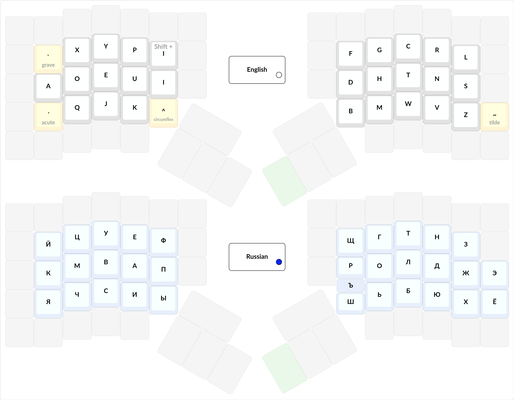
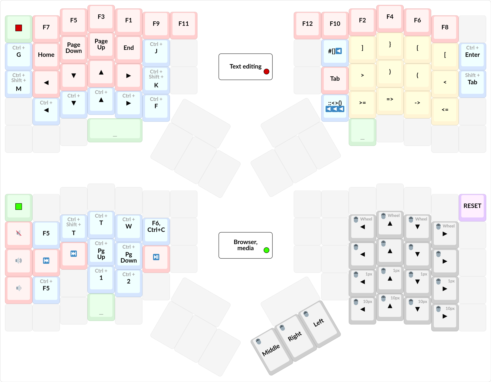
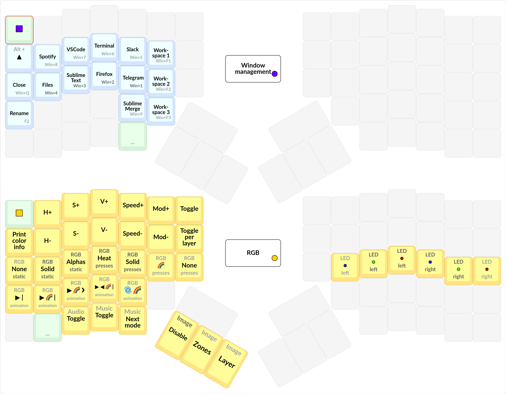
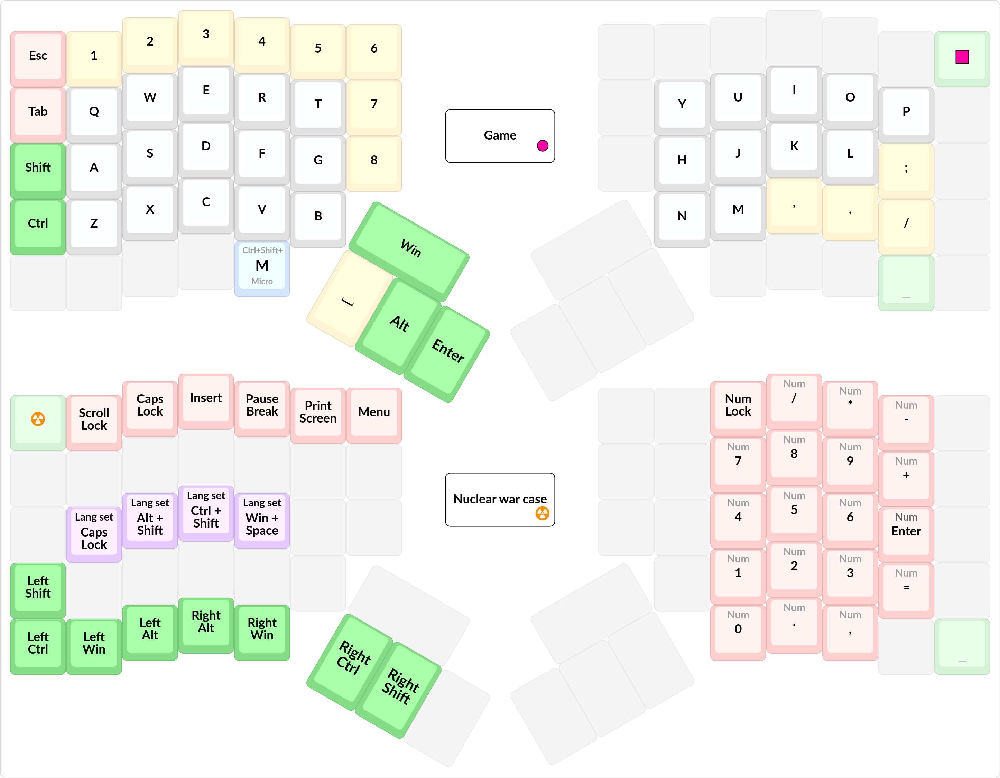
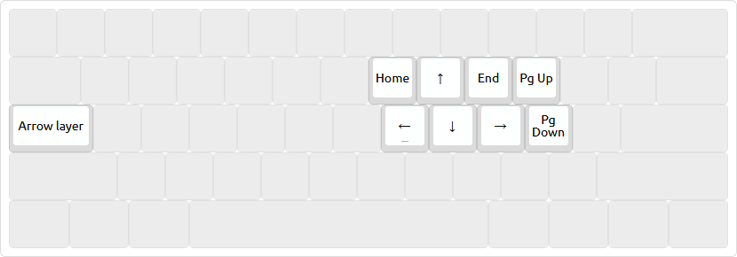

# Моя раскладка для Moonlander на QMK

## О чём этот репозиторий

В этом репозитории находится исходный код моей раскладки. В данной ридмишке написано:
1. Попутная вводная информация.
1. История прихода к такой раскладке.
1. Физическая составляющая клавиатуры.
1. Описание раскладки с картинками и детальное объяснение каждого дизайнерского решения, которое было принято.
1. Технические детали.

Для тебя эта статья может быть полезна по следующим причинам:
* Ты хочешь узнать что вообще можно сделать с программируемой клавиатурой.
* Ты уже имеешь программируемую клавиатуру, и хочешь начать проектировать собственную раскладку, и начинаешь вдохновляться чужими примерами.

Я человек одновременно радикальный, и стремящийся к совершенству. Так что данная раскладка является, по моему мнению, самой лучшей известной мне раскладкой в мире. Так что если ты спросишь у меня "а как мне сделать X", то мой ответ всегда будет таков: смотри как я сделал это у себя, и сделай так же. В некоторых случаях у меня есть планы как сделать, что-то лучше, но я это просто пока не реализовал. 

Я считаю что способность мыслить "для таких-то людей такое-то будет лучше, но мне это не нравится" это ложное направление мысли, и я никогда не научусь мыслить и рассуждать таким образом, чтобы в итоге получилась истина. Поэтому готовьтесь к тому, что эта статья будет максимально субъективной.

## Что за клавиатура Moonlander?

Это **правильная**/эргономичная/ортолинейная **программируемая** клавиатура, которую можно тупо купить и получить работающий продукт из коробки. Обычно подобного рода клавиатуры люди паяют и собирают самостоятельно. 

Официальный сайт даной клавиатуры: https://www.zsa.io/moonlander/

Моя клавиатура на данный момент выглядит так:


## Что такое "раскладка"?

Под словом "раскладка" понимается много чего, более подробно можно прочитать тут: http://klavarog.tk/page/термины/виды_раскладок, в данном месте я буду рассказывать о не-буквенной и немного о буквенных раскладках.

## Как связаны клавиатура и раскладка?

Данная клавиатура является программируемой, то есть она обладает микроконтоллером, в который можно зашить программу (которая называется **прошивка**), которая работает со считыванием нажатых клавиш, и посылает на компьютер результат нажатия.

Кажется, как будто клавиатура - это очень тупая вещь, и она не должна содержать у себя вообще никакого вида процессора, а отдавать полностью всю информацию на компьютер, и получать тоже всё от компьютера (чтобы, например, подсветку нарисовать). Но это не так, и внутрь клавиатуры можно засунуть много чего интересного.

Благодаря тому, что на клавиатуру можно залить произвольную программу, прямо на клавиатуре можно задавать произвольную раскладку с любой степенью автоматизации и кастомизации (если вы, конечно, умеете программировать), будь то автозамены или автоматический пробел после препинаков (знаков препинания). Что хорошо, всё это реализуется при помощи самого стандартного протокола USB HID, так что такая программируемая клавиатура будет работать на любом компьютере (и даже телефоне) без установки драйверов.

Возможности настолько велики, что кто-то даже сделал тетрис на клавиатуре: https://github.com/danamlund/meckb_tetris.

[QMK](https://github.com/qmk/qmk_firmware) - пример библиотеки на языке программирования Си, для написания прошивки клавиатуры.

## Как выглядит раскладка?

Пока что без объяснений, просто кидаюсь картинкой, выглядит она так:







## Как ты сделал эту раскладку?

Сначала я сделал набросок на официальном конфигураторе Oryx: https://www.zsa.io/oryx/, а затем скачал исходный код и начал модифицировать его. Картинки я нарисовал при помощи сайта https://kle.klava.org. Чем этот сайт отличается от http://www.keyboard-layout-editor.com можно почитать здесь: https://t.me/klavaorgwork/180429.

Чтобы в итоге получить картинки, я делал скриншоты через встроенный в Firefox инструмент для снятия больших скриншотов. Для доступа к нему нужно открыть консоль (Ctrl+Shift+K), и ввести следующую команду, заменив `ИМЯ` на имя файла:
```
:screenshot ИМЯ --selector '#keyboard-bg' --dpr 3
```

`DPR` означает во сколько раз нужно увеличить картинку при создании скриншота, то есть в итоге этой команды получится картинка, которая имеет разрешение в 3 раза больше, чем то что вы сейчас видите на экране.

Вот все ссылки на мои раскладки:
* [Просто клавиши без надписей](https://kle.klava.org/#/gists/337191ca7166c6cb93781f50f71181ca)
* [Базовый слой](https://kle.klava.org/#/gists/9a4b993ea6bff1ff0f9b7a33bc755623)
* [Английский и русский язык](https://kle.klava.org/#/gists/91178524f9e3273d73aec89aefab0ab0)
* [Красный и зелёный слои](https://kle.klava.org/#/gists/2e94ef1a8f6616e655bfc218fcda885e)
* [Фиолетовый и жёлтый слои](https://kle.klava.org/#/gists/b6323946c89a4dd6b0c5c29c0531132a)
* [Слой для игр, и слой на случай ядерной войны](https://kle.klava.org/#/gists/d119e7590b585c0c3a8706e953f40745)

## С чего ты начинал?

### Доисторические времена, предпосылки

Изначально я печатал на клавиатуре так же как и печатают все:
* Иногда смотрел, иногда не смотрел на клавиатуру.
* Нажимал клавиши какими попало пальцами, практически не использовав мизинцы.
* Печатал вроде как быстро, и с большим числом опечаток.

Что в терминологии клавогонок называется "набор по динамическим зонам".

Затем после просмотра видео от Sorax'а о том ["Как освоить слепой набор?"](https://youtu.be/YirgDp-zlkM), у меня в голове засела идея что неплохо было бы научиться **Слепой Десятипальцевой Печати™**, и желательно сразу поставить раскладку Дворака для английского языка.

Важная ремарка, Слепая Десятипальцевая Печать™ - не то же самое что просто печать вслепую. Это использование всех 10 пальцев, при этом каждый палец нажимает только конкретное множество клавиш, а не рандомные, как это обычно бывает. Поэтому ей надо особо учиться, и особо себя ограничивать. Чтобы это подчеркнуть я всегда ставлю знак ™ после этого названия, и никогда не сокращаю это до слов "слепая печать", чтобы меня не misundestood'нули.

Ближе к концу 11 класса школы (2016 год) я начал копать эту тему чтобы начать обучаться такой печати. 

Я начал учиться такой печати именно после 11 класса, а не раньше, потому что я считал что так как я пойду учиться в университет, то я буду записывать все лекции, и лучше это делать на клавиатуре, потому что это быстрее ручной записи. 

Такая идея пришла мне в голову ещё потому что у меня был положительный опыт на уроках истории, когда нам диктовали очень много материала под запись (подготовка к ЕНТ), и я не успевал писать всё ручкой, и вообще у меня был отвратительный почерк, из-за чего я не мог потом это читать. Поэтому я как-то раз притащил свою огромную беспроводную клавиатуру на урок, вставил свисток в телефон через переходник и начал печатать в телефон. Мы же это для себя делали, для подготовки к ЕНТ, так что мне никто ничего не сказал, все просто удивились. Потом учительница попросила меня скинуть все мои записи в электронном виде, чтобы она могла это немного подредачить и распечатать всем. То есть я сделал это не только для себя, но и для других. Кстати, это ещё один плюс в копилку почему я не люблю писать ручкой.

Так вот, я хотел научиться слепой печати, чтобы (!) записывать лекции в университете. Сейчас вспоминаю эту причину, и только смех берёт. Такая идиотская причина, чтобы сделать такую долгую вещь. Если кратко, то во-первых лекции чаще всего полная фигня, и их можно заменить качественной методичкой. А во-вторых если на данном предмете нету методички, и тебе надо что-то записывать, что скорее всего что-то не так. Особенно если это предмет, который читается испокон веков, как, например, математический анализ, теория вероятности, история.

Эх, слишком я тогда боялся неизвестного. Но зато благодаря этому я выучил навык, который теперь будет давать мне плюсы всю жизнь.

### Начало кастомизации, WinAPI

Так же когда-то я наткнулся на [статью про клавиатуру UHK](https://habr.com/ru/company/crowdtoolz/blog/385943/) на тогдашнем GeekTimes. И после неё я понял, что хочу эту клаву, а пока этой клавы нету, хочу иметь стрелки так же как и на ней, а именно подобным образом:


Сейчас я понимаю, что эта клавиатура не такая уж и классная, и самое главное - неправильная (из-за смещённых рядов). Хотя статье стоит отдать должное, она очень глубоко во мне посеяла эту идею, и вообще идеи о том, что можно сделать, имея программируемую клавиатуру.

Возвращаясь к теме, я решил прежде чем научиться печатать, сделать себе такие же стрелки, чтобы вместо капс-лока у меня была какая-то такая магическая клавиша, при зажатии которой другие клавиши работают по-другом (это называется **слой**, а сама такая клавиша называется - **слоефикатор**). Для начала я попытался сделать такое через [AutoHotKey](https://www.autohotkey.com), но когда я это сделал, стрелки работали **слишком** медленно, и этим невозможно было пользоваться. Это даже вылилось в тему на CyberForum, на которую мне _никто_ не ответил. Вот эта тема, там же находится исходный скрипт: https://www.cyberforum.ru/keyboards/thread1761049.html. В те времена я не знал такого термина как "слой".

Сейчас для решения этой проблемы я могу вам посоветовать программу [Enhanced Keyboard](https://github.com/klavarog/enhanced-keyboard), которая, к сожалению, работает только на винде. На линуксе, я думаю вы сможете найти какие-то способы так же сделать.

Так как в то время я про такую програму не знал, а гугление ничего не давало, единственный вариант что у меня остался - использоваться WinAPI, с которым я уже значительно поигрался, чтобы рисовать окошки и делать простенькие программы. С помощью него я решил сделать перехват всех клавиш, и соотетственно их изменение. Назвал я такую программу ModBind, где "Mod" обозначает клавишу для включения слоя, а "Bind" обозначает "забиндить" (это слово я впервые узнал из CS 1.6).

Исходники этой программы лежат здесь: [modbind](modbind) (хотя они вам не нужны, и никому больше не нужны, пусть лежат для истории). И раскладкой, которая выглядит следующим образом:


Как видно, здесь появилось намного больше, чем просто стрелки в слою. Здесь я:
* **Назначил шифт на правый альт.** Я это сделал, потому что решил попробовать а каково это - нажимать шифт большим пальцем. Как в итоге оказалось, на обычной клавиатуре тянуться далеко, но это реально удобно, и УДОБНО ПИСАТЬ КАПСОМ.
* **Сделал стрелки плоскими.** Где-то я слышал, что в каком-то vim'е стрелки сделаны именно так, поэтому так и сделал. Как я потом узнал, в виме стрелки смещены на 1 влево, чтобы мизинец не нажимал стрелку. Но мне норм было.
* **Добавил отдельную клавишу для запятой.** Запятая - крайне частый символ, и ставить её на нажатие шифта с точкой в русском языке - преступление, поэтому я сделал так.
* **Перетащил бэкспейс на место капс лока.** Капс-лок бесполезная клавиша, особенно когда у тебя шифт на большом пальце, поэтмоу я поставил на его ценное место **ОЧЕНЬ** частую клавишу - бэкспейс.
* **Выделил отдельную клавишу для переключения языка.** Тупо потому что лень нажимать Ctrl+Shift, и оно не всегда срабатывает.

Ну и ещё по мелочи всякое, все эти идеи до сих пор со мной, более подробно и с широкими объяснениями я их рассмотрю далее.

Как видно, ещё до того как узнать о существовании ErgoDox, ещё до того как узнать о стандартных техниках в программируемых клавиатурах, я уже изобрёл множество идей, которые актуальны до сих пор, поэтому я очень горжусь собой.

Затем, когда я сделал эту идеальную раскладку на тот момент времени, я наконец начал обучаться слепой десятипальцевой печати™ через тренажёр VerseQ. После него я перешёл на клавогонки, и катал с такой модификацией раскладки долгое время под аккаунтом [optozorax](http://klavogonki.ru/u/#/451401/). Там же можно более подробно прочитать про эту раскладку.

Когда я печатал десятипальцевым методом, я заметил что левой руке как-то неудобно нажимать клавишу С, надо двигать палец в неестественном направлении. Затем я посмотрел на клавиатуру, и увидел то, и осознал что всю жизнь был слеп, оказывается клавиатура кривая.

Клавиатура кривая. И эта кривость может и идёт на пользу правой руке, но вот левой очень обидно. И моя любимая на тот момент UHK тоже оказывается кривая! Поэтому я погуглил и узнал об ErgoDox EZ, и пометил себе в голове обязательно купить эту клавиатуру, когда у меня появятся деньги.

### Первая слим клавиатура

До этого я печатал на мембранной клавиатуре с высокими клавишами. И хейтил плоские клавиатуры, потому что они на ощущение были отвратительны. Плюс меня бесила тенденция всё делать сенсорным и плоским, убирая тактильные ощущения. Да и сейчас бесит. Готов убить создателя сенсорной плитки, которая стоит в квартире, которую я снимаю.

Но почему-то на клавогонках все писали что лучшая клавиатура для быстрой печати - слим-клавиатура. То есть такая, у которой плоские клавиши, ножничный механизм. И это писали даже лучшие из лучших. Особенно это актуально для русского языка, где очень много символов нажимаются одним пальцем, и чтобы это быстрее печатать слепым десятипальцевым методом, нужно использовать скольжение по клавиатуре. А такое возможно только на плоской клаве. Это стало сильным ударом, и поводом проверить, действительно ли это правда.

Когда я стал достигать скоростей (400 символов в минуту), я заметил что задеваю клавиши, и виной этому их высокость, и наконец понял почему люди рекомендуют плоские клавиатуры.

Поэтому я купил дешманскую слим-клавиатуру Rapoo E9070. Первое время было неприятно, и неудобно, я частенько промахивался из-за отсутствия хоть какого-то разделения между клавишами, но на 400 символов в минуту ты уже на уровне рефлексов знаешь где какая клавиша, поэтому я привык.

И вот когда я привык к ней и начал печатать быстро, я понял что всё это было правдой. Плоская клавиатура действительно удобна именно для _быстрой_ слепой десятипальцевой™ печати.

Вот так я из хейтера плоских клав превратился в их любителя. 

### Покупка ErgoDox EZ

Параллельно я продолжил заниматься десятипальцевым методом печати на клавогонках: https://klavogonki.ru, и к следующему событию научился печатать со максимальной скоростью ≈550 символов в минуту.

Когда я был студентом 2-го курса, и у меня появилась стипендия и маленькие заработки на делании работ в универе другим людям, я смог себе купить б/у ErgoDox EZ.

19 февраля 2018 получил ErgoDox. Только в этот момент узнал что существует оказывается визуальный конфигуратор и прошивка написана на Си. До этого я покупал эргодокс только из-за его физического расположения кнопок, и из-за того, что на нём есть много клавиш для большого пальца.

20 дней спустя запрограммировал следующую раскладку и прошил её в клавиатуру: (картинку нарисовал в фотошопе :D)


Уже тогда эта раскладка работала без всяких драйверов, и настройки софта, и единственное, что ей было нужно - это чтобы на компе были самые обычные раскладки QWERTY и ЙЦУКЕН.

Когда я наконец получил эту раскладку, можно было возвращаться на клавогонки, и бить рекорды.

Но для начала нужно рассказать про привыкание к клавиатуре. Это важная тема для тех, кто переходит на подобную клавиатуру.

На привыкание к прямым рядам (орто) у меня ушло две недели. Частенько не попадал, но в итоге привык, и затем понял что на прямых рядах я даже совершаю меньше ошибок, и тупо удобнее печатать. Явный пример: существует [12 упражнение Хруста](http://klavogonki.ru/vocs/13663/), которое выглядит следующим образом:
```
 по-любому облюбовать облюбовал любовь любой любая любви полюбив любое любимое любимая любой Любляна любая любой любви любимый любойы
```

Это упражнение надо тренировать и набирать на скорость, без ошибок, и нужно его набрать с определённой скоростью. Будучи на обычной клавиатуре для меня это упражнение представляло трудности, и я спотыкался об него. Но при переходе на прямые ряды это упражнение стало печататься _намного_ проще, чем раньше, и я начал в нём совершать невероятные для своего уровня рекорды. 

И это при том, что упражнение в основном на правую руку, для которой стандартная клавиатура вроде как предоставляет удобное смещение рядов. После этого я сомнительно отношусь к любому виду смещения рядов, даже как на клавиатуре Катана 60:


Хоть я и считаю эту клавиатуру правильной и в целом неплохой.

Но, оказывается переучивание под прямые ряды было не главной проблемой! Судя по тому что я писал в мессенджерах самую большую проблему для меня составил переход на высокие клавиши, с низких. Вот это да.

Знаете почему практически все симметричные, эргономичные, одним словом, правильные клавиатуры поголовно механические? А потому что механические переключатели позволяют собрать клавиатуру по одной клавише, и тебе не нужно идти ни на какие заводы чтобы напечатать мембранную клавиатуру твоего формата. Да и не напечатают они, судя по тому, что на нету мембранных правильных клавиатур. Поэтому на механике я не по собственной воле, и до сих пор скучаю по плоским клавишам.

(Конечно, есть низкопрофильные свитчи, но там надо паять, а я паять не собираюсь.)

Так что если вы считаете высокую механику манной небесной, то по сравнению со мной, для вас переход на прямые ряды будет максимально безболезненным.

Итак, через 4 дня после введения этой раскладки я побил свой рекорд и в обычном режиме на Клавогонках сделал 559 символов в минуту. А потом сделал и 570.

Затем через 15 дней я реализовал залипающий шифт - это такой шифт, который при обычном зажатии работает как обычный, а при единоразовом нажатии и отпускании автоматически применится к следующей клавише.

А уже через месяц, 20 апреля 2018 я пришёл в чат https://t.me/klavaorgwork, где находятся люди, так же как и я, увлечённые созданием раскладок и клавиатур.

Это означает, что большинство идей что здесь находятся я придумал самостоятельно ещё до прихода в сообщество, где эти идеи накапливались постепенно.

Уже когда я пришёл в это сообщество в телеграме, у меня была примерно такая раскладка, описание которой сейчас находится здесь: https://github.com/optozorax/keyboard_layout.

Фух, на этом история заканчивается.

## Физическая реализация

В моей клавиатуре есть несколько важных физических аспектов:
* Прозрачные пустые кейкапы
* Подсветка
* Звуки
* Переключатели, их смазка
* Транспортировка

Повторю картинку, чтобы вы вспомнили как она выглядит:


### Прозрачные пустые кейкапы

Я считаю, что на правильной клавиатуре должны быть пустые кейкапы, потому что кейкапы с надписями не имеют смысла. Во-первых зачем тебе надписи, если нужно учиться слепому десятипальцевому методу печати, и ты зашёл настолько далеко, что купил себе правильную клавиатуру? 

А во-вторых, синхронизировать их с раскладкой тоже не очень приятно, и не всегда возможно. Так зачем вообще иметь эти надписи, если ты ими не будешь пользоваться, и они не будут отражать реальную картину? На твоей клавиатуре всё-равно никто не сможет печатать, так что можно отпустить. Тем более пустые клавиши выглядят солидно, сразу видно что ты не обычный смертный.

В крайнем случае можно распечатать картинку своей раскладки и таскать с собой, если кто-то захочет печатать на твоей клавиатуре.

А кейкапы у меня именно прозрачные, чтобы подсветку лучше было видно. И действительно лучше видно! Купил самые дешёвые, на алишке, по 70р за штуку.  Есть какие-то дорогие из америки, но мне пока и так норм.

Некоторые люди зачем-то полностью пишут свою раскладку на кейкапы, чтобы подглядывать. Я их никогда не пойму. Я даже свою раскладку не печатаю на бумаге, после того как её спроектировал, она уже отложилась у меня в мозгу.

Ссылка на aliexpress: [прозрачные кейкапы](https://aliexpress.ru/item/Transparent-ABS-Keycaps-Mechanical-keyboard-Keycaps-Matte-Backlit-Keycaps-10Pcs/4000628309870.html?spm=a2g0s.9042311.0.0.223733edKALEIs&_ga=2.237861000.963229042.1609590679-1301360025.1609590679&sku_id=10000004332979542).

### Подсветка

Первое время я использовал "лгбт"-подсветку, и моя клавиатура переливалась цветами радуги, но потом меня это стало немного отвлекать, и я перешёл на более нейтральный вариант - подсветка только тех клавиш, которые были раннее нажаты. Вкупе с прозрачными кейкапами это выглядит замечательно.

Так же у меня на месте тамб-кластера всегда светится цвет текущего слоя. На картинке это можно видеть как синюю подсветку, синий означает что сейчас включён русский язык. Белый - английский. Остальные слои называются в честь своего цвета. Это дико удобно. Раньше, на эргодоксе, я использовал маленькие светодиоды сбоку вверху клавиатуры, чтобы обозначать текущий слой, но они имели всего 3 цвета, и боковым зрением не так хорошо видны.

Так же цветом текущего слоя подсвечиваются и все нажимаемые символы. То есть если сейчас русский, то все нажимаемые символы - тоже синие. По мне так, очень красиво. Посмотреть как это выглядит вживую можно здесь: https://t.me/klavaorgwork/168706.

Ещё я зашил себе в клавиатуру режим подсветки зон, чтобы IRL показывать людям по каким зонам я печатаю. Тут всё более-менее очевидно, разве что нужно сказать то оранжевые зоны нажимаются большим пальцем, а белые - любым и даже зряче, ибо их не достать из домашней позиции.


Так же есть прикольный режим подсветки, когда текущие нажатия подсвечиваются в режиме тепловой карты, можно использовать для записи видео для клавогонок: https://t.me/klavaorgwork/161127.

Так же ещё есть видео, где при помощи подсветки я объясняю как у меня работают некоторые клавиши, связанные с шифтом:

[](http://www.youtube.com/watch?v=ImsooykMguA "")

### Звуки

В данную клавиатуру встроен простенький (похоже 8-битный) динамик, так что можно играть разные прикольные звуки при нажатии определённых клавиш.

В частности у меня стоят звуки на:
* Переключение языка
* Нажатие клавиши выключения программы в консоли, и скриншота
* Включение слоя в режиме капс-лока (TG)
* Нажатие клавиши для смены метода переключения языка

Почти все эти звуки можно увидеть здесь: https://t.me/klavaorgwork/169552.

А ещё по дефолту есть звук при включении: https://t.me/klavaorgwork/161147

На что ещё можно поставить я не придумал, но в целом очень прикольно, когда какие-то твои действия происходит звук. Я уже привык что когда я нажимаю клавиши для выключения программы в консоли (Ctrl+C, но я себе поставил Ctrl+J, чтобы можно было копипастить, если интересно, смотри в [optozorax/dots](https://github.com/optozorax/dots#terminal)).

Так же, в клавиатуре есть музыкальный режим, когда каждая клавиша издаёт звук, но я не придумал как его можно применить, так что это поиграться на один раз: https://t.me/klavaorgwork/161165

### Переключатели, их смазка

Изначально я купил клавиатуру с переключателями: Cherry MX Brown RGB. Они довольно шумные, и по ощущениям я не почувствовал никакой особой тактильности, особенно когда печатаю на скорости. Плюс мне тактильность и не нужна, ибо я предпочитаю плоские клавы.

Благо в этой клавиатуре есть хот-свап! Это означает, что переключатели можно заменить без перепайки:


Поэтому я сразу зашёл на алишку и заказал переключатели Cherry MX Silent Red RGB. Я взял 100 штук, сразу с запасом, и это обошлось мне в 5к рублей.

Так же дополнительно я заказал смазку и так называемый Film - штуку, которая ставится между половинками свитча, чтобы свитч был тише. Ещё купил инструмент для разборки свитча за 700р.

Когда мне пришли сайленты, я заметил что они чуть-чуть менее громкие, чем брауны. Особенно громко было слышно как скрипит пружина, это было невозможно слышать. Но затем, когда я смазал их, и потестировал как они звучат, это было невероятно! Я всю жизнь относится крайне сомнительно ко всем этим вещам типо смазки свитчей, воббла-шмоббла, тактильности итд, но смазанные свитчи по-настоящему звучат тише. Плюс этот Film даёт немного тишины, да.

Видео где можно увидеть как звучат смазанные свитчи по сравнению с несмазанными: https://t.me/klavaorgwork/170818.

А вот здесь я вставил парочку смазанных свитчей в клаву: https://t.me/klavaorgwork/170824.

Печать текста на полностью смазанных сайлент редах: https://t.me/klavaorgwork/171013.

Так что если вас интересует тишина при наборе на клавиатуре, то первое что вы должны сделать - это купить смазку и смазать. Готовьтесь что это будет долго.

Так же, если вы всё-равно будете покупать сайлент реды, то не советую покупать клаву с браунами, ведь они по сути бесполезны. Лучше купить клаву хотя бы с голубыми кликающими свитчами, чтобы можно было поиграться, и на некоторые редкие кнопочки поставить кликающие свитчи.

Плюс, я как-то давно покупал на алишке тестер свитчей, и от него осталась такая пластмассовая подставка (которую можно увидеть здесь: https://t.me/klavaorgwork/170818), куда идеально вставлять разобранные свитчи, тоже советую купить что-то подобное. Поверьте мне, собирать эти свитчи в воздухе - не самое приятное занятие, плюс есть риск погнуть контакты.


Ссылки на всё что я покупал:
* Тестер свитчей - 404, ищите новый :(
* [Свитчи](https://aliexpress.ru/item/Original-Cherry-MX-Mechanical-Keyboard-Switch-Speed-silent-pink-axis-mute-shaft-RGB-SMD-switch/4000936545168.html?spm=a2g0s.9042311.0.0.223733edKALEIs&_ga=2.237861000.963229042.1609590679-1301360025.1609590679)
* [Смазка](https://aliexpress.ru/item/Advanced-Synthetic-Fluorine-Containing-Grease-Fusser-Film-Mechanical-Keyboard-Stabilizers-Switches-Gear-Grease-N15-19-Dropship/4000370062485.html?spm=a2g0s.9042311.0.0.223733edKALEIs&_ga=2.237861000.963229042.1609590679-1301360025.1609590679&sku_id=10000001511765831)
* [Открыватель свитчей](https://aliexpress.ru/item/Mechanical-Keyboard-Keycaps-Aluminum-Alloy-Metal-Switch-Opener-instantly-For-Cherry-mx-And-Kailh-Box-Gateron/4001115947996.html?spm=a2g0s.9042311.0.0.223733edKALEIs&_ga=2.237861000.963229042.1609590679-1301360025.1609590679)
* [Film](https://aliexpress.ru/item/Switch-film-for-mechanical-keyboards-DIY-cherry-mx-switch-gateron-switches/1005001365894792.html?spm=a2g0s.9042311.0.0.223733edKALEIs&_ga=2.237861000.963229042.1609590679-1301360025.1609590679&sku_id=12000015823827870)

### Транспортировка

Кидаю респект компании ZSA за то как они отнеслись к комплектации и вообще проектировке мунляндера. Если посмотреть на официальный сайт, то видно, что в комплекте идёт чехол, а подставки под руки сгибаются под клавиатуру.

Так же огромнейший плюс мунляндера - у него всего 2 ножки. В отличие от эргодокса, у которого 6 ножек. И если вы переносите эргодокс, то вам надо настраивать все 6 ножек, синхронизировать их с собой, чтобы клава не шаталась. Этим невозможно пользоваться. А на мунляндере ножку поставил и всё. Далее остаётся только поставить тамб-кластер в соотетствии с ножкой, и готово, клава идеально стоит.

Посмотреть как настраивается мунляндер можно в этом видео:

[](http://www.youtube.com/watch?v=Gs-kb3McXfU "")

Хоть мунляндер и огромной, но благодаря тому как он сделан, он крайне удобен в транспортировке. И да, так как я хожу работать в офис, мне всегда приходится его таскать с собой, на работу и обратно домой. Меня это устраивает, и я не собираюсь покупать вторую клавиатуру. Особенно я не собираюсь печатать на обычной клавиатуре никогда.

## Раскладка

### Введение: что такое слой

Прежде чем вообще начать рассказывать о раскладке, нужно понять концепцию слоя.

Итак, вот есть у вас обычная клавиатура, и при зажатии кнопки, находящейся на месте капс-лока у вас вместо некоторых символов появляются стрелки:



При этом если вы нажимаете другие символы - то они остаются собой. Так вот, то что включается называется слоём. Клавиша, которая включает слой называется **слоефикатор**, по аналогии со словом модификатор. Слой можно включить двумя способами: 
* Чтобы он работал при зажатии клавиши - по аналогии с Shift, в терминах QMK - это обозначается как `MO(номер слоя)`.
* Чтобы он включался и выключался по нажатию определённой клавиши - по аналогии с Caps Lock, в терминах QMK - это обозначается как `TG(номер слоя)`.

Вообще сама по себе клавиша Shift тоже в какой-то степени слоефикатор.

С точки зрения терминологии операционной системы слой может обзываться как "3-й уровень клавиатуры". А реализовываться слой может через клавишу AltGr. [Статья, рассказывающая об этом.](https://habr.com/ru/post/419687/)

Но мне не нравится сочетание "3-й уровень", и вообще концепция слоя куда более абстрактная и чистая.

Плюс, разработчики операционных систем не очень далеко продвинулись в раскладкостроении, поэтому вряд ли у вас получится так просто через официальные инструменты создать себе слой.

Поэтому в основном все самые продвинутые люди хранят свои слои и вообще раскладки полностью внутри клавиатуры. Там это и легче сделается, и вообще это кросс-платформенно.

### Каждому слою - своя картинка

Если вы взглянете на стандартную клавиатуру, где нанесены надписи на русском языке, то не зная клавиатуры, довольно сложно понять что при каком языке, при шифте нажимается. Ещё надписи располагаются по углам клавиши.

Примерно такому же стилю следуют люди, которые рисуют свою раскладку для программируемой клавиатуры, где помимо двух языков может быть ещё два дополнительных слоя. Из-за этого им приходится сувать надписи в экзотические места, а иногда разукрашивать надписи разным цветом для разных клавиш.

Пример:


Взято с вики про клавиатуру [Коряга](http://klavarog.tk/page/клавиатуры/коряга). Справедливости ради стоит сказать, что автор в своей раскладке на KLE таки разделил всё на отдельные слои, я эту раскладку просто показываю как пример, как другие люди обычно делают. А обычно они делают такую картинку без картинок, разделённых на слои.

Конечно, такие картинки раскладки крайне компактны, и напечатать их легко. Но мне такие картинки не нравятся совсем, потому что-то, во-первых нужно научиться читать что означает позиция символа с точки зрения автора картинки. Во-вторых если ты, незнакомый человек, хочешь посмотреть как выглядит конкретный слой, то у тебя будет очень много отвлекающих моментов, и ты не сможешь так просто найти то что тебе нужно.

Особенно этот подход становится неприменим, когда у тебя надо подписать комментарий к символу, или у тебя очень много слоёв. Именно поэтому я придерживаюсь философии: 

**Каждому слою - своя картинка.**


### Зоны

Начнём пока что с самой простой картинки - основой всех остальных картинок.


Здесь цветами показаны зоны - какой палец какую клавишу должен нажимать. Тёмным цветом показаны клавиши домашней позиции, то есть где пальцы находятся по умолчанию.

Видно, что больше всего клавиш сначала у указательного, затем мизинца, затем большого пальца (мы его называем тамбом для краткости).

Оранжевым цветом показывается то, что нажимает тамб, и можно увидеть, что тамб нажимает не только клавиши из тамб-кластера, но ещё и две клавиши на основной клавиатуре.

Белым цветом показываются те клавиши, которые не нажимаются из домашней позиции, и для их нажатия обязательно нужно сместить руку. Плюс эти клавиши могут нажиматься любым пальцем, будь то мизинцем, безымянцем или указательным.

Так как я печатаю слепым десятипальцевым™ методом, то у меня каждый палец нажимает строго те зоны, что ему предназначены. И вообще правильная клавиатура куда более подходит для десятипальцевой печати, чем стандартная.

### Основа

Итак, самый сложный и самый основной слой:


#### Аккорды

**Аккорд** - это одновременное нажатие нескольких клавиш.

Самые простые аккорды - это те что находятся на зоне указательного пальца (розовый цвет),  и с цветными точками. Та клавиша, что находится между двух клавиш является аккордом, и активируется при одновременном нажатии двух этих клавиш.

Куда более сложные аккорды находятся на тамб-кластере, и тут нужно отдельное объяснение:

[](https://kle.klava.org/#/gists/2c45a0b833ca272d7b94fdc66a668af7)

Клавиши обозначаются числами 1, 2, 3, 4, а аккорды обозначаются как сумма этих чисел. В целом, если посмотреть на картинку, логику расстановки аккордов можно понять - они находятся между всеми клавишами, что нажимаются.

Обычно все привыкли, что аккорды нажимаются разными пальцами, а у меня все аккорды нажимаются одним пальцем. Сделал это я потому, чтобы не было коллизий при печати, и мне не приходилось замедляться только из-за аккордов. А ведь их перемешка с обычными буквами, например, может сильно замедлить. Только полностью аккордные клавиатуры дают ускорение, например: стено.

Я использовал аккорды на тамб-кластере, чтобы уместить как можно больше полезных вещей поближе, и на основной слой, чтобы не было необходимости переключаться на какой-то слой, и синхронизировать два пальца друг с другом.

Так же я немного использую аккорды на указательно, потому что он довольно большой, и в целом неплохо справляется с их нажатием.

Вообще в целом, аккорды эти нажимать довольно удобно, ибо на мунляндере клавиши по умолчанию широкие на тамб-кластере. Самые удобные - это те что нажимаются по две штуки, конечно, и те, что поближе.


```
/// TODO
```

## Как прошить?

Если вы попробуете скачать исходный код вашей раскладки, сделанной на Oryx, то она будет работать только с форком QMK от ZSA: https://github.com/zsa/qmk_firmware. Конечно, можно использовать обычный QMK, но там вроде чего-то не хватает. Поэтому первым делом надо скачать этот форк (все команды даются для линукса).

```bash
git clone https://github.com/zsa/qmk_firmware zsa_qmk
cd zsa_qmk
./util/qmk_install.sh
git submodule init
git submodule update
```

Затем нужно создать символьную ссылку на папку с вашей раскладкой. Делаеть именно символьную ссылку нужно, чтобы не хранить свою раскладку где-то в дебрях этого форка QMK:

```bash
ln -s /home/optozorax/my/moonlander ~/zsa_qmk/keyboards/moonlander/keymaps/optozorax
```

Чтобы прошить, нужно внутри этого форка вызвать такую команду:
```bash
make moonlander:optozorax:flash
```

