# Моя раскладка для Moonlander на QMK


[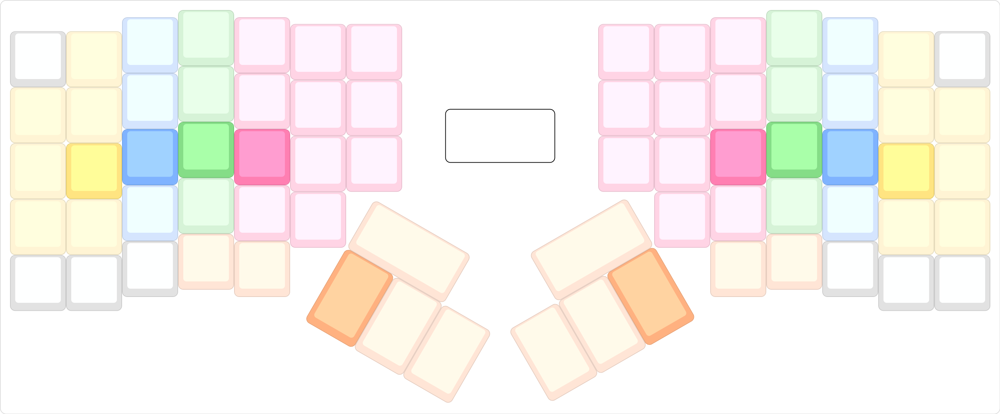](https://kle.klava.org/#/gists/337191ca7166c6cb93781f50f71181ca)
[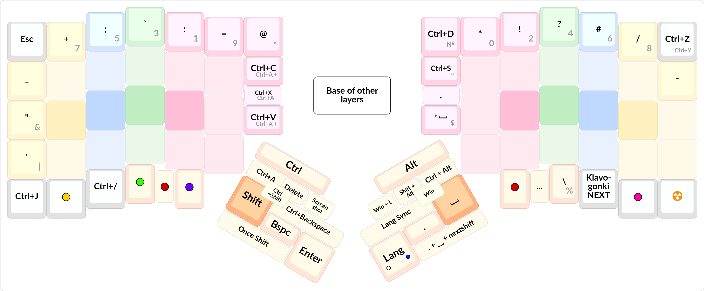](https://kle.klava.org/#/gists/9a4b993ea6bff1ff0f9b7a33bc755623)
[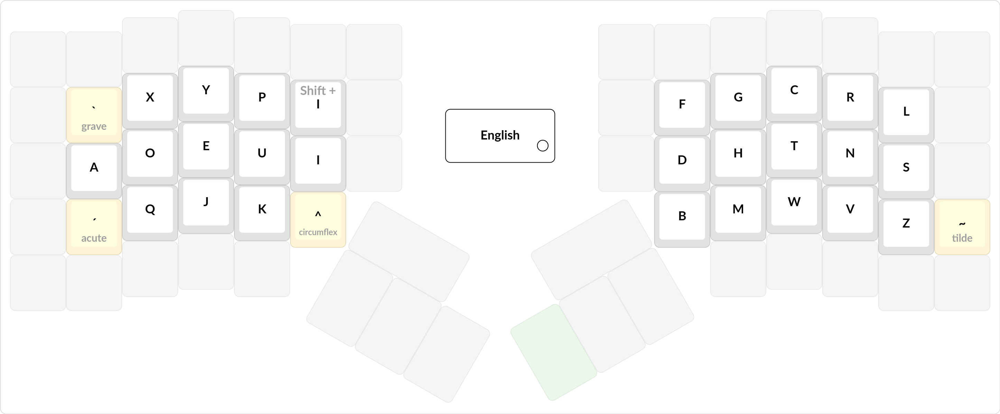](https://kle.klava.org/#/gists/91178524f9e3273d73aec89aefab0ab0)
[](https://kle.klava.org/#/gists/07c65db22ed9614664a2eb42cf88ef1f)
[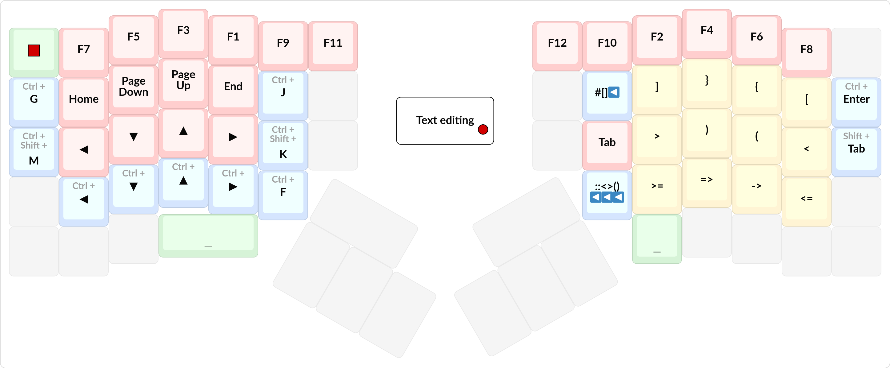](https://kle.klava.org/#/gists/2e94ef1a8f6616e655bfc218fcda885e)
[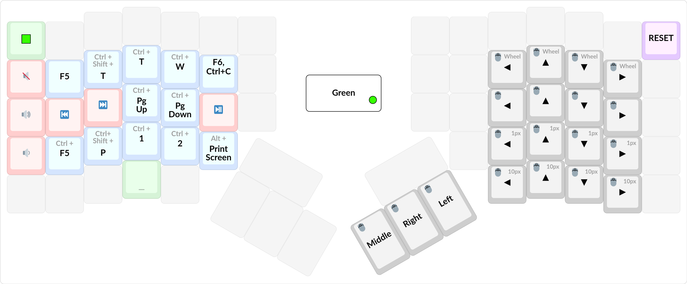](https://kle.klava.org/#/gists/0611ab0f9b2546eb385ccd9c35e18782)
[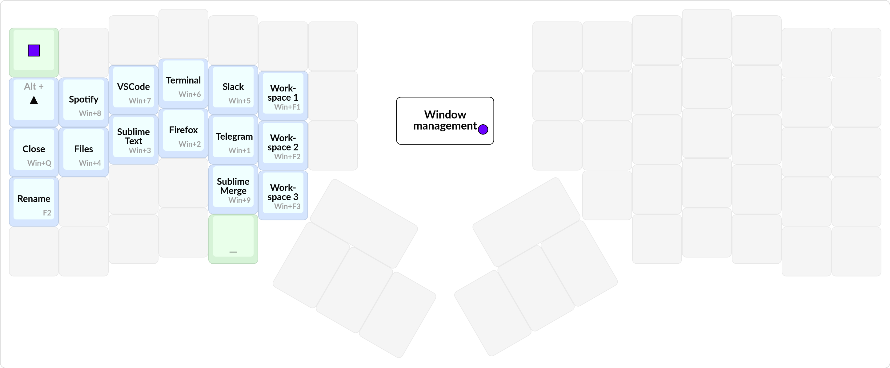](https://kle.klava.org/#/gists/b6323946c89a4dd6b0c5c29c0531132a)
[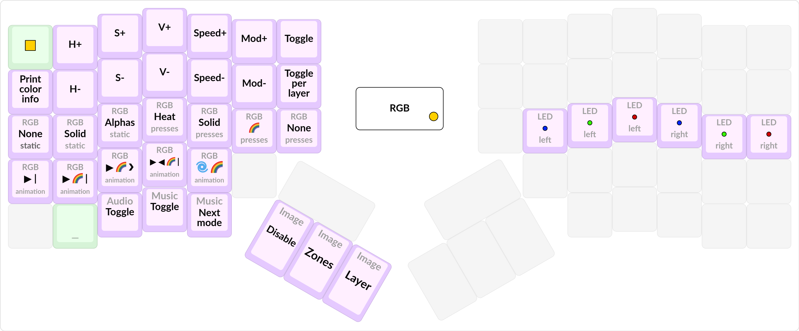](https://kle.klava.org/#/gists/266a463f773aeb71fdd808377a9ea597)
[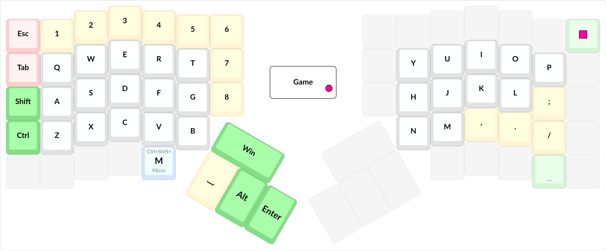](https://kle.klava.org/#/gists/d119e7590b585c0c3a8706e953f40745)
[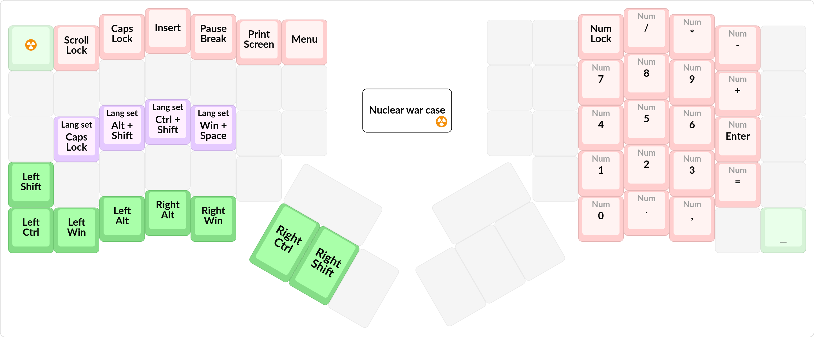](https://kle.klava.org/#/gists/5a6a1244d0f353c495d5aa0f3065d2c1)

# О чём эта статья

Это статья о моей раскладке, как я к ней пришёл и почему она именно такая.

Для тебя эта статья может быть полезна по следующим причинам:
* Ты хочешь узнать про десятипальцевый метод печати и какие клавиатуры для него идеально подходят.
* Ты хочешь узнать что вообще можно сделать с программируемой клавиатурой.
* Ты уже имеешь программируемую клавиатуру, и хочешь начать проектировать собственную раскладку, и пришёл чтобы [воровать идеи](https://www.chitai-gorod.ru/catalog/book/391987/).

Данная статья рассказывает про раскладку, которую я создавал для себя, и все удобства будут рассмотрены с моей точки зрения. Очевидно, что для людей с отличающимся воркфлоу будут подходить совершенно другие раскладки.

# Содержание

[//]: # "start-toc"
   * [Моя раскладка для Moonlander на QMK](#моя-раскладка-для-moonlander-на-qmk)
   * [О чём эта статья](#о-чём-эта-статья)
   * [Содержание](#содержание)
   * [Вводная информация](#вводная-информация)
      * [Термины](#термины)
      * [Что за Moonlander](#что-за-moonlander)
      * [Связь между клавиатурой и раскладкой](#связь-между-клавиатурой-и-раскладкой)
      * ["Правильная" клавиатура](#правильная-клавиатура)
   * [Про слепую десятипальцевую печать](#про-слепую-десятипальцевую-печать)
      * [Зоны](#зоны)
      * [Смещение кисти](#смещение-кисти)
      * [Большой палец](#большой-палец)
      * [Скорость и сомнения](#скорость-и-сомнения)
   * [История](#история)
      * [Доисторические времена, предпосылки](#доисторические-времена-предпосылки)
      * [Начало кастомизации, WinAPI](#начало-кастомизации-winapi)
      * [Начало обучения десятипалу](#начало-обучения-десятипалу)
      * [Набор скорости](#набор-скорости)
      * [Первая слим клавиатура](#первая-слим-клавиатура)
      * [Покупка ErgoDox EZ](#покупка-ergodox-ez)
      * [Привыкание к прямым рядам](#привыкание-к-прямым-рядам)
      * [Привыкание к высоким клавишам](#привыкание-к-высоким-клавишам)
      * [Продолжение истории с Ergodox EZ](#продолжение-истории-с-ergodox-ez)
      * [Перестановка букв](#перестановка-букв)
      * [Двоения](#двоения)
      * [Heatmap](#heatmap)
      * [Кладенец](#кладенец)
      * [Покупка Moonlander](#покупка-moonlander)
   * [Форма клавиатуры](#форма-клавиатуры)
      * [Наличие цифрового ряда](#наличие-цифрового-ряда)
      * [Два столбца для мизинца, три для указательного](#два-столбца-для-мизинца-три-для-указательного)
   * [Физическая реализация](#физическая-реализация)
      * [Прозрачные пустые кейкапы](#прозрачные-пустые-кейкапы)
      * [Подсветка](#подсветка)
      * [Звуки](#звуки)
      * [Переключатели, их смазка](#переключатели-их-смазка)
      * [Транспортировка](#транспортировка)
   * [Раскладка](#раскладка)
      * [Что такое слой](#что-такое-слой)
      * [Выключение слоя на месте Esc](#выключение-слоя-на-месте-esc)
      * [Каждому слою - своя картинка](#каждому-слою---своя-картинка)
      * [Зоны](#зоны-1)
      * [Основа](#основа)
         * [Аккорды](#аккорды)
         * [Один шифт на большом пальце левой руки](#один-шифт-на-большом-пальце-левой-руки)
         * [Залипающий одиночный шифт](#залипающий-одиночный-шифт)
         * [Долой правые модификаторы](#долой-правые-модификаторы)
         * [Backspace рядом с домашней позицией](#backspace-рядом-с-домашней-позицией)
            * [Самые частые сочетания с контролом - на основной слой](#самые-частые-сочетания-с-контролом---на-основной-слой)
         * [Не использовать модификаторы настолько, насколько это возможно](#не-использовать-модификаторы-настолько-насколько-это-возможно)
         * [Точка, пробел, запятая](#точка-пробел-запятая)
            * [Запятая](#запятая)
            * [Точка](#точка)
            * [Пробел](#пробел)
         * [Одинаковые препинаки в английском и русском языке](#одинаковые-препинаки-в-английском-и-русском-языке)
         * [Непонятное положение цифр](#непонятное-положение-цифр)
         * [Отдельная клавиша для переключения языка](#отдельная-клавиша-для-переключения-языка)
         * [Отдельная клавиша для скриншота области](#отдельная-клавиша-для-скриншота-области)
         * [Слоефикаторы на большом пальце](#слоефикаторы-на-большом-пальце)
      * [Языки](#языки)
         * [Фонетическая раскладка](#фонетическая-раскладка)
         * [Кастомные раскладки и модификаторы](#кастомные-раскладки-и-модификаторы)
         * [Английский язык](#английский-язык)
         * [Русский язык](#русский-язык)
            * [Ё](#ё)
            * [Ъ](#ъ)
      * [Красный слой](#красный-слой)
         * [Стрелки в слое, на домашней позиции левой руки, ширины 4](#стрелки-в-слое-на-домашней-позиции-левой-руки-ширины-4)
            * [Home, End](#home-end)
            * [Статистика](#статистика)
            * [Почему стрелки должны быть в слое](#почему-стрелки-должны-быть-в-слое)
            * [Форма стрелок: 4×1 vs перевёрнутая T](#форма-стрелок-41-vs-перевёрнутая-t)
            * [Стрелки с повтором](#стрелки-с-повтором)
            * [Использовать мизинец для стрелок или нет?](#использовать-мизинец-для-стрелок-или-нет)
            * [←↓↑→ или ←↑↓→?](#-или-)
            * [Стрелки на левой руке, вместо правой](#стрелки-на-левой-руке-вместо-правой)
      * [Зелёный слой](#зелёный-слой)
      * [Фиолетовый слой](#фиолетовый-слой)
         * [Как я не осилил i3](#как-я-не-осилил-i3)
      * [Жёлтый слой](#жёлтый-слой)
      * [Слой для игр](#слой-для-игр)
      * [Слой на случай ядерной войны](#слой-на-случай-ядерной-войны)
   * [Технические детали](#технические-детали)
      * [Как ты сделал эту раскладку?](#как-ты-сделал-эту-раскладку)
      * [Изображения](#изображения)
      * [Код](#код)
      * [Как в клавиатуру засунуть свою буквенную и препинаковую раскладку](#как-в-клавиатуру-засунуть-свою-буквенную-и-препинаковую-раскладку)
      * [Рассинхрон](#рассинхрон)
      * [Как прошить?](#как-прошить)
   * [Общее принципы проектировки раскладки](#общее-принципы-проектировки-раскладки)
      * [Логика дороже трёх процентов](#логика-дороже-трёх-процентов)
      * [У каждого своя раскладка](#у-каждого-своя-раскладка)
      * [Оверинжиниринг](#оверинжиниринг)
      * [Сборник всех принципов](#сборник-всех-принципов)

[//]: # "end-toc"

# Вводная информация

## Термины

**Раскладка** - способ организации клавиш на клавиатуре: положение букв, стрелок, F-клавиш, модификаторов, макросов итд.

**СК** - стандартная клавиатура.

**Смещение рядов** aka **горизонтальный стаггер** - горизонтальное смещение следующей строки клавиш на клавиатуре относительно предыдущей. На СК смещение идёт сверху вниз сначала на 1/2 клавиши, затем 1/4 клавиши, затем снова 1/2 клавиши.

**Десятипал** - сокращение для фразы: метод слепой десятипальцевой печати на клавиатуре™.

**Программируемая** клавиатура - такая клавиатура, внутрь которой можно поместить нестандартную раскладку.

**Правильная** клавиатура - клавиатура, которая адекватна для десятипала. Измеримые критерии правильной клавиатуры будут даны далее.

[**Клавогонки**](https://klavogonki.ru) - сайт-тренажёр для печати на клавиатуре, где можно хорошо развивать скорость. Обладает элементами социальной сети, соответственно там можно познакомиться и пообщаться с множеством крутых наборщиков.

**Препинак** - сокращение от "знак препинания". Здесь, для краткости, будет считаться, что к препинакам относится любой символ, который можно напечатать на клавиатуре, но который не является буквой или цифрой, например: `'"+-*/^@#&|$~` являются препинаками. 

**Слой** - абстракция в раскладке, которая позволяет при нажатии определённой клавиши иметь клавиши, отличные от текущих. Например клавиши <kbd>Fn</kbd> и <kbd>Shift</kbd> активируют слои:
* Зажатие <kbd>Fn</kbd> активирует слой, на котором в определённых местах есть клавиши управления звуком, музыкой и прочим. 
* Зажатие <kbd>Shift</kbd> позволяет вместо цифр набирать препинаки, а вместо букв большие буквы. 

**Слоефикатор** - клавиша, которая активирует слой. Образовано от слой + модификатор.

**зн/мин** - сокращение для фразы "знаков в минуту". Используется для обозначения скорости печати.

**Неизвестная необходимость** - когда у тебя нету предмета, который обладает этим свойством, и ты о нём даже не знаешь, то ты живёшь без него, и тебе вроде как нормально. Когда ты узнаёшь о нём, то всё-равно кажется что без него можно прожить, и не так уж он и нужен. Но когда ты начинаешь им пользоваться, понимаешь, что он тебе необходим.

У меня в раскладке очень много вещей были неизвестной необходимостью.

## Что за Moonlander

Это **правильная**/эргономичная/ортолинейная **программируемая** клавиатура, которую можно купить и получить работающий продукт из коробки. Обычно правильные клавиатуры люди паяют и собирают самостоятельно. Так как я не люблю паять, то для меня это идеальный вариант. В данной статье будет представлена раскладка именно для этой клавиатуры, хотя в целом, ничего не мешает, использовать все эти идеи и даже код на любых абсолютно других клавиатурах.

Я его называю не совсем по транскрипции "мунляндер", потому что люблю коверкать слова.

[Официальный сайт.](https://www.zsa.io/moonlander/)

Моя клавиатура на данный момент выглядит так:

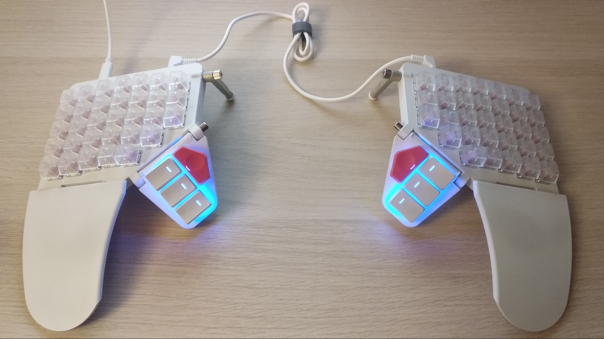

## Связь между клавиатурой и раскладкой

Данная клавиатура является программируемой, то есть она обладает микроконтоллером, в который можно зашить программу (которая называется **прошивка**), которая работает со считыванием нажатых клавиш, и посылает на компьютер результат нажатия. Эта программа реализует некоторую раскладку.

Кажется, как будто клавиатура - это очень тупая вещь, и она не должна содержать у себя вообще никакого вида процессора, а отдавать полностью всю информацию на компьютер, и получать тоже всё от компьютера (чтобы, например, подсветку нарисовать). Но это не так, и внутрь клавиатуры можно и нужно засунуть много чего интересного.

Благодаря тому, что на клавиатуру можно залить произвольную программу, прямо на клавиатуре можно задавать произвольную раскладку с любой степенью автоматизации и кастомизации (если ты, конечно, умеешь программировать), будь то автозамены или автоматический пробел после препинаков (знаков препинания). Что хорошо, всё это реализуется при помощи самого стандартного протокола USB HID, так что такая программируемая клавиатура будет работать на любом компьютере (и даже телефоне) без установки драйверов.

Возможности настолько велики, что кто-то [даже сделал тетрис на клавиатуре](https://github.com/danamlund/meckb_tetris)!

Благодаря программируемости клавиатуры, стандартная раскладка СК может быть полностью переосмыслена, и воплощена в совершенно в другом, более удобном виде. Этим переосмыслением я и занимался, когда создавал данную раскладку.

[QMK](https://github.com/qmk/qmk_firmware) - одна из библиотек на языке программирования Си, для написания прошивки клавиатуры. Данная библиотека на данный момент является лучшей библиотекой, которую поддерживают практически все программируемые клавиатуры. Главное её свойство для данной статьи - можно писать собственные расширения на Си, без погружения в низкоуровневые детали протокола или сканирования матрицы.

## "Правильная" клавиатура

Как я уже говорил, правильная клавиатура адекватна для десятипала. Я считаю что клавиатура должна соответствовать следующим критериям, чтобы считаться правильной:
* Не обладает горизонтальным стаггером вида `\\\\`, и являются симметричной.
* Обладает как минимум тремя клавишами для каждого большого пальца.
* Является программируемой, чтобы была возможность поместить все клавиши как можно ближе к пальцам, через слои, не раздувая клавиатуру до огромных размеров, и минимизируя движения кистей.

Все эти пункты подробно и будут рассмотрены далее.

Я предпочитаю такой своего рода "субъективный" термин вместо термина **эргономичная** клавиатура, потому что эргономика не обязана содержать в себе описанные пункты. А эти пункты по моему мнению очень важны. Плюс, существуют просто **ортолинейные** клавиатуры, типо Planck, которые являются правильными, но не эргономичными. Вот как выглядит Planck:

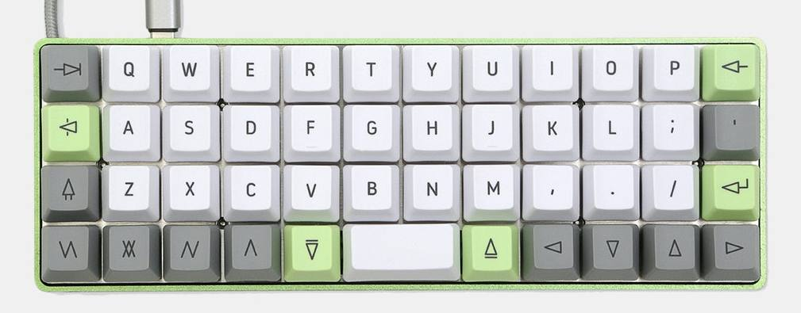

Так же я не хочу вдаваться в споры об эргономике, про которую я ничего не знаю, и которая меня не интересует.

Но в любом случае, у любой правильной клавиатуры, шансов быть эргономичной намного больше, чем у любой СК. А принципы "правильности" в целом достаточно универсальны и для других видов печати.

# Про слепую десятипальцевую печать

Это важный пункт, потому что на основании того как работает этот метод печати, будет зависеть _очень_ много дизайнерских решений. Да и вообще, сам термин **правильная** клавиатура, завязан на этом методе.

Итак, **слепая десятипальцевая печать на клавиатуре™** - это особая техника печати, при которой:
* Пальцы стоят на "домашней" позиции `ФЫВА ОЛДЖ` или `ASDF JKL;`, при этом на большинстве клавиатур для указательных есть рисочки на клавишах <kbd>F</kbd> и <kbd>J</kbd>, чтобы проще было целиться вслепую.
* Используется 9-10 пальцев обоих рук (и мизинцы тоже).
* У каждого пальца есть строго свои зоны, и каждый палец имеет право нажимать только клавиши из своих зон. Это называется **статические зоны**. Когда каждый палец нажимает какую придётся клавишу - это называется **динамические зоны**.
* Печать происходит без подсматривания на клавиатуру, ведь все клавиши выучены на уровне рефлексов. Отсюда и слово "слепая".
* Это не тоже самое, что просто "печатать вслепую", ведь обычно печать вслепую не подразумевает статические зоны.

Так же иногда к десятипалу относят "правило шифтов" и "правило пробелов", но я считаю эти правила бесполезными и вредными. Далее эта тема будет раскрыта.

Десятипалом специально овладевают люди, которые профессионально пользуются компьютером и клавиатурой, например: программисты, транскрибаторы, рерайтеры, бухгалтеры итд. К сожалению у нас в школе не обучают десятипалу, а должны, ибо это навык, который пригодится всем нам в этой жизни, учитывая темпы цифровизации.

К плюсам десятипала можно отнести:
* Совершается меньше ошибок, так как у пальцев строго определённое множество клавиш, которые они нажимают, в строго определённых позициях. Для динамической печати такое не выполняется по очевидным причинам.
* После определённого уровня практики нету необходимости смотреть на клавиатуру вообще. Соответственно меньше устают глаза от смены фокуса клавиатура-экран-клавиатура-экран, или меньше болит шея.

Согласно моей внутренней статистике большинство людей:
* Никогда не слышали про десятипал.
* Печатают достаточно давно на клавиатуре, поэтому практически на неё не подглядывают.
* Практически не используют мизинцы, и делают в основном всё указательными, редко средними, и редко безымянными.
* Печатают достаточно быстро, чтобы их это устраивало.
* Печатаеют динамическими зонами.

## Зоны

Вот так выглядят стандартные зоны для десятипала на СК:

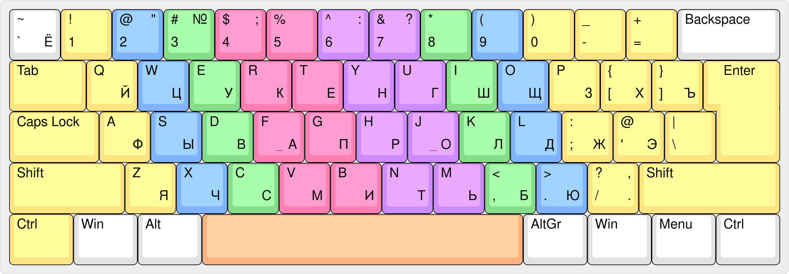

Цветом обозначается какой палец нажимает какую клавишу:
* Белый - любой палец может нажать эту клавишу
* Розовый, Фиолетовый - указательный
* Зелёный - средний
* Синий - безымянный
* Жёлтый - мизинец
* Оранжевый - большой палец

Давайте взглянем на них в более чистом виде:

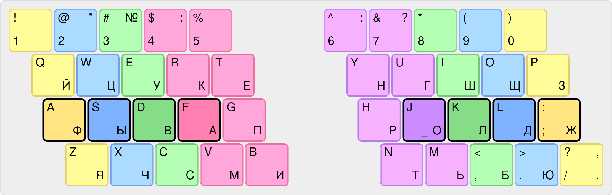

Можно заметить, что левой руке должно быть неудобно. Некоторые люди это замечают сразу, и делают костыли в виде таких зон:

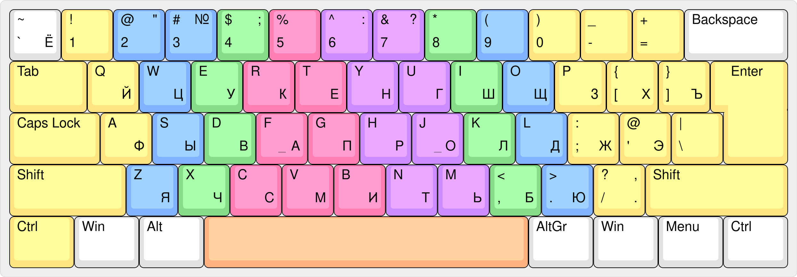

Которые в чистом виде выглядят так:


Они уже получше, но тоже довольно кривоваты. Они делают получше печать для левой руки. Но к сожаленю до них не все додумываются (я, например, не додумался), и о них не все знают. Поэтому большинство обучающихся десятипалу страдают на оригинальных зонах, которые пишут во всех учебниках и обучающих материалах. Но эти зоны нельзя назвать идеалом.

Пример людей на клавогонках, с необычными зонами: [\_VR\_](http://klavogonki.ru/u/#/389432/), [Alkhor](http://klavogonki.ru/u/#/314554/), [Переборыч](http://klavogonki.ru/u/#/191670/journal/52be892d7bf62d073991bc69).

Существуют ещё большие костыли, которые не только делают другие зоны, но ещё и другую постановку - `ЫВАМ ТОЛД`. Данная постановка значительно переделывает раскладку ЙЦУКЕН, и ещё делает положение рук немного более эргономичным. Вот как она выглядит:

[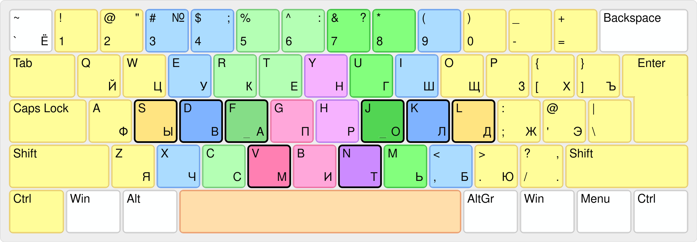](https://klavogonki.ru/wiki/Ывам-толд)

Вот `ЫВАМ ТОЛД` - уже странная концепция, и я бы не стал её советовать, тут на свой страх и риск.

Неадекватность СК для десятипала ❌
> По зонами видно почему СК неадекватна. Происходит это именно из-за горизонтального стаггера, который направлен в одну сторону, и находится на клавиатуре из-за печатных машинок. Обозначить этот сгаггер можно как и стандартные зоны: `\\\\`.

Более подробно узнать про тему горизонтального стаггера можно в статье: [Генетические недостатки стандартной клавиатуры](http://ibnteo.klava.org/keyboard/standard).

Так же стаггер `\\\\` можно очень хорошо увидеть на этой картинке:

[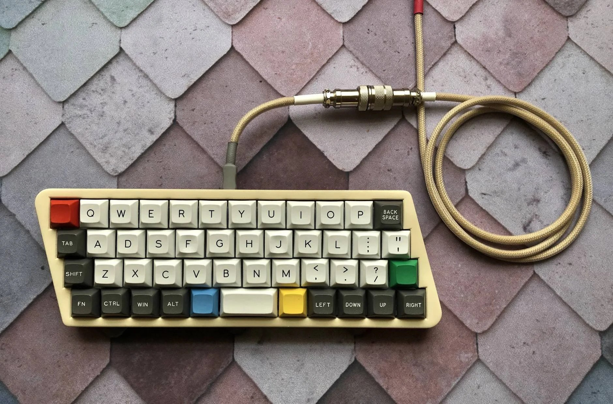](https://www.reddit.com/r/MechanicalKeyboards/comments/ac6k1b/big_boi/)

Но этот стаггер не точно такой же как и на СК. Давайте взглянем на то как выглядит смещение рядов без лишних клавиш, и с сравнением смещения относительно предыдущего:

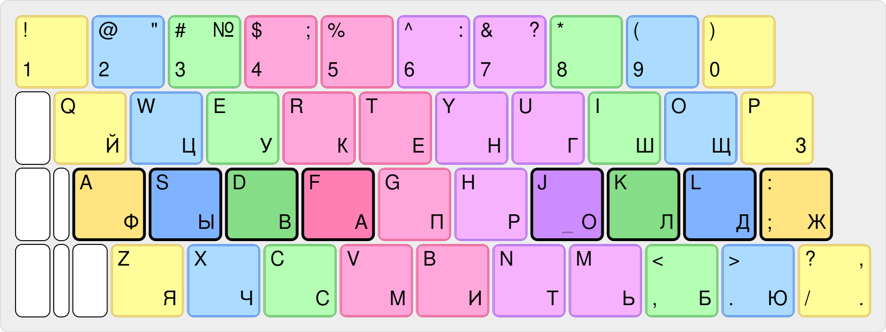

Видно, что первое смещение равно 1/2 клавиши, а вот уже второе 1/4 клавиши, а затем снова 1/2. Такое странное изменение смещения приходит к нам из-за особенностей печатных машинок, и хуже варианта с постоянным смещением 1/4. Далее это будет раскрыто в истории.

Можно сказать что правильным и адекватным стаггером будет `||||` или `//\\`. 

Пример стаггера `//\\`:

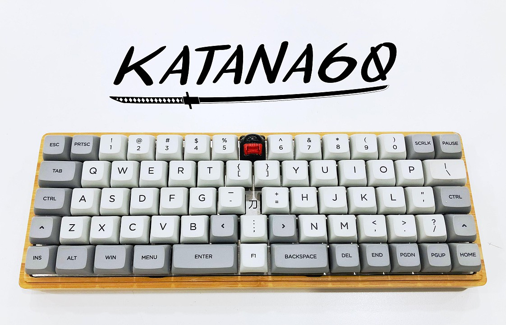

Так же можно сделать `//\\`, но с адекватным неравномерным смещением рядов, например: 0, 0, 1/4, как на клавиатуре [Сагарис](https://github.com/bouncepaw/sagaris):

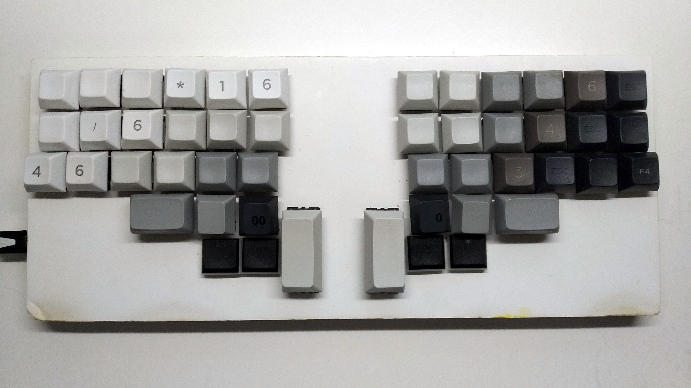

Теперь взглянем какие можно сделать зоны для моей клавиатуры с рядами `||||`:


Здесь зоны прямые и симметричные для обеих рук, не нужно выворачиваться наизнанку.

## Смещение кисти

Десятипал строится на том, что основную часть времени можно не смотреть на клавиатуру, и что можно всё нажимать вслепую. Но это удовольствие ломается, когда нужно нажимать далёкие клавиши, до которых нельзя дотянуться из домашней позиции.

Неадекватность СК для десятипала ❌
> Частые и полезные клавиши размещаются далеко, из-за чего приходится часто смещать кисть с домашней позиции.

Возьмём, например, <kbd>Backspace</kbd>. Он находится настолько далеко, что даже не помещается в самые дальние клавиши для правого мизинца. И чем его нажимать? Да чем хочешь! Хоть средним, хоть безымянным (им чаще всего и нажимают). Кисть всё-равно смещать с домашней позиции. А раз она будет смещаться, то потом она должна вернуться обратно чтобы нажать следующие клавиши. А вот это уже представляет проблемы, особенно на скорости. Возвратить кисть обратно не так-то легко, плюс если делать это быстро, и при этом ещё хотеть нажать какую-то клавишу, то высока вероятность промахнуться. И снова придётся смещать кисть и снова нажимать <kbd>Backspace</kbd>. Замкнуный круг :)

А обучаться возвращаться в домашнюю позицию из далёких мест - это практика. А зачем эта практика нужна, если можно без неё? Просто поставив <kbd>Backspace</kbd> поближе.

Очевидно, что для десятипала лучше будет, если все клавиши будут в шаговой доступности от домашней позиции, без сильных смещений руки.

Положение <kbd>Backspace</kbd> не так печально, как положение стрелок. Стрелки находятся на два порядка дальше, чем <kbd>Backspace</kbd>. А всяким программистам, и писателям статей приходится использовать стрелки во время написания текста **очень** часто. И вот скакать рукой туда-сюда только чтобы переместиться на пару символов просто невыносимо.

Кстати, именно из-за этого всякие vim'ы и придумали свои режимы, где стрелки находятся сразу на домашней позиции. То же самое относится и к нумпаду и тому что над стрелками, всё это можно засунуть под домашнюю позицию, через слои.

А такие клавиши как <kbd>Backspace</kbd>, <kbd>Shift</kbd>, <kbd>Enter</kbd> можно без всяких слоёв разместить поближе просто адекватно спроектировав раскладку, и использовав большой палец.

## Большой палец

Это удивительно, но в СК большой палец не используется ни для чего, кроме пробела. Большой палец - один из самых подвижных пальцев. Да на телефонах люди печатают очень много текста одним или двумя большими пальцами. И такой мощный палец обойдён стороной.

Неадекватность СК ❌
> СК не использует большой палец, хотя никаких причин для этого нет, и это неадекватно не только для десятипала, а и само по себе.

Большой палец силён, поэтому правильная клавиатура имеет под каждый большой палец как минимум три кнопки. А на эти три кнопки далее уже можно повесить много чего полезного.

## Скорость и сомнения

Хотел бы я сказать, что овладев десятипалом, можно начать печатать быстрее, но я не могу дать таких гарантий.

Например, обычно школьник 15 лет, давно печатающий вслепую, по динамическим зонам, имеет скорость в районе 300-500 зн/мин. А это довольно немало. И если этот школьник, прямо сейчас, в своём молодом возрасте, зайдёт на клавогонки, и начнёт очень активно тренироваться, то в силу твоего возраста, он будет очень быстро расти. И после определённого времени сможет вообще достичь самого высочайшего ранга скорости - Тахион, достигнув 900 зн/мин. Я наблюдал очень много таких примеров, и ещё больше я наблюдал примеров школьников, которые приходили со скорость 400, и очень быстро росли до менее амбициозных скоростей - 600-700 зн/мин.

При этом самый быстрый печатальщик на планете - Шон Врона, печатает по динамическим зонам, и достигает на английском языке около 1200 зн/мин. Тоже самое относится и к альтернативным раскладкам. Объективного практического преимущества у них нет. Но настоящие преимущество есть у стенографической машины.

А что тем временем десятипал? У меня ушло больше года, чтобы достичь скорости 500 зн/мин. И я при этом очень очень тяжело тренировался, и начал в 17 лет. Сейчас моя максимальная скорость на клавогонках - 700 зн/мин.

Так что если твоя цель - скорость, то придётся ресёрчить дальше, всё не так просто.

Поэтому неизвестно, является ли десятипал истинным методом взаимодействия с клавиатурой, чтобы под него они оптимизировались.

Как пример, можно придумать что-то лучше. На клавогонках, пользователь под ником [Fenex обучился ограниченной динамике](http://klavogonki.ru/u/#/82885/journal/52beafae7bf62df3458b7833) на указательных пальцах для раскладки ЙЦУКЕН. В случае когда ему попадается две последовательные клавиши в зоне указательного, он нажимает их не одним пальцем, а указательным и средним. Таким образом он уменьшает нагрузку на указательные, и повышает свою скорость за счёт сокращения нажатий одним пальцем, и увеличением числа перекатов. И этот подход не является чистым десятипалом, и чистой динамикой.

Так же существует стенография и автозамены.

Так что я не уверен, что истина в последней инстанции стоит за десятипалом. Но он к ней очень близок. И я не жалею что ему научился.

Так же нужно отметить, что приобретая правильную клавиатуру, скорее всего придётся переучиваться под десятипал, потому что если на СК ты привык печатать динамикой, то она не будет работать на правильной клавиатуре из-за совсем другого положения клавиш. А динамику переучить намного сложнее, чем статику.

Далее будет раскрыто в каких ещё местах СК неадекватна для десятипала, и как эту проблему можно решить на правильной клавиатуре.

# История

## Доисторические времена, предпосылки

Изначально я печатал на клавиатуре так же как и печатают все:
* Иногда смотрел, иногда не смотрел на клавиатуру.
* Нажимал клавиши какими попало пальцами, практически не использовав мизинцы.
* Печатал вроде как быстро, и с большим числом опечаток.

Что называется "набор по динамическим зонам".

Идею о том что нужно научиться десятипалу, в меня заложили независимо три блоггера:
* Сначала Денис Борисов выпускает видео о том как он проводит свой день, и там говорит что научился десятипалу чтобы проще и быстрее печатать статьи.
* Затем Константин Кадавр между делом, в рандомном месте, упоминает что считает тех, кто печатает за 300 зн/мин уже сверхлюдьми.
* И наконец видео от Sorax'а о том ["Как освоить слепой набор?"](https://youtu.be/YirgDp-zlkM).


Это как в стакан наливают воду, и вот они наливали, и после одного момента она вылилась.

Я не уверен, что стал бы этим заниматься, прочитав одну статью в интернете, или послушав одного человека. К сожалению так просто человека не переубедить и не заставить менять привычку. Это к слову о том, что я пытался объяснить своим друзьям чтобы они научились десятипалу, или чтобы они пересели на правильные клавиатуры, но ничего не выходило.

Ближе к концу 11 класса школы (2016 год) я начал копать о том как стартануть в этой теме. 

Я начал учиться такой печати именно после 11 класса, а не раньше, потому что я считал что так как я пойду учиться в университет, то я буду записывать все лекции, и лучше это делать на клавиатуре, потому что это быстрее ручной записи. Плюс, было лето, а летом ничего особо делать не надо, можно и скорость печати сломать.

Такая идея пришла мне в голову ещё потому что у меня был положительный опыт на уроках истории, когда нам диктовали очень много материала под запись (подготовка к ЕНТ), и я не успевал писать всё ручкой, и вообще у меня был отвратительный почерк, из-за чего я не мог потом это читать. Поэтому я как-то раз притащил свою огромную беспроводную клавиатуру на урок, вставил свисток в телефон через переходник и начал печатать в телефон. Мы же это для себя делали, для подготовки к ЕНТ, так что мне никто ничего не сказал, все просто удивились. Потом учительница попросила меня скинуть все мои записи в электронном виде, чтобы она могла это немного подредачить и распечатать всем. _То есть я делал это для себя, а получилось для всех._ Вот такое важнейшее свойство цифровой записи. Кстати, это ещё один плюс в копилку почему я не люблю писать ручкой.

Так вот, я хотел научиться слепой печати, чтобы (!) записывать лекции в университете. Сейчас вспоминаю эту причину, и не представляю как такое вообще сработало. Такая идиотская причина, чтобы сделать такую долгую и тяжёлую вещь. Если кратко, то во-первых лекции чаще всего полный отстой, и их можно заменить качественной методичкой. А во-вторых если на данном предмете нету методички, и тебе надо что-то записывать, что скорее всего что-то не так. Особенно если это предмет, который читается испокон веков, как, например, математический анализ, теория вероятности, история.

Лекции хорошо заходят, когда ты можешь в записанном виде смотреть их на скорости 2.0. Лекции хороши тем, что на скорости они пассивно загоняют в тебя информацию, не нужно применять усилия чтобы читать.

Вот так, из-за боязни неизвестного пришлось научиться сложному навыку, который, к счастью, будет приносить выгоду всю жизнь.

## Начало кастомизации, WinAPI

Так же когда-то я наткнулся на [статью про клавиатуру UHK](https://habr.com/ru/company/crowdtoolz/blog/385943/) на тогдашнем GeekTimes. И после неё я понял, что хочу эту клаву, а пока этой клавы нету, хочу иметь стрелки так же как и на ней, а именно подобным образом:

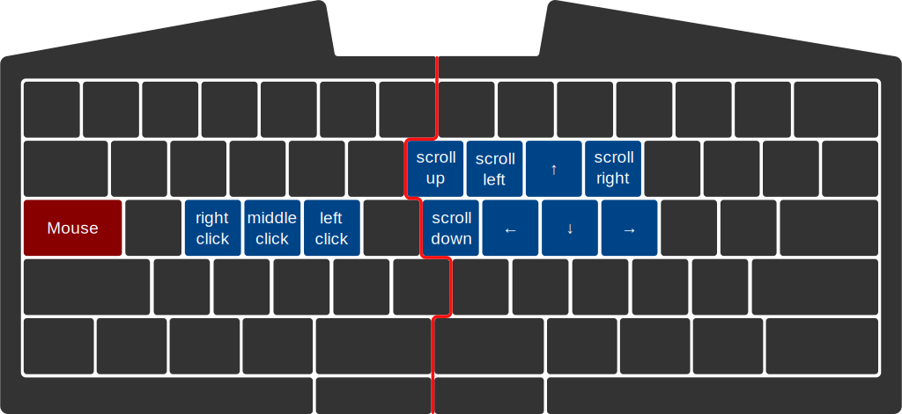

Сейчас я понимаю, что эта клавиатура не такая уж и классная, и самое главное - неправильная. Хотя статье стоит отдать должное, она очень глубоко во мне посеяла эту идею, и вообще идеи о том, что можно сделать, имея программируемую клавиатуру.

Возвращаясь к теме, я решил прежде чем научиться печатать, сделать себе такие же стрелки, чтобы вместо капс-лока у меня была какая-то такая магическая клавиша, при зажатии которой другие клавиши работают по-другом (это называется **слой**). Для начала я попытался сделать такое через [AutoHotKey](https://www.autohotkey.com), но когда я это сделал, стрелки работали **слишком** медленно, и этим невозможно было пользоваться. Это даже вылилось в тему на CyberForum, на которую мне _никто_ не ответил. Вот эта тема, там же находится исходный скрипт: [Как добиться использования стрелок на буквенной части клавиатуры?](https://www.cyberforum.ru/keyboards/thread1761049.html). В те времена я не знал такого термина как "слой", поэтому и не гуглилось ничего разумного.

Сейчас для решения этой проблемы я могу посоветовать программу [Enhanced Keyboard](https://github.com/klavarog/enhanced-keyboard), которая, к сожалению, работает только на винде.

А в те времена единственный вариант что у меня остался - использовать WinAPI, с которым я уже значительно поигрался, чтобы рисовать окошки и делать простенькие программы. С помощью него я решил сделать перехват всех клавиш, и соотетственно их изменение. Назвал я такую программу ModBind, где <kbd>Mod</kbd> обозначает клавишу для включения слоя, а "Bind" обозначает "забиндить" (слово взять из CS 1.6).

Исходники этой программы лежат здесь: [modbind](modbind) (хотя они никому не нужны, пусть лежат для истории). 

Моя раскладка после завершения этой программы выглядела следующим образом:

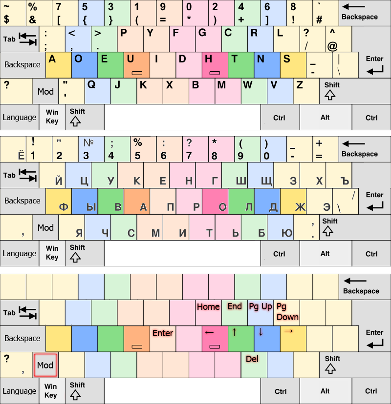

Как видно, здесь появилось намного больше, чем просто стрелки в слою. Здесь я:
* **Назначил шифт на левый альт.** Из-за этого мне пришлось переучиваться нажимать пробел с левой руки на правую.
* **Сделал стрелки плоскими.** Потому что где-то слышал, что в каком-то vim'е стрелки сделаны подобным образом.
* **Добавил отдельную клавишу для запятой.**
* **Перетащил бэкспейс на место капс лока.**
* **Выделил отдельную клавишу для переключения языка.**
* **Отдельная клавиша для запятой.**
* **Enter поближе.**

Все эти идеи до сих пор со мной, более подробно и с широкими объяснениями я их рассмотрю далее.

_Обратите внимание_ 👀
> Здесь в английском находится раскладка "Дворак для программистов", и её главной особенностью является то, что основные символы для программирования нажимаются без шифта, а цифры нажимаются с шифтом. Так же цифры расположены в нестандартном порядке.

_Лайфхак_ 👨‍💻
> Если вы хотите себе препинаки как в раскладке "Дворак для программистов", то не обязательно ставить именно эту раскладку, и переучиваться под новое положение букв. Можно сделать себе раскладку "qwerty для программистов" в специальных программах, и свести переобучение к минимуму, получив максимум результата.

Затем, когда я сделал эту идеальную раскладку, я наконец начал обучаться десятипалу через тренажёр VerseQ. После него я перешёл на [Клавогонки](http://klavogonki.ru), и катал с такой модификацией раскладки долгое время под аккаунтом [optozorax](http://klavogonki.ru/u/#/451401/). Там же можно более подробно прочитать про эту раскладку.

## Начало обучения десятипалу

Тут хочу остановиться по поводу VerseQ. Я случайно наткнулся на этот тренажёр, но влюбился в него за тот текст, что написан в справке, которая всплывает при его старте. А ещё в нём очень приятно печатать, как эстетически: внешний вид клавиатуры, и звук щелчка, так и концептуально: там очень короткие тексты, и они с первого запуска тренируют все буквы сразу.

И хочется покритиковать тренажёры "Соло на Клавиатуре", "Стамина", и словарей "ва ол" на Клавогонках. Там от вас требуют печатать сначала сто раз букву А, затем сто раз букву О, и так все буквы потихоньку. Я считаю такой подход тупостью, и нужно сразу печатать реальные сочетания, запоминать все буквы сразу, и в реальной обстановке. Ничего в этом сложного нету. Плюс в тренажёре "Соло на Клавиатуре" к печатающему предъявляются очень высокие требования в плане безошибочности, поэтому некоторые люди забрасывают обучение десятипалу вообще. В VerseQ нету такого большого количества стресса.

А сейчас для старта печати советую [klava.org](https://klava.org), он бесплатный, и там есть много функций.

Из-за видео Sorax'а я узнал что на английский лучше поставить раскладку "Дворак для программистов". Затем подумал что неплохо бы найти подобную раскладку для русского, но к сожалению Диктор и раскладка Зубачёва не нагуглились.

При обучении десятипалу я столкнулся с проблемой, что мои пальцы нажимали клавиши не из своих зон, и мне очень сложно было себя контролировать. Поэтому я сделал такие штуки из бумаги:

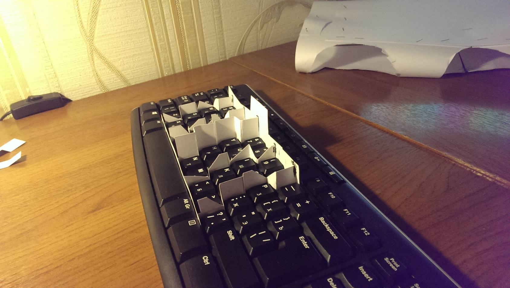

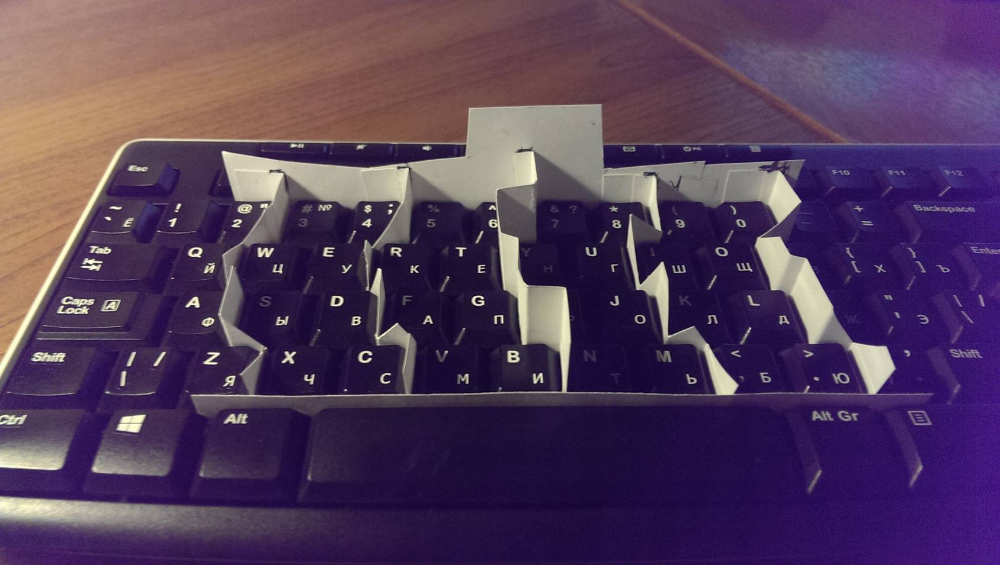

Ох, это были очень сложные в создании штуки. Первая их проблема, что из обычной бумаги это не сделаешь - она помнётся, надо из твёрдой. Следующая проблема была в том, что эти бумажки падали, поэтому пришлось их клеить на бумажные стенки. А еще на этих бумажках пришлось вырезать некоторые участки, чтобы пальцы могли двигаться без помех.

У меня ушло очень много времени на создание такого, и в итоге, когда я начал печатать - понял что это полная фигня, весь труд того не стоил, уж лучше я буду контроллировать себя не физически, а умственно. 

Затем я столкнулся с проблемой, что у меня подглядывание на клавиатуру зашито уже на подкорку, и я _постоянно_ смотрел на клавиатуру, поэтому скрафтил такое:

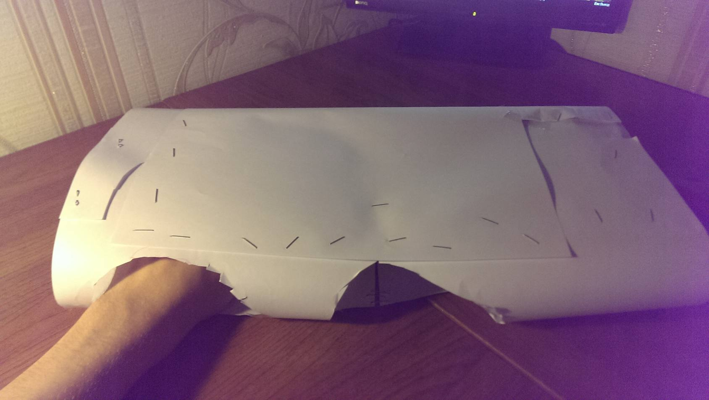

С этой штукой захотел посмотреть на клавиатуру - смотришь, и ничего не видишь. Profit 👍.

Но потом и эта штука оказалась неудобной из-за необходимости её надевать, снимать. 

_Лайфхак_ 👨‍💻
> Затем в голову пришла гениальная мысль, что подсматривание на клавиатуру не будет иметь смысла, если надписи на клавиатуре не будут иметь смысла, поэтому я вытащил все клавиши и расставил их в рандомном порядке. Это наиболее дешёвый и действенный метод борьбы с подглядыванием.

В итоге мой воркфлоу по печати выглядел как-то так:

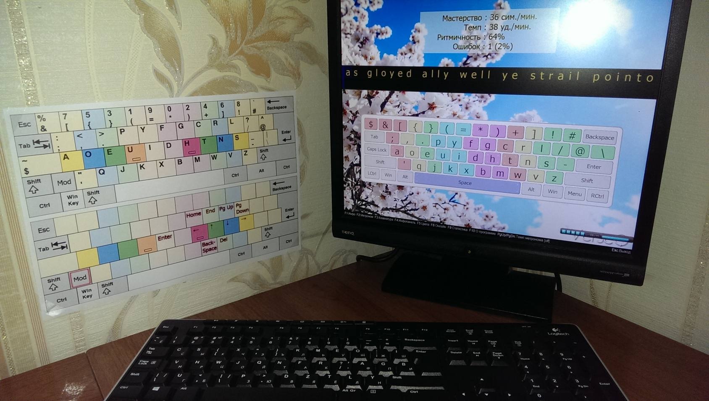

_Лайфхак_ 👨‍💻
> Распечатать свою раскладку и повесить рядом с монитором - удобно! Лучше искать нужный символ на бумажке и соответственно лучше запоминать раскладку, чем расслаблять мозг и давать компьютеру подсказывать где находится следующий символ.

А после достижения 150-200 зн/мин в этом тренажёре советую вам уйти на клавогонки, начать читать форум, и смотреть как развивались другие люди. 300 зн/мин дадутся легко. А уже дальше могут начаться проблемы.

Возвращаясь обратно, когда я печатал десятипалом, я заметил что левой руке как-то неудобно нажимать клавишу <kbd>С</kbd> на русском языке, надо двигать палец в неестественном направлении. Затем я посмотрел на клавиатуру, и осознал что всю жизнь был слеп, оказывается клавиатура кривая.

Клавиатура кривая. И эта кривость может и идёт на пользу правой руке, но вот левой очень обидно. И моя любимая на тот момент UHK тоже оказывается кривая! Поэтому я погуглил и узнал об ErgoDox EZ, и пометил себе в голове обязательно купить эту клавиатуру, когда у меня появятся деньги.

## Набор скорости

Все рекорды написаны в для обычного режима в клавогонках в единицах "знаков в минуту", и рекорды в основном со сменой ранга. К сожалению во времена до десятипала я не замерял свою скорость, и даже об этом как-то не подумал. 

Все рекорды можно более подробно посмотреть в моих аккаунтах на клавогонках: [optozorax](http://klavogonki.ru/u/#/451401/), [ergozorax](http://klavogonki.ru/u/#/517589/), у меня статистика открытая.

|Дата|Δt|Рекорд|Комментарий|
|-|-|-|-|
|~июнь 2016|0|0|Начал обучаться слепой печати в VerseQ|
|27 июня 2016|~месяц|139|Пришёл на клавогонки|
|10 июля 2016|13 дней|282|-|
|10 июля 2016|0 дней|303|-|
|8 августа 2016|29 дней|406|-|
|19 апреля 2017|8 месяцев, 11 дней|508|-|
|17 февраля 2018|9 месяцев, 29 дней|566|Последний рекорд на слим-клавиатуре|
|19 февраля 2018|2 дня|-|Получил эргодокс|
|3 марта 2018|12 дней|462|Первый рекорд на эргодоксе|
|5 марта 2018|3 дня|570|Побил рекорд на слиме|
|31 июля 2018|4 месяца, 26 дней|604|-|
|31 июля 2018|1 год, 3 месяца, 12 дней|604|В этой строчке разница времени считается от рекорда 508|
|7 января 2020|1 год, 5 месяцев, 7 дней|718|-|
|3 сентября 2020|7 месяцев, 27 дней|-|Получил Moonlander|

После рекордов > 500 я уже начал меньше кататься на клавогонках, и перестал тренироваться, поэтому рекорды так долго делались. Сейчас уже практически не катаю.

Для понимания такой скорости печати относительно чего-то другого я делал такие замеры:

|Вид деятельности|Скорость|На ком проверено|
|-|-|-|
|Чтение|1800|Я и мой друг|
|Разговор размеренным темпом без пауз|1200|Я и мой друг|
|Написание текста ручкой|160|Я|
|Написание текста на смартфоне с сенсорным экраном, стандартным размером, без Т9 и без свайпа|150|Я|

## Первая слим клавиатура

До этого я печатал на мембранной клавиатуре с высокими клавишами. И хейтил плоские клавиатуры, потому что они на ощущение были отвратительны. Плюс меня бесила тенденция всё делать сенсорным и плоским, убирая тактильные ощущения. Да и сейчас бесит. Ненавижу создателя сенсорной плитки, которая стоит в квартире, которую я снимаю. Минусы сенсорных штук - ложные срабатывания от пролившейся воды, и не срабатывания от нажатия вообще.

Но почему-то на клавогонках все писали что лучшая клавиатура для быстрой печати - слим-клавиатура. То есть такая, у которой плоские клавиши, ножничный механизм. И это писали даже лучшие из лучших. Особенно это актуально для русского языка, где очень много букв нажимаются одним пальцем, и чтобы это быстрее печатать десятипалом, нужно использовать скольжение по клавиатуре. А такое удобно только на плоской клаве. Это стало сильным ударом для меня, и поводом проверить это на истинность.

Когда я стал достигать скоростей (400 символов в минуту), я заметил что задеваю клавиши, и виной этому их высокость, и наконец понял почему люди рекомендуют плоские клавиатуры.

Поэтому я купил дешманскую слим-клавиатуру Rapoo E9070. Первое время было неприятно, и неудобно, я частенько промахивался из-за отсутствия хоть какого-то разделения между клавишами, но на 400 символов в минуту я уже на уровне рефлексов знаю где какая клавиша, поэтому я привык.

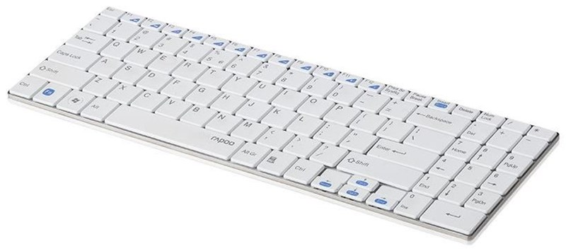

И вот когда я привык к ней и начал печатать быстро, я понял что всё это было правдой. Плоская клавиатура действительно удобна именно для _быстрого_ десятипала.

Вот так я из хейтера плоских клав превратился в их любителя. 

## Покупка ErgoDox EZ

Параллельно я продолжил заниматься десятипалом на клавогонках, и к покупке эргодокса научился печатать со максимальной скоростью ≈550 символов в минуту.

Когда я был студентом 2-го курса, и у меня появилась стипендия и маленькие заработки на написании работ в универе другим людям, я смог себе купить б/у ErgoDox EZ.

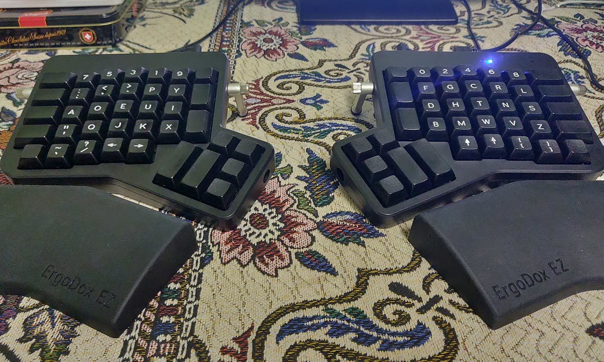

19 февраля 2018 получил ErgoDox. Только в этот момент узнал что, оказывается, существует визуальный конфигуратор и прошивка написана на Си. До этого я покупал эргодокс только из-за его физического расположения кнопок, и из-за того, что на нём есть много клавиш для большого пальца.

20 дней спустя запрограммировал следующую раскладку и прошил её в клавиатуру:

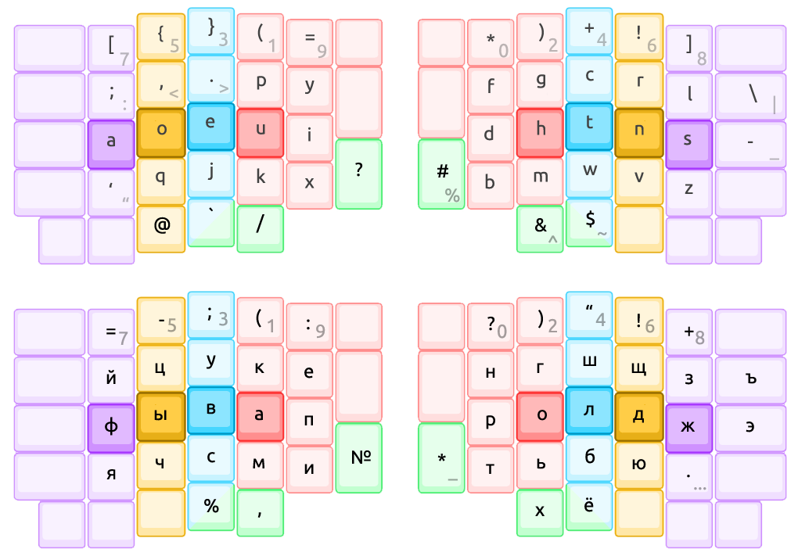

Картинку нарисовал в фотошопе :D.

Уже тогда эта раскладка работала без всяких драйверов, и настройки софта, и единственное, что ей было нужно - это чтобы на компе были самые обычные раскладки QWERTY и ЙЦУКЕН.

Когда я наконец сделал эту раскладку, можно было возвращаться на клавогонки, и бить рекорды.

## Привыкание к прямым рядам

Но для начала нужно рассказать про привыкание к клавиатуре. Это важная тема для тех, кто переходит на подобную клавиатуру.

На привыкание к прямым рядам (орто) у меня ушло две недели. Частенько не попадал, но в итоге привык, и затем понял что на прямых рядах я даже совершаю меньше ошибок, за счёт того что удобнее печатать. Явный пример: существует [12 упражнение Хруста](http://klavogonki.ru/vocs/13663/), которое выглядит следующим образом:
> по-любому облюбовать облюбовал любовь любой любая любви полюбив любое любимое любимая любой Любляна любая любой любви любимый любойы

Это упражнение надо тренировать и набирать на скорость. Будучи на обычной клавиатуре для меня это упражнение представляло трудности, и я спотыкался об него. Но при переходе на прямые ряды это упражнение стало печататься _намного_ проще, чем раньше, и я начал в нём совершать невероятные для своего уровня рекорды.

И это при том, что упражнение в основном на правую руку, для которой СК вроде как предоставляет удобное смещение рядов. Вспоминаем как выглядит смещение рядов на СК:


И тут видно, что для части где нахдоятся буквы <kbd>Ю</kbd> и <kbd>Б</kbd> смещение рядов 1/2 клавиши. Из чего делаем вывод что меня тормозило и запутывало именно смещение 1/2. Не уверен, было бы мне так же сложно набирать, будь там смещение 1/4, но вот про 1/2 я могу сказать точно, что оно неудобно.

Неадекватность СК для десятипала ❌
> Странное изменение смещения рядов и вообще смещение 1/2.

## Привыкание к высоким клавишам

Но, оказывается переучивание под прямые ряды было не главной проблемой на эргодоксе! Судя по тому что я писал в мессенджерах, самую большую проблему для меня составил переход на высокие клавиши, с низких. Вот это да.

Так что если вы считаете высокую механику манной небесной, то по сравнению со мной, для вас переход на прямые ряды будет проще.

А знаете почему правильные клавиатуры поголовно механические? А потому что механические переключатели позволяют собрать клавиатуру по одной клавише, и тебе не нужно идти ни на какие заводы чтобы напечатать мембранную клавиатуру твоего формата. Да и не напечатают они, судя по тому, что на рынке нету мембранных правильных клавиатур. Поэтому на механике я не по собственной воле, и до сих пор скучаю по плоским клавишам.

(Конечно, есть низкопрофильные свитчи, но там надо паять, а я тратить время на обучение паянию не собираюсь.)

## Продолжение истории с Ergodox EZ

Итак, через 4 дня после введения этой раскладки я побил свой рекорд и в обычном режиме на Клавогонках сделал 559 символов в минуту. А потом сделал и 570.

Затем через 15 дней я реализовал залипающий шифт - это такой шифт, который при обычном зажатии работает как обычный, а при единоразовом нажатии и отпускании автоматически применится к следующей клавише.

А уже через месяц, 20 апреля 2018 я пришёл в чат [@klavaorgwork](https://t.me/klavaorgwork), где находятся люди, так же как и я, увлечённые созданием раскладок и клавиатур. В частности там был [Волька ibnteo](http://ibnteo.klava.org) - он одним из первых в русскоязычном сообществе создал правильную клавиатуры - [Кошкоклавы](https://habr.com/en/post/185500/).

Уже когда я пришёл в это сообщество в телеграме, у меня была примерно такая раскладка, описание которой сейчас находится здесь [optozorax/keyboard_layout](https://github.com/optozorax/keyboard_layout).

Она выглядела тогда примерно так: (сейчас это самая последняя версия, сорян, лучше не нашёл)

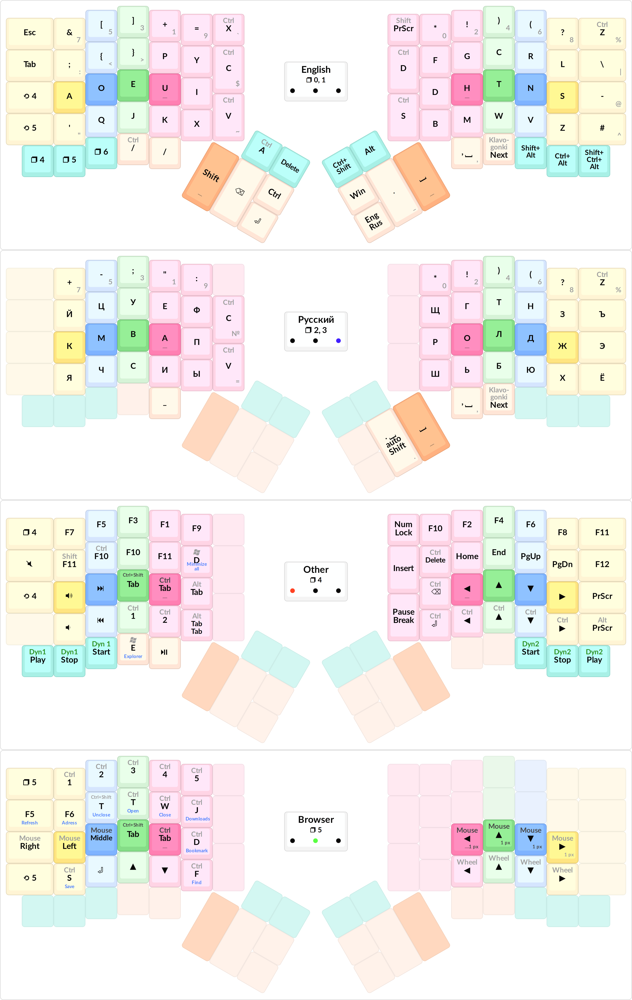

## Перестановка букв

Я всегда понимал, что ЙЦУКЕН - не предел мечтаний, и на нём не очень удобно печатать, и всегда предпринимал попытки создать _Идеальную Скоростную Раскладку_, но это не очень получалось.

В сообществе создателей раскладок я познакомился с [Kanazei](https://klavogonki.ru/u/#/439088/)'ем, который постоянно модифицировал свою раскладку тем, что переставлял пару букв, и переучивался. Он больше опирался на собственные ощущения при переделки раскладки, чем на всякие программы, и не старался сразу создать идеал. Соответственно в ходе таких ручных действий он научился многому, и благодаря этому, мне кажется, сейчас он - главный эксперт по буквенным раскладкам во всём нашем сообществе.

Вдохновившись его примером, я решился тоже немного переставить буквы. А именно, я поменял местами Щ⬌Н, Ш⬌Т. Согласно теории, такая перестановка должна была ввести в игру самое частое двубуквенное сочетание: `ТО` в виде удобного и быстрого переката. Ну и `ТГ`, `НТ` итд.

Это было 9 мая 2018 года. Спустя 2 дня удалось добиться скорости 400. Спустя 8 дней от перестановки - скорость 500. Спустя три недели от перестановки - старая скорость восстановлена.

Только после трех недель привыкания смог нормально печатать, хотя до даже спустя месяцы бывали такие моменты, когда во время печати отключаю разум, и руки сами неправильно нажимают на старое место буквы Ш, Т, Н, Щ.

Я не ожидал, что привыкнуть будет так сложно. Даже когда я привыкал к прямым рядам на эргодоксе, было намного легче.

Еще же главная проблема старых рефлексов по нажатиям клавиш в том, что руки привыкают не столько к нажатию отдельных букв, сколько к нажатию сочетаний. Например, `ТЬ`, на скорости руки это уже не воспринимают как две буквы, а как одно действие как одну новую букву. И поэтому, даже если научиться нажимать `Т` в новом месте, это не значит, что все такие действия переучатся автоматически. И вот с каждой клавишей таких сочетаний связано очень много, и всех их надо переучивать.

По ощущениям печатать с `ТО` на перекате было шикарно, мой потенциал скорости увеличился.

Где-то в сентябре я продолжил перестановки, и сделал К⬌Е и М⬌И, а затем Ф⬌К и Ы⬌М. То есть украл ещё две буквы с указательных, и поближе подвинул частые гласные. Количество перекатов у меня стало ещё больше.

Для этой перестановки я уже не помню как долго переучивался, но вроде было не так сложно, потому что это не такие частотные буквы как Н и Т.

## Двоения

Примерно где-то в это время, через год очень активного пользования, у меня в клавиатуре начались двоения наиболее частых букв: Р, В, Backspace. Виной тому думаю б/у'шность изначальной клавиатуры и плохое качество свитчей Gateron Clear. К сожалению у меня не получилось выпять двоящие свитчи и поменять местами их с менее редкими клавишами.

Но проблему немного удалось победить костылями в програмной оболочке. 

К сожалению в моей версии клавиатуры ещё не было Hot-Swap'а.

И где-то в этот момент я начал подумывать о том чтобы купить новую клавиатуру, где будет Hot-Swap.

## Heatmap

8 апреля 2019 узнал что из клавиатуры можно делать `printf`. И на основе этого решил наконец реализовать свою идею о том, чтобы собирать статистику с нажатий с клавиатуры.

Более подробно это можно прочитать под хэштэгом `#heatmap` в чатике в телеграме: [@klavaorgwork](https://t.me/klavaorgwork).

В итоге, пройдя извилистый путь, 13 августа 2019 закончил делать программу и всю сопутствующую машинерию, и опубликовал результат здесь: [klavarog/heatmap](https://github.com/klavarog/heatmap).

Так же я публиковал свою статистику на основании 1.5 миллиона нажатий в том же чатике под хэштэгом `#частотность`.

Далее в этой статье я буду использовать результаты этой статистики в демонстративных целях.

## Кладенец

7 сентября 2019 проходил Moscow Maker Faire, где Волька вместе с Suenot'ом представляли свои клавиатуры. Так как мне в тот момент повезло находится в Моксве, я решил не упускать такой шанс и пришёл наконец встретиться вживую. Заодно потыкался в тогдашнюю Волькину новую клавиатуру [Кладенец](https://ibnteo.github.io/kladenets/README-RU):

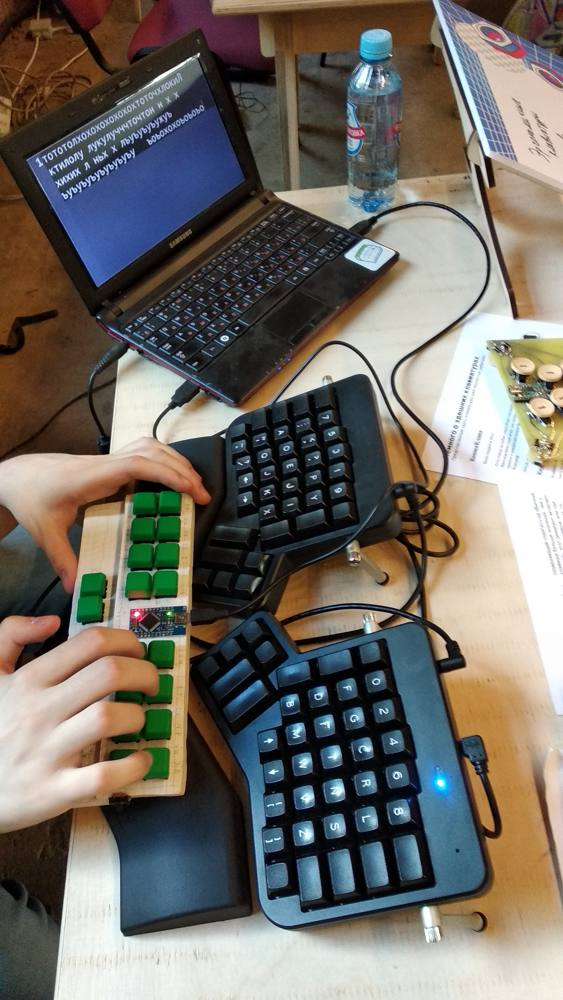

До этого, в чатике, было сложно воспринимать как работает Кладенец и что это вообще такое. А после живого сеанса очень понравилось.

Затем я пришёл к мысли, что хочу попробовать научиться печатать на Кладенце. И 15 сентября Волька подарил мне самый первый экземпляр, и я начал учиться:

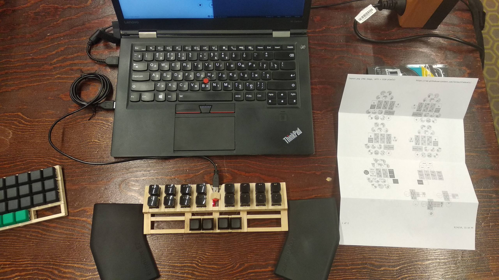

Очень подробно обо всём процессе обучения, мыслях и информации можно почитать в канале в телеграме [@kladenets_zorax](https://t.me/kladenets_zorax).

Когда я начал учиться, первые впечатления остались те же, мне показалась гениальной идея полисимвольности и то как возможно работать полностью одной рукой.

Потихоньку, помаленьку, я стал печатать дальше. Обучение Кладенцу шло намного сложнее, чем обучение десятипалу, аккорды и двукнопия было нажимать сложно и очень мучительно для мозга.

Кладенец был больше экспериментом, чем попыткой пересесть на новую платформу печати.

Через 15 дней, 30 сентября 2019 на Кладенце достиг скорости 100 символов в минуту в обычном режиме на клавогонках, одной рукой!

Вот видео, в котором я набираю простой текст одной рукой, и где можно увидеть как именно происходит печать на Кладенце:

[](http://www.youtube.com/watch?v=tRhdZPuxcyI "")

Так как Кладенец - очень интересная и сложная клавиатура, ко мне начало приходить много идей как эту раскладку можно визуализировать.

Вот уже результат тогдашних экспериментов по визуализации:

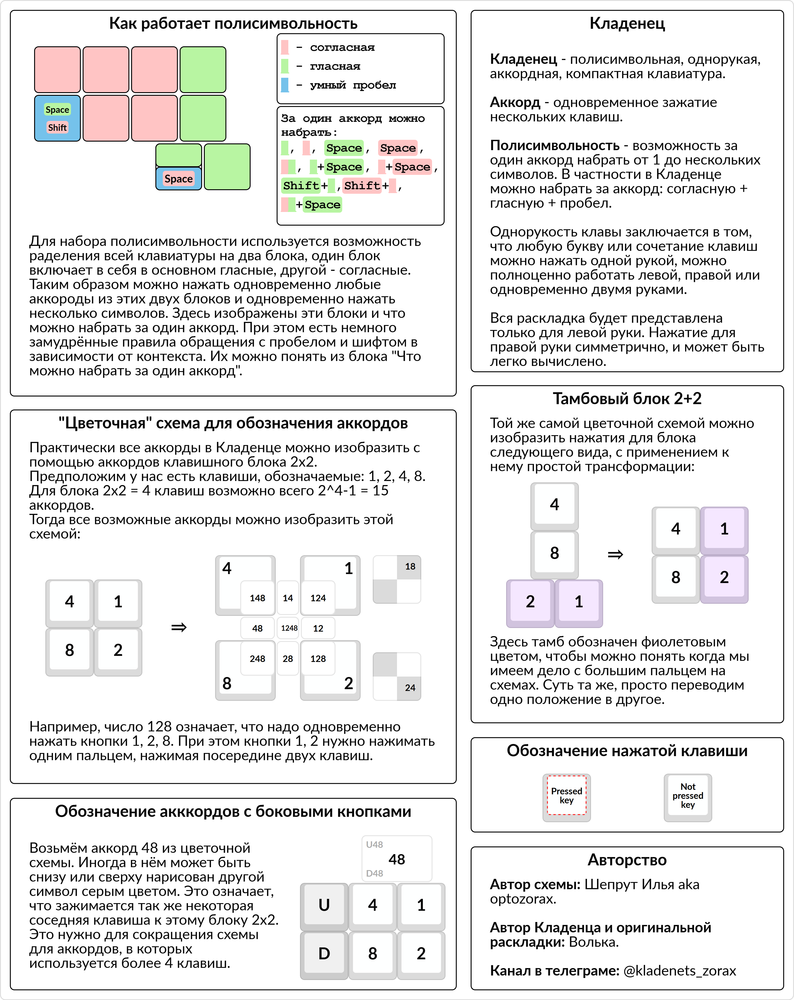

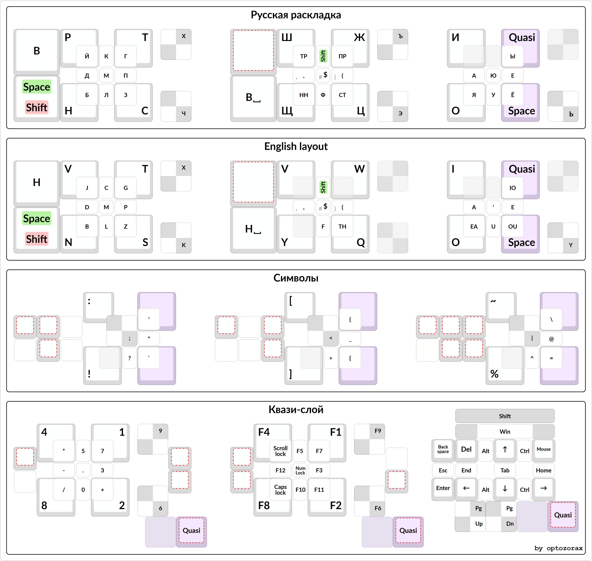

Ещё я придумал клавиатуру, которая состоит из 5 клавиш, но при этом реализует полноценный нумпад - Нумкорд:

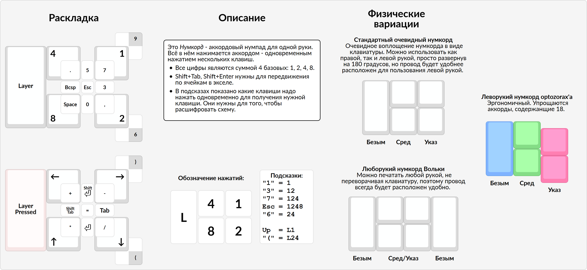

И ещё придумал визуализацию аккордов:

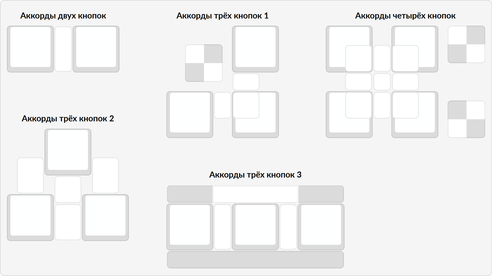

В итоге я достиг скорости почти 300 зн/мин в словаре "Соточка" на Кладенце одной рукой, и сейчас уже на нём печатаю очень редко.

Это был очень интересный опыт, после которого стали понятны ошибки Кладенца, и благодаря которому я открылся аккордам, и придумал очень много способов как их можно визуализировать. В частности идеи визуализации аккордов я использую в своей раскладке на основом слое.

## Покупка Moonlander

В июле 2020 года через неофициальные источники, ещё до официального объявления я узнал что ZSA выпустили эту новую клавиаутуру. Почитав и подумав я решил заказать, так как она получилась хорошо, и я наконец смогу избавиться от проблемы двоения клавиш.

Мне повезло, я стал одним из первых, и 3 сентября 2020 года клавиатура была уже у меня. Это стало вдохновением чтобы взять и переделать всю мою раскладку с учётом кучи идей, и переучиться на неё.

Далее будет рассказано какие именно новые фичи появились при глобальном переписывании прошивки под мунляндер. Самые главные - это аккорды, и одинаковые знаки для русского и английского языка.

# Форма клавиатуры

## Наличие цифрового ряда

Для начала **цифровой ряд** - это верхний ряд на СК, в котором находятся цифры, и препинаки при зажатии шифта.

Если погуглить эргономичные и ортолинейные клавиатуры, то можно заметить что в большинстве из них нету цифрового ряда, яркий пример - клавиатура Corne:

[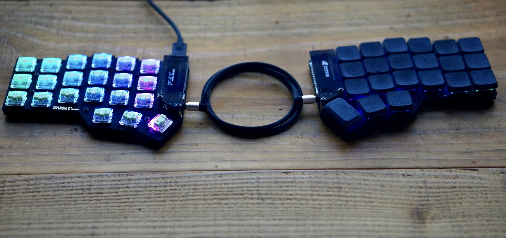](https://github.com/foostan/crkbd)

Для неподготовленного человека такая клавиатура выглядит безумно: в ней нету привычных стрелочек, F-клавиш, цифроряда.

Люди говорят, что до цифрового ряда им далеко тянуться, а препинаки и числа в слою находятся очень близко. Хотя, например, вроде как, для среднего пальца цифровой ряд находится в шаговой доступности, без смещения кисти.

Так как до цифрового ряда далеко тянуться, то они предпочитают засунуть цифры и символы в слои, например в похожей клавиатуре Jian слои выглядят следующим образом:

[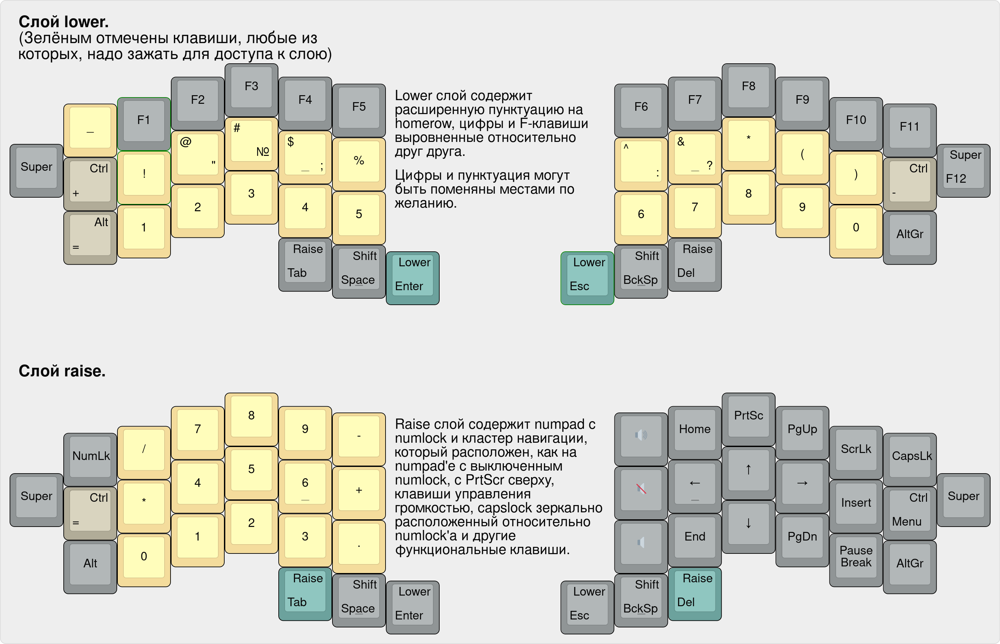](http://www.keyboard-layout-editor.com/#/gists/9740d2bf0e1b98644100a7caa60be88a)

Вот даже есть видео про этот подход:

[](http://www.youtube.com/watch?v=AKGXZ1ReU54 "")

Я же в свою очередь, очень не люблю нажимать клавишу Shift на скорости, соответственно мне и не будут нравиться нажатия слоефикатора.

Хотя, наверное, тем, кто уходит с СК, и никогда не пробовал Дворак для программистов, без разницы будут символы в слое или с зажатым шифтом. Для них же все символы набирались с шифтом, а тут то же самое, только шифт другой, а символы ближе.

А я, как человек, привыкший к символам без шифта на Двораке для программистов, уже не могу отказаться от этого удобства. Плюс мне кажется, что на скорости пользоваться цифрорядом намного проще.

Так что если найдётся программист со скоростью >600 зн/мин, который не обладает цифрорядом, то мне будет очень интересно послушать его мнение.

Поэтому я выбираю клавиатуры с цифровым рядом, и это решение значительно ограничивает круг того что мне доступно.

## Два столбца для мизинца, три для указательного

Когда люди смотрят на правильную клавиатуру, они видят что она не стандартная, а значит не понимают как стандартная раскладка может поместиться в эту клавиатуру. Очень яркий пример - люди хотят получить третий столбец для мизинца, чтобы якобы вместились клавиши <kbd>ЭХЪ</kbd> и <kbd>Enter</kbd>. То есть, например, моя клава выглядела бы следующим образом:

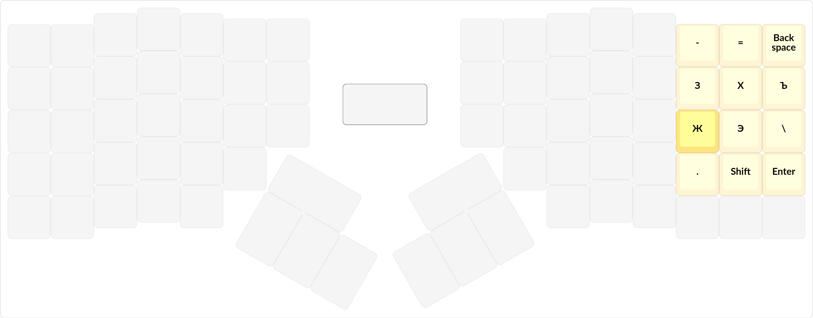

На самом деле все клавиши что в СК располагаются на третьем, четвёртом и пятом ряду мизинца, могут располагаться куда ближе. И особо третий ряд мизинцев не настолько и нужен, как может показаться.

Поэтому я не вижу никакой потери от того что третьего ряда для мизинцев у меня нету. А вот третий столбец для указательных - вполне себе удобная штука, но и без него прожить можно.

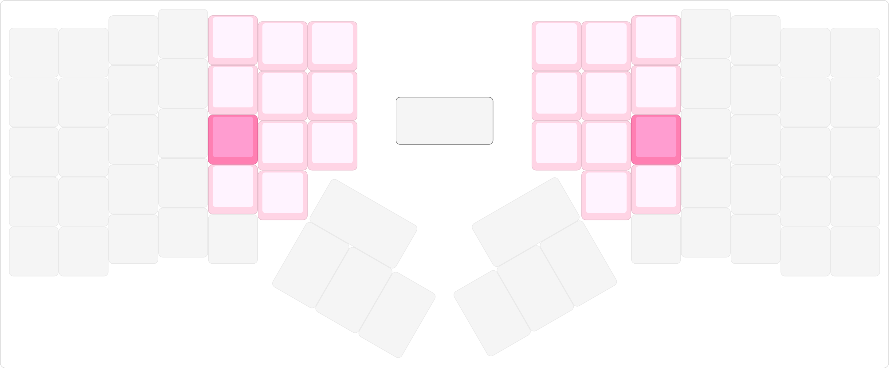

# Физическая реализация

В моей клавиатуре есть несколько важных физических аспектов:
* Прозрачные пустые кейкапы
* Подсветка
* Звуки
* Переключатели, их смазка
* Транспортировка

Повторю картинку, чтобы вы вспомнили как она выглядит:


## Прозрачные пустые кейкапы

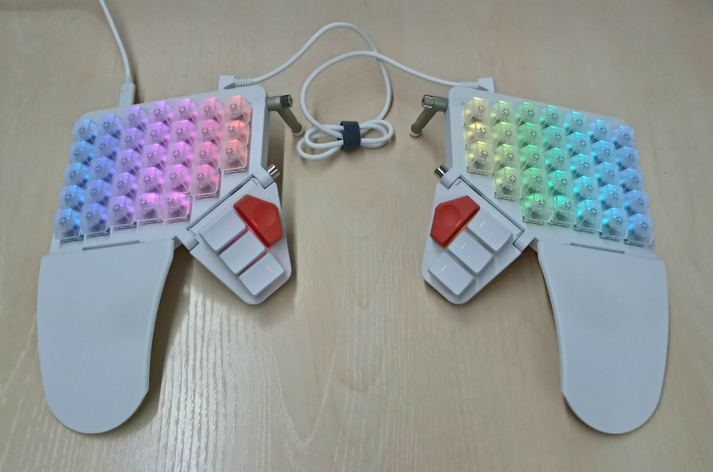


Я считаю, что на правильной клавиатуре должны быть пустые кейкапы.

Мне кажется подписи на клаве - порочная идея, человек привыкает смотреть на клавиатуру, а не доставать раскладку из памяти. Тем более, зачем тебе надписи, если нужно учиться десятипалу, и ты зашёл настолько далеко, что купил себе правильную клавиатуру? А если работа за компьютером - твоя основная работа, то тем более полезно удалить надписи.

А во-вторых, синхронизировать их с раскладкой тоже не очень приятно, и не всегда возможно. Так зачем вообще иметь эти надписи, если ты ими не будешь пользоваться, и они не будут отражать реальную картину? На твоей клавиатуре всё-равно никто не сможет печатать, так что можно отпустить. Тем более пустые клавиши выглядят солидно, сразу видно что ты не обычный смертный.

В крайнем случае можно распечатать картинку своей раскладки и таскать с собой, если кто-то захочет печатать на твоей клавиатуре.

Либо можно покупать цветные кейкапы, чтобы ими обозначать зоны (особенно актуально для какой-нибудь XD75RE). Либо можно печатать кейкапы, но с максимально абстрактными символами, чисто для красоты. Например, этот символ можно поместить на домашнюю позицию пальцев: [⛶](https://unicode-table.com/en/26F6/).

А кейкапы у меня именно прозрачные, чтобы подсветку лучше было видно. И действительно лучше видно! Купил самые дешёвые, на алишке, по 70р за 10 штук.  Есть какие-то дорогие из америки, но мне пока и так норм.

Некоторые люди зачем-то полностью пишут свою раскладку на кейкапы, чтобы подглядывать. Я их никогда не пойму. Я даже свою раскладку не печатаю на бумаге, после того как её спроектировал, она уже отложилась у меня в мозгу.

Ссылка на aliexpress: [прозрачные кейкапы](https://aliexpress.ru/item/Transparent-ABS-Keycaps-Mechanical-keyboard-Keycaps-Matte-Backlit-Keycaps-10Pcs/4000628309870.html?spm=a2g0s.9042311.0.0.223733edKALEIs&_ga=2.237861000.963229042.1609590679-1301360025.1609590679&sku_id=10000004332979542).

## Подсветка

Первое время я использовал "лгбт"-подсветку, и моя клавиатура переливалась цветами радуги, и я кичился этим на работе, но затем это стало немного отвлекать, и я перешёл на более нейтральный вариант - подсветка только тех клавиш, которые были раннее нажаты. Вкупе с прозрачными кейкапами это выглядит замечательно.

Ещё такую подсветку ранее нажатых клавиш можно использовать при наборе паролей. Если ты почувствовал, что случайно нажал не ту клавишу - то можно быстро глянуть на клавиатуру, пока подсветка не остыла, и увидеть что именно ты нажал.

Так же у меня на месте тамб-кластера всегда светится цвет текущего слоя. На картинке это можно видеть как синюю подсветку, синий означает что сейчас включён русский язык. Белый - английский. Остальные слои называются в честь своего цвета. Это дико удобно. Раньше, на эргодоксе, я использовал маленькие светодиоды сбоку вверху клавиатуры, чтобы обозначать текущий слой, но они имели всего 3 цвета, и боковым зрением не так хорошо видны.

Так же цветом текущего слоя подсвечиваются и все нажимаемые клавиши. То есть если сейчас русский, то все нажимаемые клавиши - тоже синие. По мне так, очень красиво. Посмотреть как это выглядит вживую можно здесь: https://t.me/klavaorgwork/168706.

Ещё я зашил себе в клавиатуру режим подсветки зон, чтобы IRL показывать людям свои зоны.

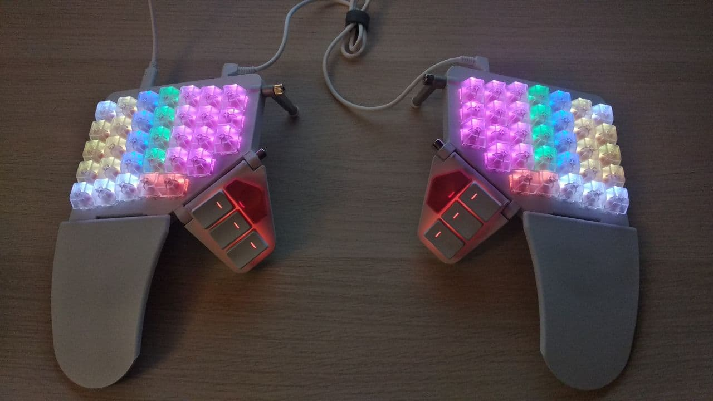

Так же есть прикольный режим подсветки, когда текущие нажатия подсвечиваются в режиме тепловой карты, можно использовать для записи видео для клавогонок: https://t.me/klavaorgwork/161127.

Так же ещё есть видео, где при помощи подсветки я объясняю как у меня работают некоторые клавиши, связанные с шифтом:

[](http://www.youtube.com/watch?v=ImsooykMguA "")

## Звуки

В данную клавиатуру встроен простенький пьезодинамик, так что можно играть разные прикольные звуки при нажатии определённых клавиш.

В частности у меня стоят звуки на:
* Переключение языка
* Нажатие клавиши выключения программы в консоли, и скриншота
* Включение слоя в режиме капс-лока (TG)
* Нажатие клавиши для смены метода переключения языка

Почти все эти звуки можно увидеть здесь: https://t.me/klavaorgwork/169552.

А ещё по дефолту есть звук при включении: https://t.me/klavaorgwork/161147

На что ещё можно поставить я не придумал, но в целом очень прикольно, когда какие-то твои действия происходит звук. Я уже привык что когда я нажимаю клавиши для выключения программы в консоли (<kbd>Ctrl+C</kbd>, но я себе поставил <kbd>Ctrl+J</kbd>, чтобы можно было копипастить в консоли, если интересно, смотри в [optozorax/dots](https://github.com/optozorax/dots#terminal)).

Так же, в клавиатуре есть музыкальный режим, когда каждая клавиша издаёт звук, но я не придумал как его можно применить, так что это поиграться на один раз: https://t.me/klavaorgwork/161165

## Переключатели, их смазка

Изначально я купил клавиатуру с переключателями: Cherry MX Brown RGB. Они довольно шумные, и по ощущениям я не почувствовал никакой особой тактильности, особенно когда печатаю на скорости. Плюс мне тактильность и не нужна, ибо я предпочитаю плоские клавы.

Благо в этой клавиатуре есть хот-свап! Это означает, что переключатели можно заменить без перепайки:

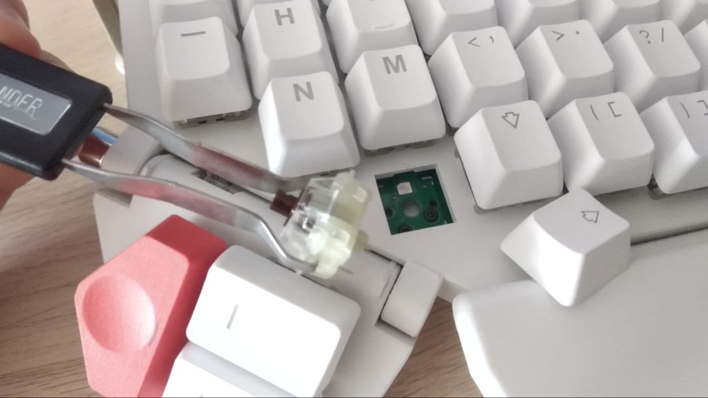

Поэтому я сразу зашёл на алишку и заказал переключатели Cherry MX Silent Red RGB. Я взял 100 штук, сразу с запасом, и это обошлось мне в 5к рублей.

Тут стоит отметить, что я захотел использовать резиновые кольца, которые ставятся под кейкап, чтобы уменьшить ход, и сделать клавиатуру тише. Я использовал прозрачные кольца, которые можно поставить максимум одну штуку под кейкап. С двумя он уже нажиматься не будет. На браунах это было нормально, но на сайлентах у меня частенько стали не прожиматься клавиши. И теперь стало заметно, что всё-таки позиция активации у браунов и сайлентов разная.

Плюс, меня хейтили чуваки из мехкульта за это, типо я уничтожаю саму суть механики, её тактильность, со своими кольцами. Но мне в целом безразлична механика. И кольца всё-равно пришлось снять из-за сайлентов. И хочу заметить, что от того, что я теперь должен прожимать клавиши до конца, у меня уменьшилось число ошибок, и в целом ощущения стали как будто я печатаю более точно. Так же после смазки, клавиатура стала тихая, и с такой тишиной ощущается как будто ход и не такой большой, но об этом далее.

Так же дополнительно я заказал смазку и так называемый Film - штуку, которая ставится между половинками свитча, чтобы свитч был тише. Ещё купил инструмент для разборки свитча за 700р.

Когда мне пришли сайленты, я заметил что они чуть-чуть менее громкие, чем брауны. Особенно громко было слышно как скрипит пружина, это было невозможно слышать. Но затем, когда я смазал их, и потестировал как они звучат, это было невероятно! Я всю жизнь относится крайне сомнительно ко всем этим вещам типа смазки свитчей, тактильности итд, но смазанные свитчи по-настоящему звучат тише. Плюс этот Film даёт немнооого тишины, да.

Видео где можно увидеть как звучат смазанные свитчи по сравнению с несмазанными: https://t.me/klavaorgwork/170818.

А вот здесь я вставил парочку смазанных свитчей в клаву: https://t.me/klavaorgwork/170824.

Печать текста на полностью смазанных сайлент редах: https://t.me/klavaorgwork/171013.

Так что если вас интересует тишина при наборе на клавиатуре, то первое что вы должны сделать - это купить смазку и смазать. Готовьтесь что это будет долго.

Так же, если вы всё-равно будете покупать сайлент реды, то не советую покупать мунляндер с браунами, ведь они по сути бесполезны. Лучше купить клаву хотя бы с голубыми кликающими свитчами, чтобы можно было поиграться, и на некоторые редкие кнопочки поставить кликающие свитчи.

Плюс, я как-то давно покупал на алишке тестер свитчей, и от него осталась такая пластмассовая подставка (которую можно увидеть здесь: https://t.me/klavaorgwork/170818), куда идеально вставлять разобранные свитчи, тоже советую купить что-то подобное. Поверьте мне, собирать эти свитчи в воздухе - не самое приятное занятие, плюс есть риск погнуть контакты.

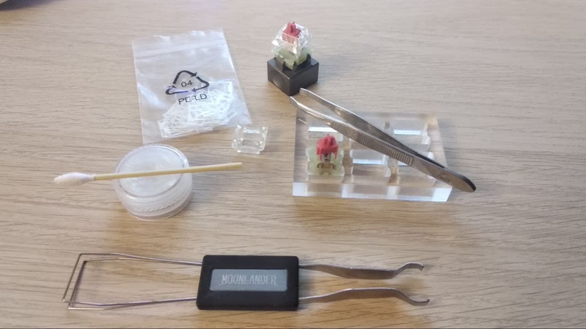

Ссылки на всё что я покупал:
* Тестер свитчей - 404, ищите новый :( Ничо не гарантирую.
* [Свитчи](https://aliexpress.ru/item/Original-Cherry-MX-Mechanical-Keyboard-Switch-Speed-silent-pink-axis-mute-shaft-RGB-SMD-switch/4000936545168.html?spm=a2g0s.9042311.0.0.223733edKALEIs&_ga=2.237861000.963229042.1609590679-1301360025.1609590679)
* [Смазка](https://aliexpress.ru/item/Advanced-Synthetic-Fluorine-Containing-Grease-Fusser-Film-Mechanical-Keyboard-Stabilizers-Switches-Gear-Grease-N15-19-Dropship/4000370062485.html?spm=a2g0s.9042311.0.0.223733edKALEIs&_ga=2.237861000.963229042.1609590679-1301360025.1609590679&sku_id=10000001511765831)
* [Открыватель свитчей](https://aliexpress.ru/item/Mechanical-Keyboard-Keycaps-Aluminum-Alloy-Metal-Switch-Opener-instantly-For-Cherry-mx-And-Kailh-Box-Gateron/4001115947996.html?spm=a2g0s.9042311.0.0.223733edKALEIs&_ga=2.237861000.963229042.1609590679-1301360025.1609590679)
* [Film](https://aliexpress.ru/item/Switch-film-for-mechanical-keyboards-DIY-cherry-mx-switch-gateron-switches/1005001365894792.html?spm=a2g0s.9042311.0.0.223733edKALEIs&_ga=2.237861000.963229042.1609590679-1301360025.1609590679&sku_id=12000015823827870)

## Транспортировка

Кидаю респект компании ZSA за то как они отнеслись к комплектации и вообще проектировке мунляндера. Если посмотреть на официальный сайт, то видно, что в комплекте идёт чехол, а подставки под руки сгибаются под клавиатуру.

Так же огромнейший плюс мунляндера - у него всего 2 ножки. В отличие от эргодокса, у которого 6 ножек. И если вы переносите эргодокс, то вам надо настраивать все 6 ножек, синхронизировать их с собой, чтобы клава не шаталась. Этим невозможно пользоваться. А на мунляндере ножку поставил и всё. Далее остаётся только поставить тамб-кластер в соотетствии с ножкой, и готово, клава идеально стоит.

Посмотреть как настраивается мунляндер можно в этом видео:

[](http://www.youtube.com/watch?v=Gs-kb3McXfU "")

Хоть мунляндер и огромный, но благодаря тому как он сделан, он крайне удобен в транспортировке. И да, так как я хожу работать в офис, мне всегда приходится его таскать с собой, на работу и обратно домой. Меня это устраивает, и я не собираюсь покупать вторую клавиатуру. И тем более не собираюсь печатать на СК.

# Раскладка

## Что такое слой

Напоминаю, что **слой** - абстракция в раскладке, которая позволяет при нажатии определённой клавиши иметь клавиши, отличные от текущих.

Прежде чем вообще начать рассказывать о раскладке, нужно подробнее объяснить концепцию слоя, потому что на ней всё строится.

Предположим, что у вас имеется обычная клавиатура, на которой при зажатии кнопки <kbd>Fn</kbd>, вместо некоторых клавиш появляются клавиши управления звуком:


Неадекватность СК ❌
> При этом видно, что помимо клавиш управления звуком и включения калькулятора, на этом слое, могло бы быть очень много полезных вещей. Да хоть те же самые стрелочки в домашней позиции. Так что, формально СК и использует слои, но делает это очень неадекватно.

Одним из важных свойств слоя является то, что если вы нажимаете другие символы - то они остаются собой. То что включается называется слоём. Клавиша, которая включает слой называется **слоефикатор**, по аналогии со словом модификатор. Слой можно включить двумя способами: 
* Чтобы он работал при зажатии клавиши - по аналогии с <kbd>Shift</kbd>. Далее этот вид слоефикатора будет обозначаться как <kbd>MO</kbd> слоефикатор, потому что так он записывается в QMK.
* Чтобы он включался и выключался по нажатию определённой клавиши - по аналогии с <kbd>Caps Lock</kbd>. Аналогично он будет обозначаться как <kbd>TG</kbd>.

[Страница документации по QMK про слои.](https://beta.docs.qmk.fm/using-qmk/software-features/feature_layers)

Вообще сама по себе клавиша <kbd>Shift</kbd> тоже в какой-то степени слоефикатор. При этом клавиши <kbd>Ctrl</kbd> и <kbd>Alt</kbd> нельзя назвать слоефикаторами, потому что они в каждой программе обрабатываются по-своему, а вот <kbd>Shift</kbd> можно, потому что обработка того как он меняет символы происходит на уровне ОС.

Аналогично, переключение языка в какой-то степени переключение слоя по <kbd>TG</kbd>.

С точки зрения терминологии операционной системы слой может обзываться как "3-й уровень клавиатуры". А реализовываться слой может через клавишу <kbd>AltGr</kbd>. [Статья, рассказывающая об этом.](https://habr.com/ru/post/419687/)

Но мне не нравится сочетание "3-й уровень", и вообще концепция слоя куда более абстрактная и чистая.

Плюс, разработчики операционных систем не очень далеко продвинулись в раскладкостроении, поэтому вряд ли у вас получится так просто через официальные инструменты создать себе слой.

Поэтому в основном все самые продвинутые люди хранят свои слои и вообще раскладки полностью внутри клавиатуры. Там это и легче сделается, и вообще это кросс-платформенно.

Кстати, у меня на картинках каждый слой имеет свой цвет, поэтому я для обозначения слоёв использую именно цвета. Слоефикаторы с цветным кругом работают через <kbd>MO</kbd>. А слоефикаторы с цветным квадратом работают через <kbd>TG</kbd>. 

## Выключение слоя на месте Esc

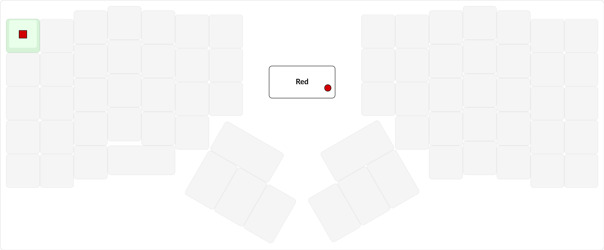

Я сделал, что при тройном нажатии на клавишу с кружочком, слой активируется как капс-лок. Это сделано, чтобы не плодить разных клавиш.

Если посмотреть на все мои слои, начиная с красного, то можно заметить у самой левой верхней клавиши находится закрашенный квадратик.

При помощи этой кнопки у меня выключается слой, если сейчас он был включён в формате `TG`.

Очень часто бывает такая ситуация, что слой включается через `TG` случайно, и когда ты продолжаешь долбить по клавиатуре на автомате, то нажимаются клавиши из этого слоя, и происходит что-то странное.

В таком случае хочется как можно быстрее это отменить, не думать что за слой был включён, и просто идти дальше - поэтому я расположил кнопку выключения слоя на положение кнопки Esc, потому что данная кнопка часто нажимается в случае "аааааа не хочу думать, просто отменись". 

У меня по такому принципу сделаны все слои, кроме Game, потому что там нужен обычный Esc.

## Каждому слою - своя картинка

Если вы взглянете на СК, где нанесены надписи на русском языке, то не зная клавиатуры, довольно сложно понять что при каком языке, при шифте, или слое нажимается.

Примерно такому же стилю следуют люди, которые рисуют свою раскладку для программируемой клавиатуры, где помимо двух языков может быть ещё два дополнительных слоя. Из-за этого им приходится сувать надписи в экзотические места, а иногда разукрашивать надписи разным цветом для разных клавиш.

Пример:

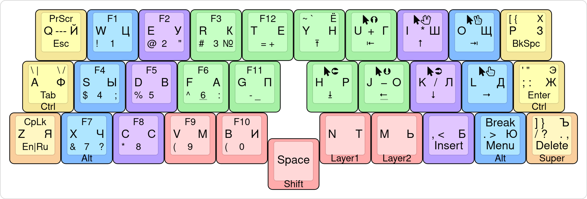

Взято с вики про клавиатуру [Коряга](http://klavarog.tk/page/клавиатуры/коряга). Справедливости ради стоит сказать, что автор в своей раскладке на KLE таки разделил всё на отдельные слои, я эту раскладку просто показываю как пример, как другие люди обычно делают, без разделения на слои.

Конечно, такие картинки раскладки крайне компактны, и напечатать их легко. Но мне такие картинки не нравятся совсем, потому что, во-первых нужно научиться читать что означает позиция символа с точки зрения автора картинки (а чего-то единого тут нету, все делают как хотят). Во-вторых если ты, незнакомый человек, хочешь посмотреть как выглядит конкретный слой, то у тебя будет очень много отвлекающих моментов, и ты не сможешь так просто найти то что тебе нужно.

Особенно этот подход становится неприменим, когда у тебя надо подписать комментарий к символу, или у тебя очень много слоёв. Именно поэтому я придерживаюсь философии: 

**Каждому слою - своя картинка.**

При этом, по идее, клавиши с зажатым шифтом и являются по сути отдельным слоем, но они отличаются только символом длиной 1, так что шифтовый слой можно размещать вместе со всеми остальными. Он не будет так сильно отвлекать. У меня на картинках то что нажимается при зажатом шифте показано серым цветом в правом нижнем углу клавиши. Вы можете заметить, что некоторые хоткеи при зажатом шифте нажимаются в другие хоткеи - а это уже моя хитрость, я отслеживаю шифт на этих клавишах и отменяю, чтобы хоткей нажался корректно.

Теперь, хоть у меня раскладка и будет длиною в километр, зато на ней всё будет понятно, и её можно будет оценить по отдельным составляющим.

## Зоны


Здесь цветами показаны зоны - какой палец какую клавишу должен нажимать согласно десятипалу. Тёмным цветом показаны клавиши домашней позиции, то есть где пальцы находятся по умолчанию.

Видно, что больше всего клавиш сначала у указательного, затем мизинца, затем большого пальца (мы его называем тамбом для краткости).

Оранжевым цветом показывается то, что нажимает тамб, и можно увидеть, что тамб нажимает не только клавиши из тамб-кластера, но ещё и две клавиши на не-тамб-кластерной части клавиатуры.

Белым цветом показываются те клавиши, которые не нажимаются из домашней позиции, и для их нажатия обязательно нужно сместить руку. Плюс эти клавиши могут нажиматься любым пальцем, будь то мизинцем, безымянцем или указательным.

Обилие клавиш с белым цветом в клавиатуре указывает на то, что клавиатура не очень удачная, ибо слишком часто надо смещать руку.

Так как я печатаю десятипалом, то у меня каждый палец нажимает строго те зоны, что ему предназначены. И ещё раз можно видеть, что правильная клавиатура куда более подходит для десятипала, чем СК.

## Основа

Итак, самый сложный и самый основной слой:


Немного про цвета сейчас и в будущем:
* **Красный** - те клавиши на обычной клавиатуре что не являются ни буквами, ни препинаками. Иными словами функциональные/управляющие клавиши.
* **Жёлтый** - препинаки. 
* **Синий** - макросы, которые нажимают какой-то хоткей.
* **Зелёный** - слоефикаторы; кружочки активируют слой как <kbd>Shift</kbd>, а квадратики как <kbd>Caps Lock</kbd>.
* **Ярко-зелёный** - модификаторы.
* **Фиолетовый** - клавиши, которые оказывают эффект только на клавиатуру. Например: подсветка.
* **Белый** - английские буквы.
* **Светло-голубой** - русские буквы.
* **Серый** - управление мышью.

### Аккорды

Здесь есть какие-то мелкие и перекрывающие друг друга клавиши, поэтому, пожалуй начну с них. И это - аккорды.

**Аккорд** - это почти одновременное нажатие нескольких клавиш, при этом порядок нажатия неважен. Более подробно на вики: [Аккорд](http://klavarog.tk/page/аккорды).

Самые простые аккорды - это те что находятся на зоне указательного пальца (розовый цвет),  и с цветными точками. Та клавиша, что находится между двух клавиш является аккордом, и активируется при одновременном нажатии двух этих клавиш.

Куда более сложные аккорды находятся на тамб-кластере, и тут нужно отдельное объяснение:

[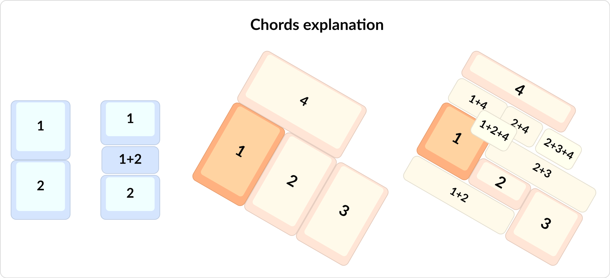](https://kle.klava.org/#/gists/2c45a0b833ca272d7b94fdc66a668af7)

Клавиши обозначаются числами 1, 2, 3, 4, а аккорды обозначаются как сумма этих чисел. В целом, если посмотреть на картинку, логику расстановки аккордов можно понять - они находятся между всеми клавишами, что нажимаются.

Вообще к аккордам я пришёл после того как довольно долго попечатал на клавиатуре [Кладенец](https://ibnteo.github.io/kladenets/README-RU.html). Свои успехи и скорость я описывал в канале в телеграме: https://t.me/kladenets_zorax.

В Кладенце активно использовались аккорды, когда две клавиши нажимаются одним пальцем, так как там существует только две клавиши на палец, то там может нажиматься одновременно две клавиши, мы называли это двукнопием. После Кладенца я понял, что двукнопие - не такая страшная вещь, как может показаться с первого взгляда.

Так же возможно ставить аккорды на различные пальцы, например: аккорд из двух клавиш, которые нажимаются указательным и средним пальцем. По сути, эти аккорды особо никуда не поставишь, кроме как на буквы. А на буквы их лучше не ставить, потому что может быть вероятность, что в каком-то слове появится биграмма, на которую я повесил аккорд, и так как я очень быстро печатаю, я не могу контроллировать когда я нажимаю клавиши практически одновременно, поэтому у меня может быть много ложных срабатываний аккордов. Одним из решением этой проблемы - печатать изначально медленно, либо замедляться на аккордах. А так как замедляться - не вариант для меня, я предпочёл не делать аккорды на буквах, и на нескольких пальцах.

_Идея_ 💡
> Правда, сейчас, во время написания этой статьи, я осознал, что можно поставить аккорды на препинаки, вверху, ибо никогда не бывает сочетания препинаков, например `#?`, поэтому на их аккорд можно повесить что-то отличное. Спасибо статья-уточка.

До того как я писал эту статью, я решил, что у меня все аккорды будут нажиматься одним пальцем, чтобы не было коллизий при печати букв.

А аккорды, которые нажимаются одним пальцем, требуют другого от печатающего: чётко прицелиться на середину между двумя клавишами, чтобы когда один палец нажимал, он смог прожать практически одновременно две клавиши. Поэтому аккорды на дву- и трёх-кнопия - это геометрическая проблема, а не синхронизационная. А на скорости как раз намного проще научиться целиться правильно, чем синхронизировать пальцы.

По этой же причине я не использую такую фичу QMK, под названием [Mod-Tap](https://docs.qmk.fm/#/mod_tap), потому что она как раз требует замедления и синхронизации пальцев.

Плюс, так как QMK слаб в плане аккордов, мне пришлось написать собственную библиотеку для их реализации. Об этом подробнее смотрите в папке [combo](combo).

Я использовал аккорды на тамб-кластере, чтобы уместить как можно больше полезных вещей поближе, и на основной слой, чтобы не было необходимости переключаться на какой-то слой, и синхронизировать два пальца друг с другом. А ещё потому что места на мизинцах заняты русскими буквами и препинаками.

Так же я немного использую аккорды на указательном пальце, потому что у него есть много клавиш, которые не являются буквами, и аккорды на нём не должны сильно замедлять печать.

Вообще в целом, аккорды эти нажимать довольно удобно, ибо на мунляндере клавиши по умолчанию широкие на тамб-кластере. Самые удобные - это те что нажимаются по две штуки, конечно, и те, что поближе.

А те, что на указательном - там я поставил кейкапы друг к другу спиной, поэтому при нажатии между клавишами у меня легко нажимаются две клавиши одновременно.

Так же я пытался купить себе пружинки с грамовкой поменьше, чем мои текущие свитчи, чтобы аккорды было проще нажимать, но к сожалению они до меня не дошли... И я устал ходить на почту раз в неделю и спрашивать есть ли что-то на моё имя. Советую вам никогда не покупать товары из-за границы без трек-номера. А если не знаете будет трек-номер или нет, напишите заранее на почту. Если не отвечают, значит лучше предположить что трек-номера не будет.

Конечно, для аккордов есть огромное поле для исследований по созданию специальных кейкапов, которые позволят нажимать две клавиши одновременно куда надёжнее.

_Идея_ 💡
> Либо есть другой вариант - чтобы свитчи стали выпускать намного более мелкими, например 30% от их текущего размера - тогда можно будет разместить очень много маленьких клавиш, которые имеют площадь той части подушечки пальца, которым мы касаемся клавиатуры. И благодаря этому можно вместо аккордов тупо разместить много клавиш между текущими клавишами. Кстати, это тоже невероятное поле для исследований. На той площади, на которой сейчас размещаются эти огроменные клавиши, можно разместить очень много маленьких клавиш, с биграммами или автозаменами. Интересно будет посмотреть насколько увеличится скорость человека, печатающего на таких клавишах. 
>
> Вот вам пример того куда расти правильным клавиатурам, и куда **никто** не копает. Как минимум, потому что нету технической возможности.

_Идея_ 💡
> Либо есть вариант сделать клавиши как с размерами 1x0.8 или 0.8x0.8 от текущих, потому что наши пальцы нажимают на клавишу не кругом, а эллипсом, и этот эллипс имеет примерно такие пропорции. С такими клавишами, цифроряд будет очень близко, и отпадёт необходимоть его убирать в клавиатурах типо Corne, Planck. Ведь при создании таких клавиатур как Corne, руководствуются логикой типо цифроряд далеко, и лучше все его клавиши засунуть в слой.
>
> Я когда-то делал даже концепт такой идеальной клавиатуры для себя:
>
> 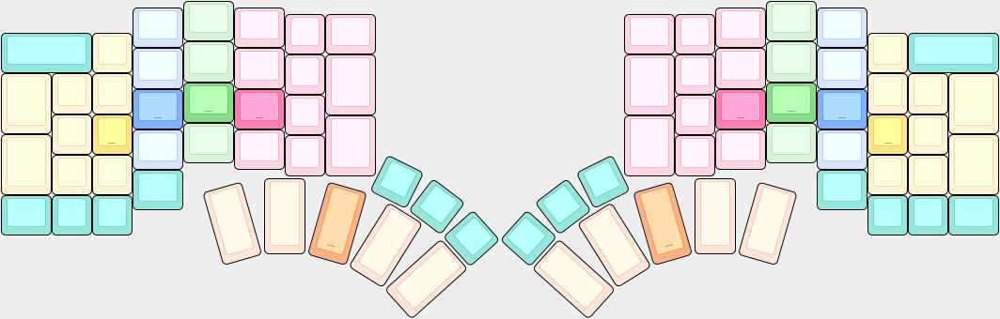
>
> Видно, что тут высота клавиш составляет 80% от оригинальной, и все клавиши для мизинца - маленькие, потому что мизинец сам по себе маленький.
>
> Плюс тогда я ещё использовал старые цвета, и в них бирюзовый цвет обозначает клавиши, которые не нажимаются из домашней позиции.

### Один шифт на большом пальце левой руки

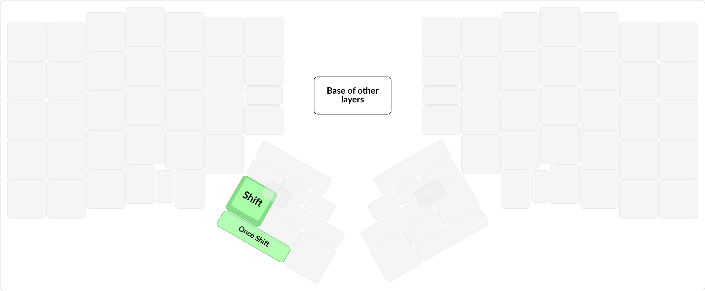

Это очень важный пункт. И это ещё одна **жирнющая** причина почему СК неадекватна для десятипала.

Далее и везде предполагается, что вы держите мышь в правой руке, если это не так, то инвертируйте зеркально все инструкции.

Для начала почему именно на левой руке. Потому что очень часто вы будете пользоваться мышью, и вам нужно будет что-то выделять, и клавиша шифт для этого используется очень часто. По аналогичной причине где-то на левой руке у вас должен быть голый <kbd>Ctrl</kbd>. Наличие контрола на левой руке даже важнее, чем шифта.

А теперь почему шифт должен быть именно на большом пальце. Изначально, на СК, все привыкли, что шифт находится на мизинце - нажимаешь его там и всё. И к сожалению очень много людей, кто покупает себе правильную клавиатуру, оставляют шифт на мизинцах, размещая на большие пальцы всякую бесполезную чушь.

Главный минус шифта на мизинцах - это когда ты нажимаешь шифт одним мизинцем, то у тебя блокируются все клавиши, что нажимаются этим мизинцем, и ты не можешь их нажимать согласно десятипалу. И тут есть два варианта:
1. Ты всегда нажимаешь шифт левым мизинцем, нажимая клавиши, которые должен нажимать мизинец, безымянным.
1. Только когда надо написать большие буквы, находящиеся в области левого мизинца, ты используешь правый шифт
1. Ты научился полностью соблюдать **правило шифтов** - нажимать шифт только той рукой, которая противоположна руке большой буквы, которую ты сейчас будешь нажимать

**Первый случай** плох тем, что тебе надо отучиваться от своей простой жизни, когда твой безымянный палец нажимает всего 4 клавиши, и обучать в определённых ситуациях нажимать ещё плюс несколько клавиш. При этом вся рука смещается, и попадать в новые места становится сложнее.

**Второй случай** плох тем, что правый шифт используется очень редко, и будет бесить обучаться нажимать правый шифт только для некоторых случаев. А плюс из-за их редкости могут частенько случаться ошибки. Или ты будешь нажимать левый шифт, а потом будешь осознавать, что не можешь нажать мизинцем нужную клавишу. В общем одна нервотрёпка.

**Третий случай** плох тем, что он живодёрский. Он не даёт скорость, не даёт безошибочность, он него получаешь только нервотрёпку, и +20% к сложности обучению печати. Зачем мучить себя? Плюс, на правильной клавиатура иметь два шифта - это значит тратить одно драгоценное место на основном слое на правый шифт.

А теперь если мы поставим шифт на большой палец, то у нас никакие буквы не блокируются, и у нас ещё появляется такая фича, что мы можем НАБИРАТЬ КАПСОМ БЕЗ ИСПОЛЬЗОВАНИЯ КНОПКИ КАПС ЛОК. 

Я кстати никогда не понимал этой кнопки. Если надо напечатать одно слово большими буквами, то включать и выключать эту кнопку - это очень сложно ведь с точки зрения выработки привычки. Особенно когда ты быстро печатаешь. Лично я всю свою жизнь для написания капса использовал шифт, и никогда капс лок. Так что это ещё одна причина выкинуть эту клавишу из клавиатуры к чёртовой матери, и сделать себе жизнь ещё проще, сократив число режимов (плюс, иногда она случайно нажимается, и прям бесит).

Конечно, случай с буквами на большом пальце отдельный, и я него не рассматриваю.

И всё это я понимал ещё до того как начал обучаться десятипалу, поэтому я в своей раскладке сделал шифт вместо кнопки альт ещё на СК. Конечно, тянуться было далековато и неудобно, но это было намного лучше, чем учиться правилу шифтов, и удобнее, чем нажимать мизинцем. Так что если вы печатаете на обычной клавиатуре - советую вам сделать жизнь проще, и тоже поставить шифт на большой палец.

Далее в заголовке говорится что шифт должен быть один, потому что а зачем нужен второй, если одного на большом пальце достаточно? Плюс, это тема следущего пункта.

### Залипающий одиночный шифт


На картинке можно увидеть <kbd>Once Shift</kbd>, который нажимается аккордом. Данный шифт является одновременно: залипающий, и одиночным.

**Залипающая клавиша** - это такая клавиша, которая при зажатии её с другими клавишами работает как обычный модификатор, а при единичном её нажатии и отпускании, применяется к одной следующей клавише.

Залипающие клавиши могут быть удобны, например, чтобы нажимать очень сложные хоткеи, не делая из пальцев твистер (игру). Тогда нужно запрограммировать модификаторы, чтобы они не применялись к другим модификаторам.

Залипающий шифт - это очень удобная вещь, позволяет считать шифт буквой, а не модификатором. Отсюда и соотетствующие бонусы по удобству набора.

Но это не совсем правда, и залипающий шифт от буквы отличает то, что если при зажатии держать шифт слишком долго, он применится сразу к нескольким клавишам: "ПРивет". Поэтому необходимо сделать так, чтобы даже шифт держится на протяжении всего слова, он применялся только к первой букве. Это и есть свойство **одиночности**.

Теперь <kbd>Once Shift</kbd> считается полноценной буквой, и может набираться таким же образом.

Изначально, как только я купил эргодокс, я сделал залипающий шифт. Но к одиночному залипающему шифту пришёл только в 2020 году, когда начал с нуля программировать раскладку для мунляндера.

Вообще залипающий и одиночный залипающий шифт очень полезны при наборе на скорости. Ибо на скорости неприятно контроллировать, что ты шифт нажимаешь только для одной клавиши, и вообще что какую-то клавишу с ним зажимаешь. И это замедляет, а одиночный залипающий не замедляет. Разве что нужно аккорд нажимать, но это не проблема.

Плюс, такой шифт может быть удобен при наборе `camelCase`, `PascalCase` имён идентификаторов.

### Долой правые модификаторы

Все модификаторы на моей раскладке обозначаются ярко-зелёным цветом.


Вообще, мне за свою жизнь никогда не пригождались правые модификаторы. Обычно все хоткеи работали и на левых модификаторах, и ещё во времена СК, я их выбросил. 

Собственно, сейчас жизнь не поменялась, и правые модификаторы всё ещё не нужны. Поэтому они у меня в раскладке отсутствуют в принципе, и все модификаторы только левые. Чего и вам советую сделать. Плюс, это сильно экономит место.

Вообще, мне кажется, что правые модификаторы возникли только ради симметрии с шифтом, которого было два, и который не додумались вставить на большой палец ещё на печатных машинках. Так что и с исторической точки зрения они не имеют особого смысла.

### Backspace рядом с домашней позицией


Снова вспоминаю раскладку некоторых людей, и у них бэкспейс находится на том же месте, что и на СК.

Как я уже говорил, десятипалу не нравится, когда вы смещаете руку далеко от домашней позиции. Поэтому вредно ставить такую частую клавишу как бэкспейс так далеко от домашней позиции.

Я поставил бэкспейс на большой палец левой руки. Но с тем же успехом его можно поставить на место Капс Лока, что я и сделал в своей первой раскладке на СК.

Главное тут - поставить его поближе.

Так же у меня в раскладке рядом с бэкспейсом стоят аккордом две очень важные клавиши: <kbd>Delete</kbd> и <kbd>Ctrl+Backspace</kbd>.

Бэкспейс и Delete лучше ставить на левую руку, так как они снова пригождаются при работе с мышью.

Delete пригождается при работе в редакторах, где удаление назначено именно на эту клавишу. Я кстати никогда этой клавишей в печати не пользуюсь, ибо привык всё делать бэкспейсом. Если надо удалить следующий символ, то стрелочки в помощь. Так что я бы вообще за удаление этой клавиши и переназначение всех удалений на бэкспейс, и переименование бэкспейса в Delete. Но что поделать, история вставила свои палки в колёса.

Следом идёт <kbd>Ctrl+Backspace</kbd> - он стирает сразу всё слово. Эта клавиша является неизвестной необходимостью. Особенно её ценность я осознал, когда начал использовать в клавогонках, и за счёт чего я сильно ускорился. Эта клавишу я по частоте нажимаю примерно часто как и обычный Backspace, если не чаще.

Часто ошибка в слове происходит не в последнем символе, а в середине. И стирать бэкспейсом три символа - уже долго, ибо нажатие одной и той же клавиши три раза долго само по себе. А потом ещё надо прочитать что ты написал, понять где ошибка, как исправить, и всё это на скорости. Да это дико медленно! И как бы парадоксально это не звучало, чаще всего быстрее тупо стереть всё слово, и напечатать заново. На стирание слова тратится одно нажатие, а печатается заново очень быстро, ибо ты как раз и учишься быстро печатать слова.

Да, кстати, надо отметить, что <kbd>Ctrl+Bacspace</kbd> - это одна клавиша (ну, аккорд), и **я не зажимаю <kbd>Ctrl</kbd>**, чтобы нажать бэкспейс. Это вообще называется макрос. И об этом тема следущих пункта.

История 🛋️
> При этом рядом с Delete y меня лежит Ctrl+A. Но благо они оба на аккордах, и случайно последовательно их нажать нельзя. А раньше обе этих клавиши лежали рядом, без аккордов.
>
> И из-за этого однажды на работе я случайно удалил все файлы в папке на гугл-диске к которому мне дали доступ.
>
> Попытки восстановить:
> * Кнопка "отмена" на всплывшем уведомлении об удалении упала с ошибкой.
> * Корзина пустая.
> * Поддержка гугла не смогла ничего восстановить.
>
> Уроки, которые я из этого извлёк:
> * Не ставьте рядом кнопки Ctrl+A и Delete
> * При шэринге ссылки не давайте права на редактирования тому, кому они не >нужны
> * Не пользуйтесь гугл-диском!!!
> * Лучше не работать когда ты спал 4 часа

#### Самые частые сочетания с контролом - на основной слой

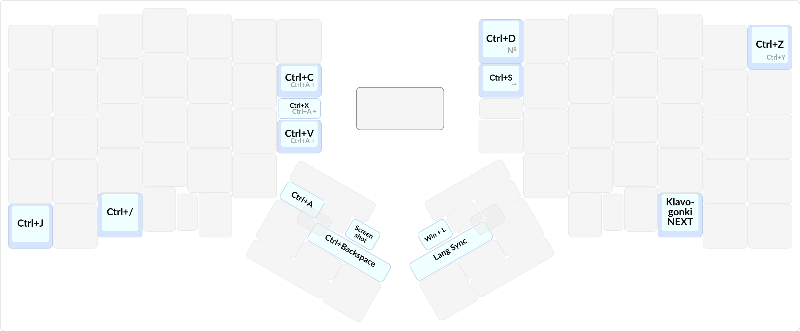

Начнём с копипасты. По сути, сейчас во всех программах копипаста спокойно работает на <kbd>Ctrl+CV</kbd>. Но некоторые особо одарённые программы (терминал, emacs) на эти хоткеи делают что-то совсем другое, и кажется как будто с этим ничего не сделаешь. На самом деле сделаешь, и в терминале можно переназначить копипасту на <kbd>Ctrl+CV</kbd>, перенеся убийство программы на другое сочетание. Я выбрал <kbd>Ctrl+J</kbd>. [Здесь](https://github.com/optozorax/dots#terminal) написано как это можно сделать.

Копипаста делается настолько часто, что только она может повлиять очень сильно на частоту использования клавиши <kbd>Ctrl</kbd>. Поэтому копипасту как отдельные клавиши можно вынести на хоткей, например в слой, или на основной слой.  Что я и сделал с самого появления эргодокса. У меня копипаста лежала на этих дальних клавишах для указательного.

Для <kbd>Ctrl+A</kbd> я тоже держу отдельную клавишу, чтобы выделять весь текст. Так же, можно заметить, что у меня при зажатом шифте на копипасте добавляется <kbd>Ctrl+A + ...</kbd>, что означает, что при зажатом шифте, и при нажатии на хоткей <kbd>Ctrl+C</kbd>, сначала перед ним делается <kbd>Ctrl+A</kbd>, это позволяет мне за два нажатия выделить весь текст и скопировать его. Аналогично с <kbd>Ctrl+A + Ctrl+V</kbd>, и <kbd>Ctrl+A + Ctrl+X</kbd>. И копирование всего и вставка вместо всего - невероятно частые вещи, особенно когда из одного маленького поля копируешь в другое маленькое поле.

Так же можно заметить, что у меня <kbd>Ctrl+X</kbd> находится на аккорде между <kbd>Ctrl+C</kbd> и <kbd>Ctrl+V</kbd>. В целом это довольно удобно, и клавиша экономится.

Далее, <kbd>Ctrl+Z</kbd> у меня размещается симметрично <kbd>Esc</kbd>, потому что и смысл у них симметричный. И когда происходит что-то неладное, фигачить по этой самой крайней кнопке очень удобно. Плюс, с зажатым шифтом, <kbd>Ctrl+Z</kbd> превращается в <kbd>Ctrl+Y</kbd>, что является повторением отменённого действия.

Следующая очень частая клавиша (пожалуй самая частая вообще среди всех хоткеев у меня) - <kbd>Ctrl+S</kbd>. Я настолько параноик, что постоянно нажимаю <kbd>Ctrl+S</kbd>, чтобы сохранить файл, поэтому она у меня такая частая, и я решил вынести её на основной слой на отдельную клавишу, чтобы успокоить свои нервы. Она нажимается в 1.5% все нажатий вообще. Так же эта клавиша используется в расширении `Rust Enhanced` в моём `Sublime Text 3`, чтобы сохранить файл и передать его на проверку компилятору, чтобы моментально вывести ошибки, так что теперь это не только клавиша для успокоения нервов.

В самом краю у меня находится клавиша <kbd>Ctrl+J</kbd> для убийства текущей программы в консоли.

Ещё один полезный хоткей - <kbd>Ctrl+/</kbd>, который в `Sublime Text 3` комментирует выделенный участок кода.

Следующий хоткей - <kbd>Ctrl+D</kbd>, который используется в `Sublime Text 3` для создания множественного курсора из текущего выделения.

Ну и конечно, <kbd>Ctrl+Bacspace</kbd>, о котором я рассказывал ранее.

На этом всё. Самые частые комбинации с контролом рассмотрены, вам я советую из этого подчерпнуть только то как я поставил копипасту, <kbd>Ctrl+ZY</kbd> и <kbd>Ctrl+Backspace</kbd>.

### Не использовать модификаторы настолько, насколько это возможно


Плюс такой философии в том, что не нужно запоминать какой модификатор и как нажимается, нужно запомнить для каждой клавиши лишь её действие, и пользоваться как чем-то высокоуровневым.

Знаете, на правильных клавиатурах, люди обычно размещают модификаторы на больших пальцах, и даже могут дублировать их на оба больших пальца, чтобы им удобно было зажимать хоткеи в своих любимых IDE.

Мне эта идея не нравится по двум причинам:
* Я не хочу нажимать одновременно много клавиш двумя большими пальцами
* Я не хочу тратить лакомое место на больших пальцах или помещать модификаторы на мизинцы
* Я не хочу помнить хоткеи

Поэтому я пришёл к другой философии, когда я стараюсь сделать свою работу на клавиатуре такой, чтобы хоткеи из модификаторов использовались примерно никогда. Этого можно достичь, если самые частые хоткеи поместить на макросы, и создать слои специально для них.

При этом, так как я больше не завишу от положения модификаторов, я могу не ставить их в самые лакомые позиции, теперь у меня в самых лакомых позициях должны быть только слоефикаторы. 

Так же я могу переместить хоткеи куда я хочу, сделать своё удобство, без модификации программ.

И ещё от меня не требуется нажимать сразу много модификаторов, чтобы выполнить какое-то сложное действие, максимум может быть одна зажатая клавиша - слоефикатор.

И ещё, я теперь запоминаю что конкретная клавиша в конкретном слою делает, и мне не нужно держать в голове каким же хоткеем она нажимается.

Из-за этого, я практически не использую клавиши <kbd>Ctrl</kbd>, <kbd>Win</kbd>, <kbd>Alt</kbd> и их комбинации. Всё уже помещено на слой в виде макроса.

А благодаря прошлому пункту мы ещё и отобрали от клавиши <kbd>Ctrl</kbd> примерно 90% его использования.

Следующий шаг - расположить все полезные хоткеи на нужные слои. Об этом будет далее рассказно при рассмотрении следующих слоёв. У меня всё прекрасно получилось, у меня не так много хоткеев, и я чувствую себя замечательно. 

Говорят, что во всяких emacs хоткеев столько, что никаких 32 слоёв не хватит, чтобы их все разместить. Благо я снова не пользуюсь emacs'ом.

Так же у меня всё же есть модификаторы на больших пальцах, и я их даже засунул наиболее частые их комбинации в аккорды, но я их никогда не использовал, хотя пусть будут на всякий случай, ибо идей что туда полезнее можно поставить, у меня нету.

Плюс, я решил проблему альтернативных раскладок и модификаторов - у меня при зажатии любого модификатора (кроме <kbd>Shift</kbd>), включается английский слой, и это можно видеть даже по подсветке. Благодаря чему даже если мне хоть раз в жизни и надо будет нажать какой-то хоткей вручную, то я нажму его независимо от текущего языка.

### Точка, пробел, запятая

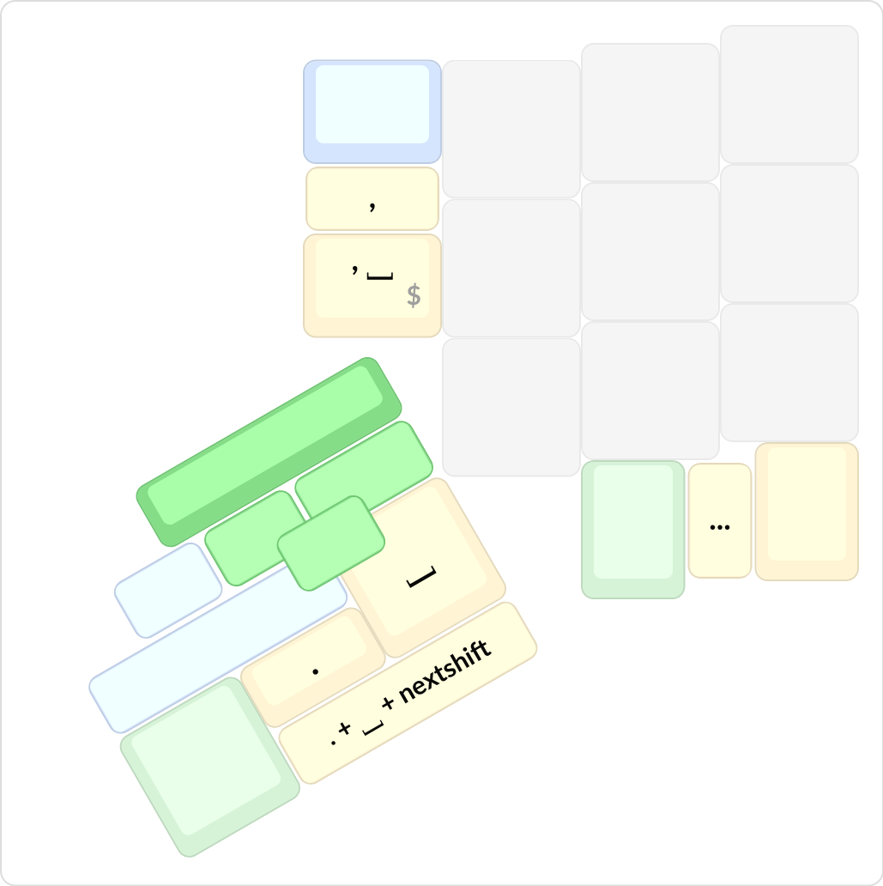

Эти препинаки стоит рассматривать отдельно от остальных препинаков.

Хочу заметить, что у меня все эти препинаки нажимаются _независимо_ от языка! Будь то английский или русский, все они будут работать одинаково.

#### Запятая

Во-первых стоит отметить, что запятая практически всегда пишется с пробелом после неё. Даже в программировании. Поэтому у меня в первую очередь запятается пишется сразу с пробелом после неё. Конечно, бывают случаи, когда запятая нужна без пробела, и это у меня стоит на аккорд.

#### Точка

А теперь такая интересная клавиша <kbd>. + ⎵ + nextshift</kbd>. Она нажимается аккордом. При её нажатии посылается сначала точку, затем пробел, а затем в клавиатуре записывается информация, что к следующей клавише нужно применить шифт. Это нужно для печати текстов на естественном языке, где чаще всего точка ведёт себя именно так. Кстати, зацените как красиво эта клавиша нажимается как аккорд точки и пробела ^\_^.

Но даже в русском языке есть точки в неожиданных местах: в прямой речи, и в `и т.д.`, `т.е.`. А ещё есть программирование. Поэтому нужна отдельная клавиша для обычной точки. И она у меня вынесена на нажатие без аккорда.

Ещё отдельно вынесено многоточие, но его довольно неудобно нажимать.

Так же раньше у меня запятая была рядом с троеточием, на большом пальце, но к сожалению пришлось оттуда убрать в пользу слоефикатора красного слоя.

Раньше, до мунляндера, у меня точка различалась для русского и для английского. На русском точка по умолчанию была с автошифтом и пробелом, а на английском без. Поэтому я не мог печатать на клавогонках английский, и не особо развивался в скорости по нему. Плюс на русском я частенько спотыкался, когда нужно было нажать точку без пробела.

А сейчас, когда сделал эти препинаки вот так удобно, для всех языков одинаково - это сказка.

#### Пробел

Остался пробел, связанный с всеми этими тремя клавишами. Он у меня **строго** один, и на правой руке.

По поводу того на какой руке должен находиться пробел - я не знаю, на правой вроде как норм. Раньше я нажимал пробел левым большим пальцем - потому что играл в игры, но затем при создании своей первой раскладки для СК переучился нажимать его правой, чтобы не было коллизий с шифтом, который на альте. И это соханилось до сих пор, так же это позволяет НАБИРАТЬ КАПСОМ С ЗАЖАТЫМ ШИФТОМ И С ПРОБЕЛОМ. Для игр у меня есть отдельный слой, где пробел находится на левой руке.

А теперь почему пробел один. Как вы помните, на СК пробел очень длинный, и вообще это единственная клавиша для двух больших пальцев. И это ещё один важный пункт, почему СК неадекватна для десятипала. Одна клавиша на целых два очень сильных и очень подвижных пальца - это грубейшая ошибка.

Кстати, так как некоторые не печатают пробел двумя пальцами, то десятипал на СК нельзя назвать десятипальцевым методом печати полностью, а говорят что используется 9 пальцев.

И эта грубейшая ошибка СК приводит людей к тому, что с большим пальцем делать особо нечего. Поэтому они придумали ещё одно живодёрское правило - **правило пробелов**. Оно по аналогии с правилом шифтов заставляет тебя нажимать пробел противоположной рукой от последней нажатой клавиши. Соответственно к нему применима аналогичная критика правила шифтов.

С одной стороны, это правило может показаться разумным, если узнать, что пробел - **самая** частая клавиша на клавиатуре. По моей статистике она нажимается в 8% случаев от всех нажатий.

Но на самом деле это не так страшно, и все скоростные наборщики нажимают пробел одним пальцем, и всем норм. Я, как наборщик со скоростью 700, полностью их поддерживаю. Пробел не представляет никаких проблем. Большой палец силён.

Возьмите, например, словарь "соточка" на клавогонках. Там частота пробела ещё выше из-за того, что слова намного короче. Но люди всё-равно делают там запредельные скорости, нажимая пробел одной рукой. Если вам кажется, что именно пробел замедляет вас в этом словаре, то с практикой это быстро проходит.

Ну а если вам правило пробелов и способно что-то дать, то эффект этого будет находиться в рамках погрешности измерений, или в рамах эффекта от плацебо. Настоящего практического эффекта от этого не видно.

Поэтому мне очень больно видеть, когда люди покупают себе правильную клавиатуру, и лакомое место на большом пальце тратят на второй пробел для второй руки.

### Одинаковые препинаки в английском и русском языке


По сути это расширение предыдущего пункта про точку-пробел-запятую.

Тут важно отметить, что препинаки в цифроряде нажимаются без шифта, и числа - с шифтом. Это сделано потому что препинаки в программировании и тексте всё-таки встречаются намного чаще, чем числа, а нажатие шифта создаёт неудобства, так что лучше их минимизировать.

Раскладка, которая для русского языка просто выносит все препинаки в цифроряд без нажатия шифта, а числа делает с нажатым шифтом называется "Русская машинопись". А раскладка, которая ещё делает цифры в таком причудливом порядке, называется "Programmer Dvorak".

Аналогично, до перехода на мунляндер, у меня препинаки были различны как для русского, так и для английского языков. Я, конечно, старался расположить всякие `!?*` на одинаковых местах, но этого было недостаточно, чтобы не спотыкаться каждый раз об другие препинаки. Особенно мне не хватало символа `` ` `` в русском языке, чтобы использовать его в Markdown.

А переключение языка, хоть и на одну клавишу, но неприятно.

На эргодоксе у меня не было особой мотивации этим заниматься, потому что там я свою прошивку наговнокодил, и не хотел вставлять в неё патч, или переписывать с нуля. А покупка новой клавы стала поводом сделать всё сразу хорошо.

С технической точки зрения, чтобы сделать одинаковые препинаки для русского и для английского языков, нужно сделать следующее: если ты сейчас находишься на русском языке, и хочешь нажать символ `#`, то нужно на момент нажатия этого символа включить английский язык, нажать его, а затем вернуть на предыдущий. Аналогично с английским.

Примерно так и я и сделал, и теперь у меня практически все препинаки находятся в основном слое на цифроряде и по бокам. 

Особенно хочу здесь отметить символ `_` (положение на левом мизинце), который нажимается без шифта, и который симметричен `-`. Такая симметрия очень красива, и я его невероятно часто использую для набора `snake_case` идентификаторов в программировании.

Так же у меня не стоит шифтового варианта на `_` и на `-`, чтобы можно было набирать: `SCREAMING_SNAKE_CASE` и `КАПС ЛОК С ДЕФИСОМ - ЭТО ХОРОШО` не отпуская шифта.

Так же можно заметить, что у меня среди препинаков отсутствуют скобочки всех видов. Они к сожалению находятся в слою, и о них позже.

Так же важно заметить, что из-за отсутствия таба, шифта и капс-лока весь второй столбец у мизинца становится свободным. Куда я разместил все необходимые препинаки. Про шифт и капс лок понятно, а таб я утащил в слой, и об этом будет сказано при рассмотрении красного слоя.

Я вынес это в отдельный модуль [lang_shift](lang_shift), который может использовать любой русскоязычный человек.

### Непонятное положение цифр

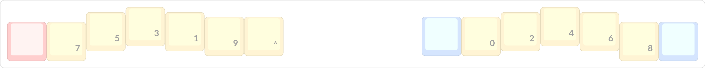

Да, вы можете заметить, что у меня цифры-то как-то странно располагаются. Всему виной раскладка Programmer Dvorak, где цифры изначально располагались в таком порядке. 

Когда я поставил эту раскладку, я принял такие цифры, и переучился под них. Не так это сложно, так что норм.

Они расположили цифры таким образом, чтобы чётные были на одной руке, а нечётные на другой, типо чтобы максимизировать чередования рук при наборе чисел.

Так же очень важной фичей такого расположения цифр становится то, что самые частые цифры: 0, 1, 2, 9 находятся на указательных пальцах. И вот это реально удобно! Знаете, нажимать 1 и 0 мизинцами - такое себе удовольствие.

Так что я оставил такие же цифры, как в раскладке Programmer Dvorak, и для русского тоже, и пользуюсь до сих пор, и пока не вижу причин переучиваться.

Есть ещё вариант создать отдельный слой для цифр - и расположить их как в нумпаде, или ещё как лучше, но мне это не нужно, ибо числа не так часто набираю, и могу их поместить в цифроряд.

Интересное расположение цифр в слою под домашней позицией можно посмотреть в клавиатуре [Сагарис](https://github.com/bouncepaw/sagaris).

### Отдельная клавиша для переключения языка

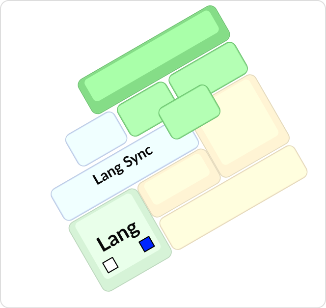

Одна из самых первых вещей, которую ты должен сделать при покупке правильной клавиатуры - это поставить хоткей переключения языка на одну кнопку.

Ведь это удобно. Во время использования СК, ещё до раскладки под неё, я переключал язык по <kbd>Ctrl+Shift</kbd>, так как сидел на винде. И было очень неприятно, когда у тебя это сочетание не прожалось и ns gbitim rfre.-nj ytgjyzny. abuyz./ Jcj,tyyj ,jkmyj 'nj joeoftncz? rjulf ns yt cvjnhbim yf 'rhfy? f cvjnhbim njkmrj yf rkfdbfnehe? b nfrjq yfgbcfk njyye ntrcnf? f gjnjv cvjnhbim? b e nt,z dtcm ntrcn d такой белиберде. Благо существуют сервисы наподобие [swopper](https://swoper.ru/resultB.php). Ты же, надеюсь, знал о таком, и не переписывал эту тонну текста?...

Поэтому переключение языка по одной кнопке - это сказка. Но встаёт вопрос а каким именно хоткеем переключать, когда ты пользуешься другой ОС, или другим компом? Ну тут можно просто запрограммировать ещё 4 клавиши, и засунуть их куда-то далеко, которые будут делать следующее:
* При нажатии клавиши 1, кнопка для переключения языка будет посылать <kbd>Caps Lock</kbd>
* Аналогично с <kbd>Alt+Shift</kbd>, <kbd>Ctrl+Shift</kbd>, <kbd>Win+Space</kbd>.

У меня такие кнопки находятся в слою "на случай ядерной войны".

Ещё я обозначаю кнопку для переключения языка зелёным цветом, потому что считаю что переключение языка - это тоже смена слоя. Она показывает что перманентно включается либо русский, либо английский язык.

Ну и как я говорил, у меня клавиша для переключения языка издаёт звук при срабатывании.

Так же рядом с кнопкой переключения слоя есть хоткей <kbd>Lang Sync</kbd>. А для объяснения что он делает, нужно объяснить как вообще язык прошивается в клавиатуру.

Итак, к сожалению, по умолчанию клавиатура не поддерживает отправку юникодных символов прямо на компьютер. Это можно делать только с установкой дополнительного софта. Клавиатура может посылать только положения текущей клавиши, которое потом операционная система транслирует в конкретный символ в зависимости от текущего языка.

Ещё одно сожаление - это текущий язык нельзя узнать внутри клавиатуры. Тоже снова придётся устанавливать какой-то софт, чтобы через костыли (а именно индикатор <kbd>scroll lock</kbd>) можно было его узнавать.

Поэтому единственным способом сообщить клавиатуре какой сейчас язык - это сказать ей лично, нажав нужные клавиши.

Конечно, в большинстве случаев, клавиатура может автоматически менять язык у себя внутри, когда ты нажимаешь клавишу <kbd>Lang</kbd>.

Но иногда бывают такие случаи что язык рассинхронизируется между клавиатурой и между компьютером по разным причинам: случайное нажатие хоткея переключения языка и неизвестные науке причины. Поэтому существует такая клавиша <kbd>Lang Sync</kbd>, которая посылает хоткей переключения языка без переключения языка внутри клавиатуры. Соотетственно, для двух языков это хорошо работает.

Более подробно об этом всём можно почитать в [lang_shift](lang_shift).

Другой вариант того, что можно сделать с языками - это сделать две отдельные клавиши <kbd>ENG</kbd> и <kbd>РУС</kbd>, которые безусловно переключают текущий язык на английский и русский соотетственно. Если сейчас стоит русский язык, то клавиша <kbd>РУС</kbd> ничего не сделает. И при таких клавишах можно даже не помнить какой сейчас язык в системе, ты просто каждый раз перед тем как печатать текст, нажимаешь клавишу языка, на котором будешь печатать, и не тратишь мыслетопливо.

Идея взята с клавиатуры Вольки - [Кошки](http://catboard.klava.org/ru.html).

### Отдельная клавиша для скриншота области

Вы можете заметить что у меня на большом пальце левой руки, на трёхкнопном акорде находится клавиша <kbd>Screenshot</kbd>. Данная клавиша делает скриншот выделенной области.

Согласно моему внутреннему ощущению, можно прмерно сказать что в 95% случаев нужен именно скриншот области, в 4.9% скриншот окна, и в 0.1% скриншот всего экрана. Именно поэтому у меня в основном слое лежит клавиша для скриншота области.

И данная клавиша должна лежать именно на левой руке, снова из-за мыши.

Данная клавиша использует информацию о том, какой сейчас хоткей используется для переключения языка, ибо в зависимости от переключения языка можно сказать какая сейчас система - Windows или Linux.

На Windows я использую стандартное сочетания для снятия области - <kbd>Win + Shift + S</kbd>. На Linux я скачал программу `flameshot`, и поставил туда хоткей, который вызывает команду `flameshot gui`.

Именно по этой причине у меня клавиша <kbd>Print Screen</kbd> присутствует только на слое на случай ядерной войны, то есть для этих 0.1% случаев.

### Слоефикаторы на большом пальце

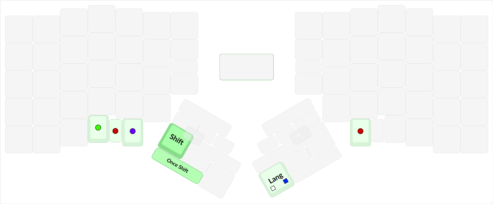

Все частоиспользуемые слоефикаторы у меня находятся на большом пальце. Сделано это именно для того, чтобы минимизировать блокирования клавиш, которые я не могу нажать.

Не частоиспользуемые слоефикаторы у меня находятся в области, которая не нажимается из домашней позиции.

Для начала нужно сказать про красный слоефикатор - вообще самый важный слоефикатор на клавиатуре, ибо там находятся стрелки. Он находится на большом пальце правой руки. Сделано это так, чтобы можно было одновременно зажимать шифт и стрелки, которые у меня тоже находятся на левой руке.

Ещё красный слоефикатор можно нажать как неудобный аккорд на большом пальце левой руки. Это нужно, чтобы во всяких редакторах можно было левой рукой нажимать стрелки, или во время просмотра фильма или видео промотать на десять секунд вперёд одной левой.

Потом идёт фиолетовый слоефикатор - для включения слоя управления окнами.

И ещё зелёный модификатор для управления браузером и с медиа-клавишами.

Обо всех этих слоях будет сказано подробно далее.

Раньше у меня красный и зелёный слоефикаторы находились на левом мизинце, в дальнем столбце, по историческим причинам, потому что на СК я сделал раскладку, где клавиша <kbd>Mod</kbd> была не левом мизинце.

В целом, нету ничего страшного в расположении слоефикаторов на дальний столбец у мизинцев, нужно только учесть, что в этом слою нельзя помещать клавиши на мизинец, который нажимает данный слоефикатор, и желательно ничего не помещать на безымянец, ведь он чуть-чуть смещается из-за мизинца. А вот на указательный и средний той же руки уже можно помещать что хочешь.

Так же красный слоефикатор на левом мизинце хорошо сочетается с шифтом на левом тамбе, и стрелками на правой руке.

На этом самый сложный базовый слой законен - ура! Дальше проще и короче.

## Языки

### Фонетическая раскладка

Фонетическая раскладка - это такая раскладка, которая стремится расположить все буквы одного языка так, чтобы они были созвучны буквам другого. Например, существует [английская раскладка JCUKEN](https://habr.com/ru/post/98745/) - фонетическая от стандартной русской ЙЦУКЕН.

Обычно советуют использовать фонетическую раскладку чтобы потратить меньше времени на обучение или переобучение десятипалу. А вот какую раскладку брать за основу, каждый решает сам.

Конечно, о удобстве фонетической раскладки для набора текста скорее всего лучше не думать, потому что русский и английский язык работают не одинаково. Но если вы очень редко печатает на русском или на английском, то можно рассмотреть такой вариант.

Я же не использую фонетическую раскладку, потому узнал о её существовании только после того как научился десятипалу на нормальной скорости, да и я готов учиться отдельно английскому и отдельно русскому ради удобства.

### Кастомные раскладки и модификаторы

Существует такая проблема, что с кастомными раскладками неудобно нажимать хоткеи. Существует две причины:
* На русском при зажатии модификатора клавиатура не такая же как на английском
* Человек привык нажимать все хоткеи на qwerty, но у него стоит кастомная английская раскладка

Меня волнует именно первый случай, и он у меня решён тем, что при зажатии любого модификатора (кроме <kbd>Shift</kbd>), у меня только на время зажатия включается английский язык и английский слой. Таким образом, даже если я и буду нажимать модификаторы, то они у меня всегда будут такие, как будто сейчас английский язык.

Причём, так как некоторые программы не воспринимают хоткеи на русском языке, у меня ещё на время нажатия кнопки посылается комбинация для включения английского языка.

### Английский язык


По умолчанию у меня включён английский язык, как и во всех системах по умолчанию. Я обозначаю английский белым, а русский синим.

Изначально на английском языке у меня был дворак для программистов, затем на эргодоксе я его немного модифицировал в плане препинаков, и ещё сильнее модифицировал его на мунляндере.

Так как точку и запятую я унёс на большой палец, у меня освободилось место в верхнем ряду у левой руки. Туда я передвинул клавиши Y и X под более удобные положения. Ещё у меня осталось 4 свободных местах, в одно из которых я засунул большую букву `I`, чтобы минимизировать нажатия шифта. А в другие свободные места засунул клавиши, которые делают из букв такие штуки: "àáâã", которые пригодились мне один раз при катании итальянского на клавогонках. Хотел бы я туда поместить препинаки для программирования, но нельзя, ибо они должны быть одинаковы для русского и для английского, чтобы не спотыкаться об них. А на этих местах стоят вполне себе важные клавиши на русском языке, так что убрать их из русского нельзя.

На английском я сейчас печатаю с максимальной скоростью около 550 символов в минуту.

По поводу самой раскладки не знаю что сказать. Я особо английский не катал на скорость, и с этой точки зрения оценить его не могу. Так же я не могу сравнивать его с qwerty, ибо на qwerty я печатал только динамикой, а это совсем другое.

### Русский язык


А вот этот язык я очень сильно катал на скорость, и мне есть что сказать.

Во-первых стандартная раскладка ЙЦУКЕН неверна для десятипала. Она плоха тем, что у неё самые частые клавиши расположены на указательных пальцах, согласно стандартным десятипалым зонам. А когда очень много букв набираются всего двумя пальцами - это очевидно замедление, так как остальные пальцы простаивают, хотя могли бы заниматься полезной работой.

Плюс, последовательные нажатия одним пальцем (ПНОП'ы) - сами по себе неудобны, и долговаты. Чтобы преодолеть это, на слим клавиатурах используют скольжение.

В какой-то момент я осознал что является ключом к скорости - [⭐Перекаты⭐](http://klavogonki.ru/forum/academy/15353/).

Я хотел разработать свою самую перекатную раскладку, но у меня до этого никак руки не доберутся.

Поэтому я начал с малого - переставил местами 2 буквы на ЙЦУКЕН. А именно, первой я сделал перестановки Щ⬌Н, Ш⬌Т. Благодаря этим перестановкам число перекатов должно было возрасти очень сильно, ибо добавились самое частое сочетание ТО к перекатам. 

Спустя какое-то время я достиг прошлой скорости, но на это уже у меня ушло около месяца. Буквы куда сложнее даются, чем любая переделка раскладки.

Затем я вытащил буквы КМ на домашнюю позицию, а ЕИ поставил поближе на одну клавишу: сначала К⬌Е и М⬌И, а затем Ф⬌К и Ы⬌М. От этого тоже число перекатов значительно увеличилось.

Сейчас я имею ЙЦУКЕН с небольшими модификациями, которые максимизируют перекаты, и на этом я достиг максимальной скорости 718 символов в минуту на клавогонках. В специализированном словаре, который состоит исключительно из перекатных слов я достиг скорости 821 символ в минуту.

#### Ё

У меня под эту букву выделена отдельная **удобная** клавиша. И я **всегда** пишу Ё, когда она присутствует. Отношусь я к этой букве так не по личным причинам, а по глобальным. Есть слова, у которых от наличия Ё меняется смысл: `всё` и `все`, и парсить этот смысл из контекста не очень приятно, а иногда и невозможно. Ё обязательно нужно писать, потому что иначе для слов `еж`, `черный` надо писать транскрипцию, которая говорит что там написано `йож` и `чорный` соответственно. А я не хочу, чтобы русский превращался в очередной английский с этими транскрипциями. Я как раз английский и ненавижу за транскрипции, и считаю что _Прекрасный Искусственный Язык Будущего_🇦🇶 обязан писаться так же как и произносится.

И поэтому с буквой Ё существует только два последовательных варианта:
* Отказаться от неё полностью и писать `йож`, `чорный`, `всьо`.
* Писать Ё там, где она произносится.

Ещё у меня есть ощущение что в 21 веке люди так невзлюбили букву Ё, потому что кто-то подумал, что лучше ей будет располагаться в очень далёком месте, чтобы до неё было лень тянуться. Мне кажется, если бы Ё располагалась где-то в удобном месте, то на порядок больше людей использовали бы её, и она бы не попала в статус официально не обязательной буквы.

Ещё я считаю, что буква Э неадекватно заменяется на Е в некоторых словах, например: `стэйк`, `хэдэр`. Так как я считаю, что язык можно и нужно менять согласно твоему личному мнению, то всегда пишу Э там, где она слышится.

#### Ъ

Этой букву тоже досталось много, ещё одна далёкая буква на мизинце, но хотя бы не официально не обязательная.

[Клавиатура Jian](https://github.com/KGOH/Jian-Info) уважает эту букву настолько, что даже имеет в для неё специальный отросток:


У меня раньше Ъ лежал там, где сейчас находится минус, то есть выше Э. Но для того чтобы иметь языко-независимый минус в удобном положении, пришлось засунуть Ъ на аккорд.

Хорошее отличие Ъ в аккорде от Ъ в слою в том, что я могу без проблем набрать его с зажатым шифтом.

Уже по прошествии времени я могу сказать, что нажатие Ъ через аккорд меня не беспокоит, и на этой букве не замедляюсь.

Ещё один вариант что можно сделать с Ъ - это засунуть его в слой. Но делать это не очень удобно по нескольким причинам:
* Если надо набрать большой Ъ, то надо зажимать две клавиши! А если слоефикатор находится на той же руке, что и шифт, то это практически невозможно.
* Если решать проблему двух слоефикаторов тем, что делать две кнопки в слою: маленький Ъ и большой Ъ, то это вообще некрасиво, неудобно и несимметрично.
* Если Ъ находится в слою, к которому имеет доступ английский язык, то это не очень красиво.
* Нажать слоефикатор во время набора слова - очень медленно, как и нажать шифт во время набора слова. Вот цифры в слою - это другое дело, они от  текста обычно отделяются пробелом, поэтому есть время на подготовку.

## Красный слой


Начинается самое интересное. Итак, красный слой - это слой для всего самого полезного, что не поместилось на основной. В частности здесь находятся:
* F-клавиши
* Таб
* Стрелки и все клавиши передвижения
* Оставшиеся препинаки
* И прочие хоткеи/макросы

Почему-то некоторые люди считают, что им нужна правильная клавиатура не только с цифрорядом, но ещё и с рядом для F-клавиш. Вам это не нужно, люди. Зачем отдельный ряд для F-клавиш, если можно их положить в самый ближайший слой на цифроряд. Если боитесь за хоткеи, то можно сделать отдельный слой с хоткеями на эти клавиши. Всё просто.

F-клавиши я поместил так же, как и цифры, ибо я уже выучил что где лежит, а на клаву подсматривать не могу.

Так же тут может показаться что я разместил все скобочки в неправильном порядке: они должны быть `()`, а не `)(`. На самом деле, для левой руки всё верно, ибо скобочки я всегда набираю парой, и потом захожу внутрь стрелкой. А если набирать парой, то нужно чтобы пара набиралась `()` вот так.


И тут встаёт такая проблема, что если разместить скобочки `()` визуально, то чтобы их набрать на левой руке, нужно сделать перекат от центра к краю, а это неудобно, куда удобнее нажимать как движением стаккато - от мизинца к указательному. Поэтому скобочки находятся в таком порядке.

Я не люблю автокомплит скобочек, потому что у него очень много лишних раздражающих срабатываний. Уж лучше его отключить, и заплатить цену писать закрывающую скобочку самостоятельно.

Ещё, так как у меня появилось свободное место, я добавил самые частые сочетания с знаками треугольных скобочек.

<kbd>Tab</kbd> и <kbd>Shift+Tab</kbd> я разместил в слою, потому что хотел сэкономить место на основном слое, чтобы там поместились все препинаки. Да и в целом хотелсь чего-то нового.

Так же ещё у меня лежит отдельный макрос для набора [turbofish из раста](https://turbo.fish). Очень часто пригождается.

И есть отдельный макрос для набора `#[]`.

Ещё у меня есть отдельная клавиша <kbd>Ctrl+Enter</kbd> чтобы удобно было отправлять сообщения во всяких телеграмах итд, ибо я люблю нажимать <kbd>Enter</kbd> для написания нового абзаца, и вообще писать большие сообщения в мессенджерах.

На левой руке на втором столбце мизинцев и указательных у меня лежат хоткеи для упрощения жизни в Sublime Text 3.

Ну а теперь, последняя тема в этом слое, и самая важная в правильных клавиатурах

### Стрелки в слое, на домашней позиции левой руки, ширины 4

Возможность иметь стрелки в слою - это одна из самых главных возможностей, которые может вам предоставить правильная клавиатура.

Так же это ещё одна из причин почему СК неадекватна для десятипала.

#### Home, End

Изначально, я вообще не знал что это за клавиши такие: <kbd>Home</kbd>, <kbd>End</kbd>, и накогда их не использовал. Но затем, в 7 классе школы, у нас началось программирование, и наш учитель во время того как мы пишем код, ходил и смотрел как мы это делаем. Когда он замечал, что люди для передвижения до конца строки используют стрелки, он говорил им обязательно нажимать <kbd>End</kbd>. И так он заставлял нас использовать эти кнопки, и ещё <kbd>Home</kbd>, <kbd>Delete</kbd>.

За это я очень благодарен нашему учителю, без него я бы наверное очень долго доходил до того что эти кнопки можно использовать и что они бесконечно удобны в работе.

Получается, что <kbd>Home</kbd> и <kbd>End</kbd> были для меня неизвестной необходимостью.

#### Статистика

Для начала хочу предоставить статистику, которую я собирал со своей клавиатуры при помощи [klavarog/heatmap](https://github.com/klavarog/heatmap), ссылка на статистику: https://t.me/klavaorgwork/154628.

Частотность красного слоя: `17.04%`.

Клавиша включения красного слоя: `4.5%`
```
 Name   Taps Percent
Space 637350   8.13%
    о 376177   4.80%
MO(4) 353057   4.50%
```

Видно, что клавиша включения красного слоя занимает `4.5%` от всех нажатий, и находится на третьем месте. Чаще нажимается только русская О и пробел. При этом, нужно отметить, что если зажимается клавиша включения красного слоя, то в этот момент может быть нажато много стрелок (<kbd>Down</kbd> + <kbd>Down</kbd> + ...). То есть включение красного слоя равносильно перемещению руки на стрелки, если бы стрелки были не в слою, а где-то далеко, как на СК.

Частотность стрелок: `58.92% * 17.04% = 10.03%`
```
 Name   Taps Percent
 Down 278392  20.83%
   Up 247413  18.51%
 Left 143400  10.73%
Right 118343   8.85%
```

Частотность других клавиш для перемещения: `9.98% * 17.04% = 1.7%`
```
     Name   Taps Percent
      End  73547   5.50%
     Home  51320   3.84%
  Page Up   4423   0.33%
Page Down   4096   0.31%
```

Частотность стрелок с контролом: `14.78% * 17.04% = 2.52%`
```
       Name   Taps Percent
  Ctrl+Left  99319   7.43%
 Ctrl+Right  96027   7.18%
    Ctrl+Up   1138   0.09%
  Ctrl+Down   1119   0.08%
```

Итого все клавиши для перемещения составляют `14.25%` от всех нажатий на клавиатуре.

#### Почему стрелки должны быть в слое

Существует несколько способов куда можно поставить стрелки: 
1. В слой
1. Раскидать их на разные руки на основной слой
1. Положить их в определённое место, куда рука обязательно будет смещаться с домашней позици.

Пример для пункта 2:

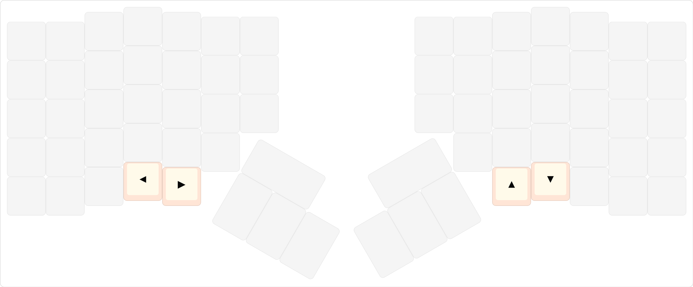

Пример для пункта 3:

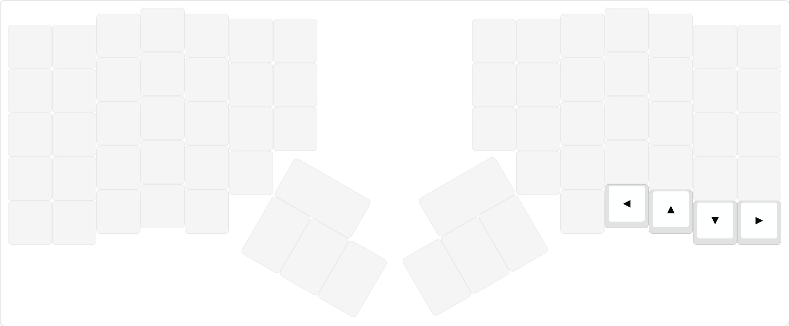

[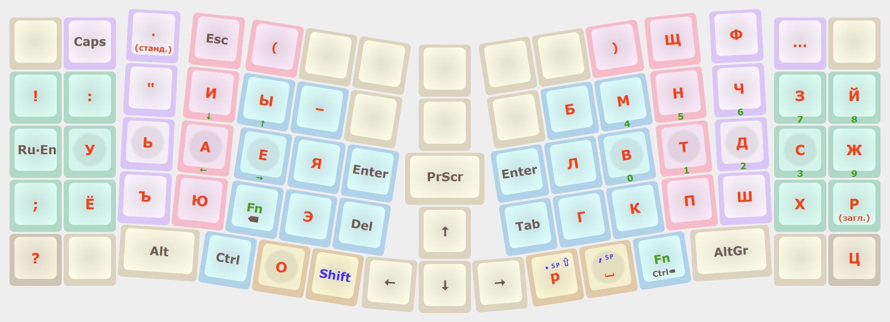](http://klavarog.tk/page/раскладки/оптима)

Так же примером для пункта 3 является СК.

Начнём с рассмотрения, почему 2 пункт является не очень хорошим:
* Стрелок много, и их особо некуда ставить, кроме как на мизинцы или на большие пальцы. При этом нужно учесть, что очень часто используются стрелки + шифт, и стрелки + контрол. И иногда бывают стрелки+шифт+контрол.
* Целых 1.7% нажатий составляют другие виды управления клавиатурой, которые всё-равно придётся засунуть в слой.

Обычно, при редактировании текста, а особенно при редактировании программы, очень часто приходится передвигаться по тексту при помощи стрелок: передвинулся на две строки выше, выделил с помощью стрелок текст, скопировал его, передвинулся на две строки вниз, вставил, передвинулся вбок, стёр, написал новый текст и готово. То есть стрелки нажимаются как часть набора текста. И, как видно по статистике, происходит это очень часто, в `4.5%` процентов от всех нажатий. И каждый раз для такого случая смещать руку - это ужасно.

Поэтому третий пункт тоже плох. Хотя, вторая картинка для 3 пункта взята из раскладки реального человека. Он решил, что ему будет удобнее иметь стрелки в основном слою. Но он и не занимается программированием, а как говорит, любит стрелками просто передвигаться по тексту. То есть у него стрелки работают не так, как у программистов. Так что тут тоже нужно смотреть на свой воркфлоу.

Ещё есть аргументы против стрелок в слою - это то, что при просмотре фильма или видео хочется передвигаться стрелками без использования двух рук, просто одной что-то нажимать.

Для такого случая можно сделать две вещи:
1. Чтобы стрелки были на левой руке, и где-то на левой руке был слоефикатор, чтобы их активировать
1. Чтобы были дубликаты стрелок, которые созданы специального для этого случая
1. Чтобы был слой специально для просмотра фильмов, где на левой руке будут и стрелки, и синхронизация субтитров, и найстрока звука, и всё что хочешь.

В частности я реализую первый пункт: у меня стрелки находятся на левой руке и существует слоефикатор, который нажимается через аккорд, при помощи которого я могу во всяких редакторах или фильмах легко нажимать стрелки, держа при этом правую руку на мыши.

#### Форма стрелок: 4×1 vs перевёрнутая T

Для тех кто не знал - если нажимать стрелки с контролом, то они перемещаются по словам.

Итак, в основном существует два лагеря стрелок. Первый лагерь - стандартные стрелки в форме перевёрнутой буквы T:


Второй же лагерь использует плоские стрелки, формата 4×1.

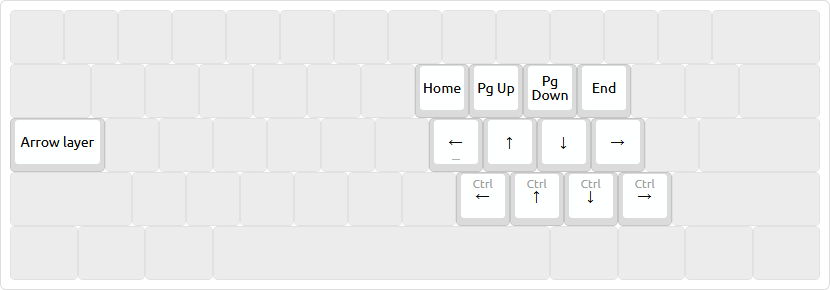

Видно, что второй вариант хорош во всём:
* <kbd>Home</kbd>, <kbd>Pg Up</kbd>, <kbd>Pg Down</kbd>, <kbd>End</kbd> симметричны стрелкам снизу
* Снизу от стрелок есть стрелки с зажатым контролом

Обоими этими свойствами не обладает первый вариант. Но первый вариант является знакомым, правда он знаком только расположением стрелок, но не всех остальных символов.

Стрелки с зажатым контролом это ещё один пример неизвестной необходимости. 

Можно возразить: зачем нужны стрелки с зажатым контролом, если, собственно, можно зажать контрол? Тут возникает две проблемы:
* А если сейчас выделяется текст, то чем нажимать контрол? Если уже зажат слоефикатор и зажат шифт. Тогда надо выносить кого-то на мизинец, либо нажимать это аккордом. И ещё надо находить для контрола удобное место.
* А если нужно передвинуться всего несколько раз по словам, а потом по одному символу? Тогда надо отжимать и нажимать снова контрол. А как известно, необходимость зажимать клавишу на определённый промежуток времени сильно тормозит и чревато ошибками синхронизации.

А когда имеется отдельные клавиши с уже зажатым контролом, то чтобы их нажать единственное что нужно сделать - это просто нажать пониже. Всё. И таким образом можно невероятно быстро передвигаться по словам и по символам одновременно. Особенно это становится актуально при длинных именах в программировании. Или при редактировании текста проще 3 раза нажать влево с контролом, чем 20 раз просто стрелкой влево, или чем зажимать стрелку влево, и высчитывать момент когда она разгонится и остановится.

Плюс, при зажатии кнопки передвижения по словам вбок, передвижение происходит намного быстрее, чем при зажатии кнопки передвижения по символам.

Если хочется, то можно ещё сверху, на цифроряде разместить <kbd>Ctrl+Home</kbd>, <kbd>Ctrl+End</kbd>. <kbd>Ctrl+Pg Up</kbd>, <kbd>Ctrl+Pg Down</kbd> тоже можно, но это настолько частая комбинация, что мы о ней поговорим на зелёном слое.

#### Стрелки с повтором

_Идея_ 💡
> Иногда даже передвижения по словам работают медленно, потому что встречаются кучи препинаков, и передвижение по словам превращается в передвижение по символам. В таком случае я бы хотел иметь клавиши "5 раз влево" и "5 раз вправо".

Но даже если реализовать такую функцию прямо сейчас, то она не будет работать при зажатии такой клавиши: то есть при зажатии она сможет работать как обычная стрелка, медленно передвигаться, по одному символу в единицу времени, а не в 5 за единицу времени. А обычный QMK слаб для таких фич. Поэтому надо сделать фичу которую давно делал Волька в Кошкоклаве - собственный повтор внутри клавиатуры, а не на стороне ОС. Пока такое только в планах.

#### Использовать мизинец для стрелок или нет?

Следующее о чём нужно поговорить, это использование мизинца. Некоторые боятся, что мизинец слишком слабый палец, чтобы нажимать такую частую вещь как стрелку влево. Напоминаю, что у меня на всех картиках стрелки расположены полностью на домашней позиции, то есть мизинец нажимает стрелку вбок, и указательный нажимает стрелку вбок.

Наверное по этой причине, стрелки в виме выглядят следующим образом:

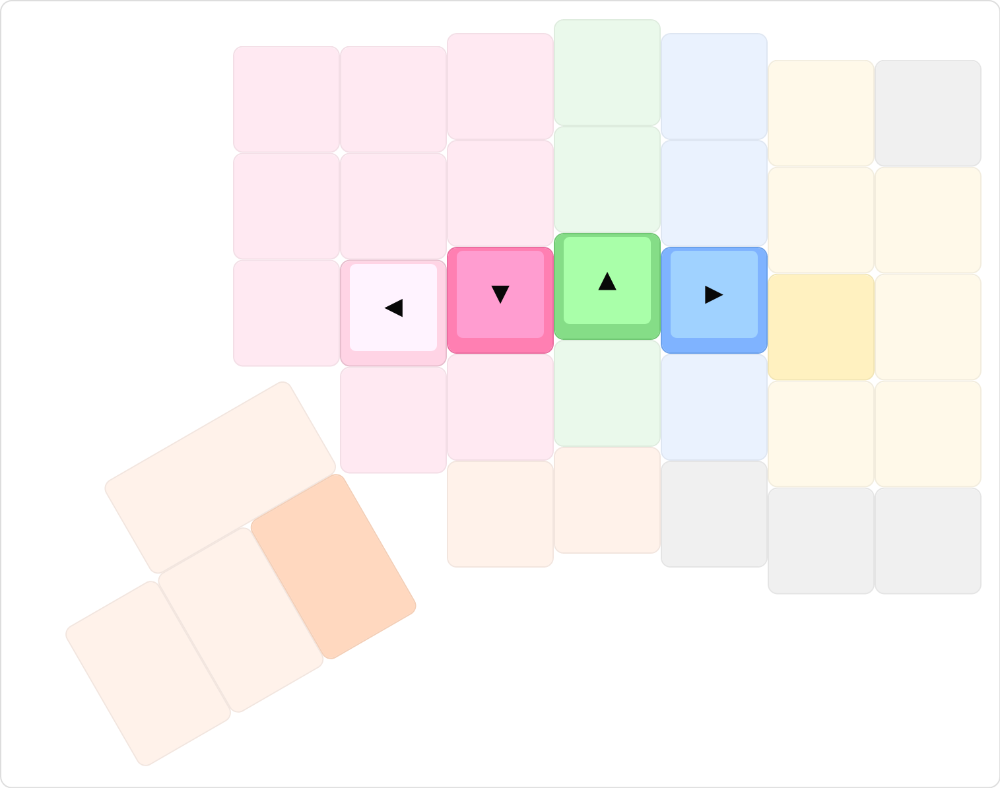

То есть две стрелки находятся на одном указательном пальце, и мизинец не нажимает ни одну.

Я считаю что неудобно будет каждый раз смещать указательный вбок, когда нужно передвинуться влево. А влево-вниз вообще боль наверное в виме для десятипала.

Так что тут ничего сложного нету, твои мизинцы могут быть сильными, нужно лишь немного практики. Я тоже сначала думал, что эти пальцы неспособны ничего нажимать.

#### ←↓↑→ или ←↑↓→?

В этом вопросе я считаю что кнопка вверх должна быть на среднем пальце, так как он очень привык к этой кнопке во времена <kbd>WASD</kbd>, или во времена стрелок на СК.

Получается переучивать придётся только два пальца: мизинец и безымянец.

По поводу того насколько сложно переучиться на такие четырёхпальцевые стрелки - я не помню, ибо сделал это с самого начала. Видимо несложно, раз я не запомнил этот процесс.

#### Стрелки на левой руке, вместо правой

И последнее что нужно сказать про стрелки - это как их разместить на левой руке. Они у меня на ней выглядят так:

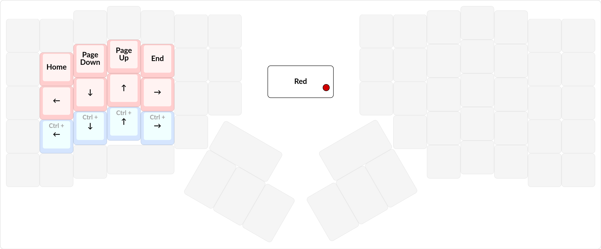

По поводу клавиш вверх-вниз понятно почему я их так разместил, а вот над клавишами влево-вправо я действительно думал как их лучше. Чтобы визуально было правильно, или чтобы сохранилось что мизинец ходит вправо, а указательный влево? Как оказалось, запутывает именно второй вариант, поэтому я разместил стрелки так, как проще всего визуально, и это оказалось удобно. И это симметрично с вправо-влево на с WASD.

До покупки мунляндера я больше 4 лет печатал со стрелками на правой руке, и тут я переместил их на левую руку, наверное мне было сложно переучиваться? Первое время да, у меня эти стрелки на подкорке уже лежали, а тут они неожиданно разместились на левую руку. Но в целом привык довольно быстро. Это всяко проще чем на другое положение букв переучиваться. Так что ничего в этом сложного нету.

Я разместил стрелки на левую руку для того, чтобы при использовании мыши я мог использовать стрелки. Но как потом оказалось, на самом деле не так часто это пригождается, и в целом я бы мог и не переучиваться. Так что их нахождение именно на левой руке не так важно. Зато теперь я могу перематывать видео одной рукой, и в редакторах использовать стрелки для перемещения на одну единицу длины.

## Зелёный слой


Этот слой содержит всё что не поместилось в красном, и всё ещё может быть полезно:
* Клавиши управления звуком и текущим треком.
* Хоткеи для браузера. Причём я настроил, чтобы большинство этих хоткеев работало так же и в текстовом редакторе и терминале.
  * <kbd>Ctrl+W</kbd> - закрыть текущую вкладку.
  * <kbd>Ctrl+T</kbd> - открыть новую вкладку.
  * <kbd>Ctrl+Shift+T</kbd> - восстановить предыдущую.
  * <kbd>F5</kbd> - перезагрузить страницу.
  * <kbd>Ctrl+F5</kbd> - перезагрузить страницу с очисткой кэша.
  * <kbd>F6</kbd>, <kbd>Ctrl+C</kbd> - перейти в адресную строку и скопировать адрес.
* Хоткеи для перемещения по вкладкам. По умолчанию эти хоткеи работают и в Sublime, и в Терминале, что очень удобно. <kbd>Ctrl+Tab</kbd> плох тем, что он по умолчанию в некоторых программах переключает не вправо-влево, а согласно истории посещения вкладок (а это отвратительно).
  * <kbd>Ctrl+Pg Up</kbd> - переместиться на вкладку влево.
  * <kbd>Ctrl+Pg Down</kbd> - переместиться на вкладку вправо.
  * <kbd>Ctrl+1</kbd>, <kbd>Ctrl+2</kbd> - переместиться в первую группу вкладок или на вторую в Sublime.
* Клавиши управления мышью
* Кнопка RESET - для перепрошивки клавиатуры

## Фиолетовый слой


Для начала нужно сказать что я отказался от сочетания <kbd>Alt+Tab</kbd>. Сделал я это потому что когда я пытался быстро передвигаться между окнами, то как я ощущал какое окно было прошлым, постоянно отличалось от реальности, поэтому у меня было много ошибок переключения между окнами.

А зажимать альт, чтобы передвигаться между окнами по табу - это трата мыслетоплива, ибо надо смотреть что там за программы, искать тебе нужную, думать, отвлекаться.

Это медленно и раздражает. Поэтому я пришёл к **безусловному переходу в окно**. Безусловный переход - это когда я нажимаю клавишу Sublime, и независимо от истории посещения окон, у меня открывается Sublime.

На Windows такое возможно сделать, если в панели программ расположить закреплённые программы в определённом порядке. Тогда нажатие <kbd>Win+1</kbd> будет включать первую программу в этом списке и так далее. На Ubuntu та же самая история.

Но на Linux я предпочитаю использовать для безусловного перехода программу jumpapp. Более подробно можно об этом почитать в [dots#gnome](https://github.com/optozorax/dots#gnome).

Теперь я могу перемещаться безусловно в одну из основных программ, и их можно видеть на картинке слоя. Так же я добавил хоткеи для:
* Закрытия окна
* Перехода на папку вверх в проводнике (<kbd>Alt + Up</kbd>)
* Переименования выделенного файла (<kbd>F2</kbd>)
* Безусловного перемещения на воркспейсы 1, 2, 3. И то я ими не пользуюсь.

Видно, что у меня тут набор хоткеев довольно прост. Хотя казалось, такой замороченный человек как я должен пользоваться каким-нибудь тайловым менеджером, или хотя бы иметь побольше хоткеев для управления окон. Но нет, я по большей части для остального управления окнами использую мышь, благо на Pop!\_OS это довольно удобно, и без боковой панели.

### Как я не осилил i3

i3 - это такая программа, которая управляет окнами в общем смысле: их перемещением, открытием, закрытием. И она позволяет размещать окна таким образом, чтобы они касались друг друга по краям - это называется тайлинг. Более подробно на [официальном сайте](https://i3wm.org) или в [видео](https://youtu.be/j1I63wGcvU4).

Я давно слышал о такой штуке как i3, которая позволяет тайлить окна, и управлять всем через хоткеи. Как-то раз я решил перейти на этот i3, установил себе линукс рядом с виндой, поставил его туда, настроил идеальную раскладку для i3, и начал пользоваться. Вот такую раскладку я тогда спроектировал:

[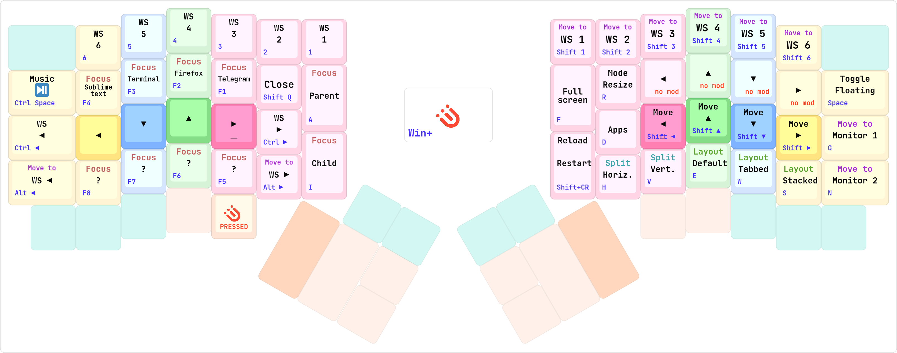](https://kle.klava.org/#/gists/eb7b88463f8c778d151f423f6b184c28)

Казалось бы, я так всё продумал, все хоткеи настроил.

А потом оказалось, что я совсем не люблю, когда окно телеги разворачивается на весь экран, или вообще на половину экрана. Я люблю когда телега висит в виде мелкого окошка, чёрт знает где посреди экрана.

А этот i3 ещё всякие мелкие окошки настроек открывает на половину экрана. И мне это дико не понравилось. Плюс, я тратил слишком много мыслетоплива на то, чтобы эти хоткеи освоить и быстро выравнивать окно как нужно.

В общем всё свелось к тому, что я тупо перестал запускать линукс, потому что было слишком сложно и больно этим пользоваться.

Всё изменилось, когда я снёс этот линукс, и вернул как всё было, красивую графическую оболочку с гуём и управлением мышью. Всё-таки этот i3 не для меня. Винда меня испортила.

## Жёлтый слой

Это слой управления подсветкой, тут ничего интересного, просто вынес всё что меня когда-либо может заинтересовать подсветкой в один слой на всякий случай.


## Слой для игр

Игры - это такая вещь, которая предполагает что у вас СК. А некоторые игры даже на дают возможности ремапить клавиши. Так что лучше для игр отдельно создать специальный слой где эта СК будет имитироваться. Для переписывания в чатиках можно придумать какие-нибудь клавиши, включающие нормальный слой.

Я в игры практически не играю, поэтому слой у меня не идеально отточен.

Советую вам на все такие особые случаи создавать свои слои.


Например, можно создать отдельный слой для фотошопа. Или вообще можно купить/собрать отдельную клавиатуру, где будут расположены самые частые макросы - макропад.

## Слой на случай ядерной войны


Слой с самым интересным названием хранит самые неинтересные клавиши. Тут находится то, что я намеренно выкинул отовсюду, и что не имеет особо смысла, но раз в жизни, в случае ядерной войны, может пригодиться.

А именно здесь находится:
* Весь нумпад и его клавиши (некоторые программы работают исключительно на цифрах нумпада).
* Все модификаторы, даже правые.
* Всякие бесполезные <kbd>scroll lock</kbd>, <kbd>caps lock</kbd>, <kbd>pause break</kbd>, <kbd>insert</kbd>.
* Клавиши, которые задают каким хоткеем сейчас будет переключаться язык. Пожалуй это - единственные активно используемые клавиши в моей клавиатуре. Ибо иногда я пользуюсь виндой, и клавиатуре надо об этом сказать.

Вообще паттерн такого слоя "на случай ядерной войны" - это удобный паттерн, и его можно иметь независимо от клавиатуры или типа личности. Туда удобно сбрасывать весь мусор.

# Технические детали

## Как ты сделал эту раскладку?

Компания ZSA хороша тем, что она делает продукт не только для программистов, поэтому у них есть официальный визуальный конфигуратор раскладок для всех их клавиатур. В этом конфигураторе можно использовать множество фич QMK, можно там же печатать на тренажёре, и можно смотреть на другие раскладки. Называется этот конфигуратор [Oryx](https://www.zsa.io/oryx/). Вот он выглядит:

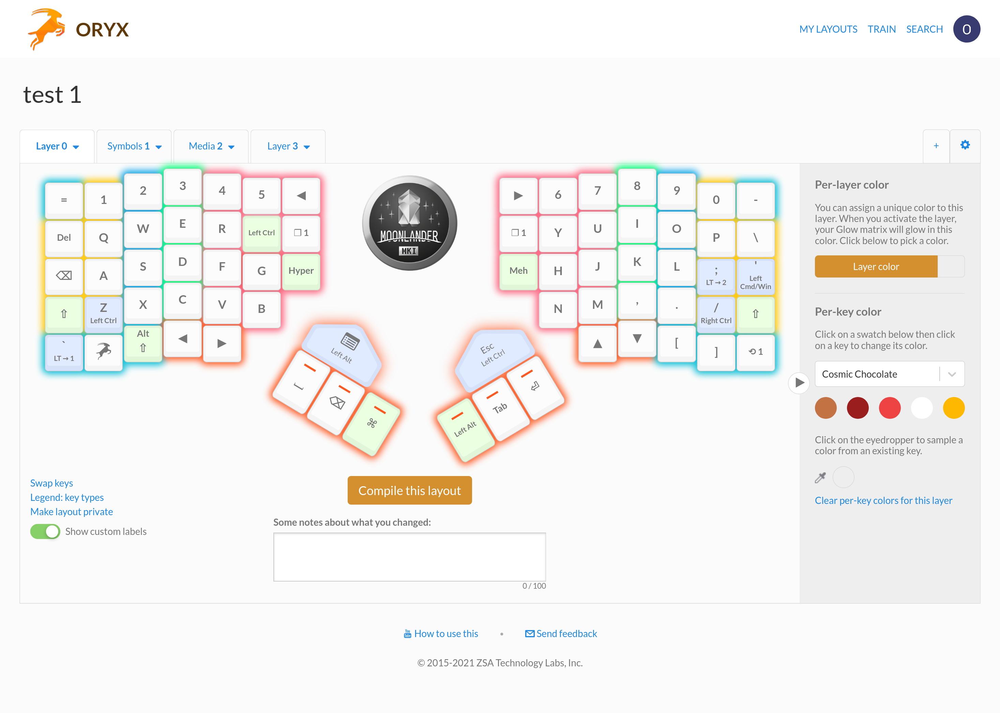

В нём можно нажать снизу кнопочку, и скачать свою раскладку в виде уже готовой прошивки, и в виде исходного кода. Так как я программист, то для меня самое главное - исходный код.

Но вообще клавиатуры не только от этой компании можно настраивать в визуальном редакторе, ещё существует прошивка [EasyAVR](https://github.com/dhowland/EasyAVR), у QMK есть визуальный редактор, и вообще если погуглить, существует очень много способов сделать себе раскладку без программирования.

Но, конечно, раскладку моего уровня сложности, по-любому придётся программировать в каком-либо виде.

Я же скачал исходный код из визуального редактора, по нему узнал некоторые тонкости, почитал документацию по QMK, и начал писать собственные расширения.

## Изображения

Так как у меня раскладка представляется в виде кода, то я не могу всё время читать код, чтобы вспомнить что и где нажимается, поэтому нужно где-то держать визуальную версию того что я запрограммировал. И для этого отлично подходит сайт [Keyboard Layout Editor](http://www.keyboard-layout-editor.com). Но этот сайт делает немного некрасивые картинки, и имеет парочку багов, поэтому я взял его исходный код и немного модифицировал по себя. Результат этой модификации лежит по адресу: [kle.klava.org](https://kle.klava.org). Чем именно моя модификация отличается от оригинала можно [почитать на вики](http://klavarog.tk/page/soft/kle).

После того как нарисовал картинки, нужно получить их в виде, собственно, картинки. И для этого можно сделать скриншот экрана. Но обычный скриншот экрана делать муторно, и он получается не с большим разрешением, поэтому я использую особую возможность снятия скриншотов в Firefox.

Для её использования сначала нужно открыть консоль (<kbd>Ctrl+Shift+K</kbd>), и ввести следующую команду, заменив `ИМЯ` на имя файла:
```
:screenshot ИМЯ --selector '#keyboard-bg' --dpr 3
```

* `--dpr 3` означает во сколько раз нужно увеличить картинку при создании скриншота, то есть в итоге этой команды получится картинка, которая имеет разрешение в 3 раза больше, чем то что сейчас находится на экране.
* `--selector '#keyboard-bg'` - это возможность указывать какую именно часть страницы надо заскриншотить. Тут я выбираю самую важную часть, где нарисована раскладка.

## Код

Во время написания прошивки для мунляндера, я подумал что неплохо бы сделать её очень качественной, чтобы другие люди тоже могли этим воспользоваться. А то во времена прошивки для эргодокса, даже мне было больно смотреть на собственный код.

Напоминаю, что прошивка написана для библиотеки QMK.

Благодаря этому я выделил три модуля, которые может переиспользовать любой в своей клавиатуре:
* [arbitrary_keycode](arbitrary_keycode) - для нажатия произвольного кейкода. Является зависимостью для `combo`.
* [combo](combo) - модуль для задания аккордов, является намного более сильным, чем стандартные аккорды в QMK.
* [lang_shift](lang_shift) - модуль для задания альтернативных русской и английской раскладки, без модификации на стороне ОС.

Во всех этих трёх модулях я написал очень хорошую документацию, так что открывайте, читайте, поймёте принцип.

Так же ещё есть отдельные участки кода, которые отвечают за кастомные хоткеи, макросы, проигрывание музыки, управление подсветкой; но они не подходят для переиспользования, так что если вам интересно, то можно читать в этом репозитории на свой страх и риск.

Файл [keymap.c](keymap.c) мне очень нравится, так как там практически всё задано через массивы, а не через код.

## Как в клавиатуру засунуть свою буквенную и препинаковую раскладку

Например, существует раскладка Дворак и Диктор, и хочется их засунуть в клавиатуру. В этом случае есть два пути:
* Сделать так, чтобы клавиатура работала на лююбом компьтере со стандартными раскладками, без всякой настройки софта (так сделал я).
* Главное чтобы работало на своём компе, количество настройки софта не важно.

Первый пункт плох тем, что требует умения хотя бы немного программировать или уметь собирать прошивку, хоть и для него можно использовать мой модуль [lang_shift](lang_shift).

А второй пункт хорош тем, что для него особых знаний не нужно, и раскладку для клавиатуры можно делать в визуальном редакторе, например: EasyAVR. А затем сделать софтварную раскладку через [MSKLC](https://ru.wikipedia.org/wiki/Microsoft_Keyboard_Layout_Creator), например. Таким подходом пользуются Kanazei и Steve Key. Более подробно можно спросить у них в чате.

## Рассинхрон

При это один из главнейших минусов моего подхода, когда раскладка хранится внутри клавиатуры - это рассинхрон раскладки на компьютере, и рассинхрон раскладки на компьютере.

Обычно это происходит во время случайного нажатия сочетания, которое переключает язык. Иногда из-за багов в клавиатуре, а иногда по неизвестным науке причинам.

Причём, чтобы это работало, в ОС обязательно должна быть одна раскладка для всех окон. В Windows 10 это настраивается только для, а в Windows 7 это настроить невозможно. В Linux такая настройка стоит по умолчанию.

## Как прошить?

Если вы попробуете скачать исходный код вашей раскладки, сделанной на Oryx, то она будет работать только с [форком QMK от ZSA](https://github.com/zsa/qmk_firmware). Конечно, можно использовать обычный QMK, но там вроде чего-то не хватает. Поэтому первым делом надо скачать этот форк (команды ниже не работают для винды).

```bash
git clone https://github.com/zsa/qmk_firmware zsa_qmk
cd zsa_qmk
./util/qmk_install.sh
git submodule init
git submodule update
```

Затем нужно создать символьную ссылку на папку с вашей раскладкой. Делать именно символьную ссылку нужно, чтобы не хранить свою раскладку где-то в дебрях этого форка QMK:

```bash
ln -s /home/optozorax/my/moonlander ~/zsa_qmk/keyboards/moonlander/keymaps/optozorax
```

Чтобы прошить, нужно внутри этого форка вызвать такую команду:
```bash
make moonlander:optozorax:flash
```

# Общее принципы проектировки раскладки

## Логика дороже трёх процентов

Принцип 📖
> Если стоит выбор между двумя решениями, удобство или прирост одного из которых обоснован логичной идеей, а другое обосновано подсчётом статистики, и даёт прирост/улучшение в 3%, то я предпочту выбрать то что обосновано логическим принципом.

То есть `логика > 3%`. Именно поэтому я отказываюсь от правила шифтов и от правила пробелов. У них максимальный возможный прирост в скорости и безошибочности как раз колеблется в этих пределах. С другой стороны есть логический принцип, который говорит что на один палец можно поставить шифт, и это будет удобнее, чем нажимать мизинцами, меньше обучения.

С другой стороны кто-то говорит что ему нужно два пробела, потому что так у него меньше болят руки. Тоже хороший логический принцип.

Некоторые люди настолько гонятся за этими тремя процентами, что хотят посчитать статистику нажатия всех несимвольных клавиш типо стрелок и других управляющих, и размещать их согласно этой статистике.

Очевидно, что это даст какой-то прирост может быть скорости, но явно не удобства и простоты. Автоматический вариант расположения стрелок скорее всего расположит их в сложном порядке, а поэтому для меня не так привлекателен как вариант "сделай стрелки плоскими, чтобы под ними можно было разместить <kbd>Ctrl+</kbd> версию их".

## У каждого своя раскладка

Принцип 📖
> В области правильных клавиатур не может быть понятия "стандартная раскладка", каждый должен делать свою раскладку сам.

Всё потому что невозможно одним верным способом поместить СК в маленькую клавиатуру с учётом удобства. Приходится идти на множество компромиссов и жертв.

Ещё раскладка каждого человека очень сильно зависит от программ, которыми он пользуется, от его стиля печати.

Вот, например, я размещаю F-клавиши в слой, практически ими не пользуюсь, и даже не думаю что они когда-то будут с чем-то нажиматься в качестве хоткея. А тем временем в майнкрафте есть хоткей [<kbd>F3+G</kbd>](https://minecraft.gamepedia.com/Debug_screen#More_debug-keys), который у меня будет нажать крайне сложно.

Если этот хоткей мне нужен довольно часто, я бы мог перепроектировать свою раскладку под удобство этого и подобных хоткеев, либо я могу создать слой, куда помещу его как макрос. Это пример как моя раскладка должна меняться при встрече с реальностью.

Либо есть клавиша AltGr: некоторым людям она невероятно нужна для набора типографских символов, но у меня такой клавиши даже нету. Тоже пример, что человек, которому нужна эта клавиша, сам должен решать куда он её поместит. А может он может забыть про эту клавишу, и создать слой где каждая клавиша уже будет нажиматься с этим модификатором, и он удобно, под себя, разместит все символы.

Вот если бы изначально все печатали на правильных и компактных клавиатурах, то майнкрафт бы не создавал такие хоткеи, которые неудобно нажать на правильной клавиатуре, и не пришлось бы идти на столько компромиссов, и не было бы такой потребности в личной коррективровке.

Так же поэтому я при создании своей раскладки даже не думаю о других людях, и делаю только так как будет удобно в первую очередь мне. Потому что вряд ли я смогу понять хотелки всех людей, и создать что-то удовлетворяющее всех.

## Оверинжиниринг

Принцип 📖
> При проектировании раскладки надо добавлять только то, чем пользуешься сейчас, либо чем с уверенностью в 100% будешь пользоваться потом. Так же нужно регулярно проводить чистку раскладки от неиспользуемых клавиш и слоёв.

При проектировании раскладки есть соблазн создать сразу идеальную раскладку, всё продумать, и заставить себя пользоваться какими-то функциями. Яркий пример этому - как я создал слой для i3, и в итоге не осилил.

Поэтому нельзя создать раскладку сразу хорошей. Создание своей раскладки - это вечный, итеративный процесс.

Если следовать этому принципу, то раскладка не будет обрастать бесполезными функциями, и со временем будет понятнее как должен выглядеть идеал.

Ещё раскладка может значительно меняться, когда в жизнь приходит новый софт, который переворачивает с ног на голову предположения, с которыми строилась раскладка.

Поэтому все идеи раскладки в данной статье не преподносятся как истина в последней инстанции, а предлагаются как один из вариантов, который можно украсть и переработать под себя.

## Сборник всех принципов

В качестве подведения итогов соберу все свои принципы воедино, в краткой форме:
* 
