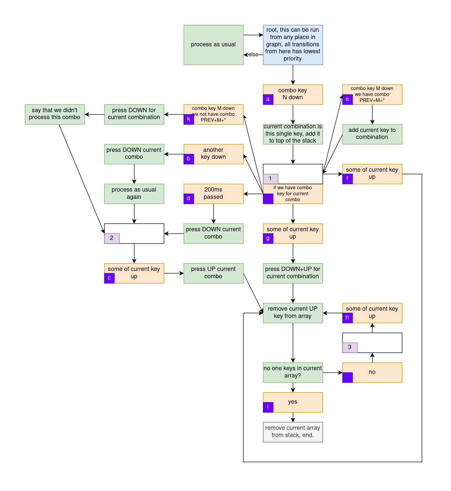

# Аккорды

Данный модуль позволяет вам задавать аккорды любой длины, причём в отличие от стандартной фичи [combos](https://docs.qmk.fm/#/feature_combo) в QMK, данный модуль способен посылать любые кейкоды. Причём данные аккорды способны работать не только в качестве "нажал-отпустил", а качестве зажимаемых клавиш, будь то переключение слоя или модификатор.

Аккорд срабатывает в следующих случаях:
* Если вы зажимаете клавиши для аккорда более 100 миллисекунд, то считается что вы больше не нажмёте клавиш для следующего аккорда, и кейкод текущего аккорда нажимается. Например, можно задать на клавише `CMB_001` аккорд из одной этой клавиши, который при срабатанывании будет нажимать `KC_BSPC` (Backspace), таким образом если вы зажмёте клавишу `CMB_001`, то у вас сначала будет ожидание 100мс, затем нажмётся клавиша Backspace, и начнёт стираться текст. То есть клавиши для аккордов можно свободно использовать даже для клавиш, которые предполагается зажимать, а не только нажать и отпускать.
* Если вы во время зажатия аккорда нажимаете другую клавишу, то считается что вы больше не нажмёте клавиш для следующего аккорда, и кейкод текущего аккорда нажимается.

Если вы хотите более подробно понять как работает обработка аккордов, или хотите модифицировать код, смотрите секцию [принцип работы](#принцип-работы).

Советую вам не бояться нажимать две клавиши одним пальцем, и помещать на такие нажатия аккорды.

# Как использовать?

Приготовьтесь, использовать довольно сложно, потому что данный модуль построен на костылях и хаках (если придумаете как сделать иначе - делайте MR!).

Последовательность действий буедт описана так, чтобы вы модифицировали свой файл `keymap.c` сверху-вниз.

## Задать характеристики

В самом верху файла нужно прописать задание следующих переменных, модифицируя их под свои нужды:

* `#define COMBO_KEYS_COUNT 5` - количество используемых клавиш для аккордов, для данной опции у вас в итоге получатся клавиши `CMB_000`, `CMB_001`, ... , `CMB_004`.
* `#define COMBO_MAX_SIZE 3` - максимальное количество одновременно зажимаемых клавиш для одного аккорда, больше этого размера аккорд задавать нельзя.
* `#define COMBO_STACK_MAX_SIZE 3` - максимальное количество одновременно зажимаемых аккордов. То есть, например, у вас есть аккорд для получения шифта, вы его зажимаете, затем вы нажимаете другой аккорд один раз, это значит что максимально у вас было 2 одновременно зажатых аккорда. 3 должно хватить для всех целей.
* `#define COMBO_WAIT_TIME 100` - время в миллисекундах в течении которого ждётся что все клавиши текущего аккорда будут нажаты. Если это время истекло, и текущую комбинацию нажатых клавиш можно трактовать как аккорд, то именно эта комбинация и пошлётся.
* `#define COMBO_LAYER 4` - слой, на котором будут находиться нажимаемые клавиши для аккордов, об этом подробнее потом. Рекомендуется создать отдельный слой для этого, и разместить его самым последним.
* `#define COMBO_COUNT 10` - количество аккордов, которое вы будете использовать.

## Подключить кейкоды аккордов

В своём файле `keymap.c` в `enum`'е `custom_keycodes` подключаете файл `combo/keycodes.h`. Сразу после него нужно подключить файл `combo/code.c`, выглядеть это будет примерно так:

```c
enum custom_keycodes {
  RGB_SLD = ML_SAFE_RANGE,
  HSV_86_255_128,

  #include "combo/keycodes.h"
};

#include "combo/code.c"
```

## Написать какие аккорды существуют

Далее надо записать какие комбинации зажатых клавиш для аккордов будут иметь место, каждый аккорд должен заканчиваться `NONE_COMBO_KEY`. Например, аккорд `{ COMBO_KEY(1), COMBO_KEY(2), NONE_COMBO_KEY }` соответствует одновременному нажатию клавиш `CMB_001` и `CMB_002`. Выглядеть это будет примерно так:

```c
const ComboKey combos[COMBO_COUNT][COMBO_MAX_SIZE + 1] = {
  { COMBO_KEY(0), NONE_COMBO_KEY },
  { COMBO_KEY(1), NONE_COMBO_KEY },
  { COMBO_KEY(2), NONE_COMBO_KEY },
  { COMBO_KEY(3), NONE_COMBO_KEY },
  { COMBO_KEY(4), NONE_COMBO_KEY },
  { COMBO_KEY(0), COMBO_KEY(1), NONE_COMBO_KEY },
  { COMBO_KEY(0), COMBO_KEY(2), NONE_COMBO_KEY },
  { COMBO_KEY(1), COMBO_KEY(2), NONE_COMBO_KEY },
  { COMBO_KEY(3), COMBO_KEY(4), NONE_COMBO_KEY },
  { COMBO_KEY(0), COMBO_KEY(1), COMBO_KEY(2), NONE_COMBO_KEY },
};
```

Здесь можно указывать аккорды в любом порядке, не обязательно по возрастанию количества клавиш и по возрастанию чисел внутри аккорда.

## Поместить аккорды на вашу раскладку

Используйте кейкоды `CMB_000`-`CMB_XXX` (зависит сколько вы задали их в начале файла).

```c
const uint16_t PROGMEM keymaps[][MATRIX_ROWS][MATRIX_COLS] = {
    //---------------------------------------------------------------------------
  [0] = MY_layout(
    // ...
    XXXXXXX,    XXXXXXX,  XXXXXXX,  CMB_003,  CMB_004,
    CMB_002,
    CMB_000,    CMB_001,  KC_ENT,
    // ...
  ),
  // ...
```

## Задать каждому аккорду кейкод

Именно здесь уже начинаются костыли. Из-за невозможности просто вызвать функцию для нажатия произвольного кейкода, будь то `TG(4)` или ваш кастомный кейкод, приходится прибегать к такой эмуляции, что как будто после срабатывания аккорда мы на самом деле нажимаем клавишу из слоя клавиатуры.

Нужно внутри объявления раскладки, в переменной `keymaps` создать в самом конце слой, который не будет использовать макрос `keyboard`, а будет напрямую задаваться в виде набора строк и столбцов. Здесь клавиши нумеруются слева-направо, сверху-вниз. Нужно для каждого номера аккорда написать какая клавиша будет нажата для него.

```c
[4] = {
  { SHF_1_O, KC_BSPC, KC_LCTL, KC_SLSH, KC_UP,   SHF_1,   XXXXXXX },
  { KC_DEL,  MO(2),   KC_E,    XXXXXXX, XXXXXXX, XXXXXXX, XXXXXXX },
  { XXXXXXX, XXXXXXX, XXXXXXX, XXXXXXX, XXXXXXX, XXXXXXX, XXXXXXX },
  { XXXXXXX, XXXXXXX, XXXXXXX, XXXXXXX, XXXXXXX, XXXXXXX, XXXXXXX },
  { XXXXXXX, XXXXXXX, XXXXXXX, XXXXXXX, XXXXXXX, XXXXXXX, XXXXXXX },
  { XXXXXXX, XXXXXXX, XXXXXXX, XXXXXXX, XXXXXXX, XXXXXXX, XXXXXXX },
  { XXXXXXX, XXXXXXX, XXXXXXX, XXXXXXX, XXXXXXX, XXXXXXX, XXXXXXX },
  { XXXXXXX, XXXXXXX, XXXXXXX, XXXXXXX, XXXXXXX, XXXXXXX, XXXXXXX },
  { XXXXXXX, XXXXXXX, XXXXXXX, XXXXXXX, XXXXXXX, XXXXXXX, XXXXXXX },
  { XXXXXXX, XXXXXXX, XXXXXXX, XXXXXXX, XXXXXXX, XXXXXXX, XXXXXXX },
  { XXXXXXX, XXXXXXX, XXXXXXX, XXXXXXX, XXXXXXX, XXXXXXX, XXXXXXX },
  { XXXXXXX, XXXXXXX, XXXXXXX, XXXXXXX, XXXXXXX, XXXXXXX, XXXXXXX }
},
```

То есть для такого слоя и для опсания аккордов из предыдущего пункта получаем следующую картину:
* Для аккорда `CMB_000` будет нажата клавиша `SHF_1_O`
* `CMB_001` - `KC_BSPC`
* `CMB_002` - `KC_LCTL`
* `CMB_003` - `KC_SLSH`
* `CMB_004` - `KC_UP`
* Для аккорда с одновременно нажатыми `CMB_000` + `CMB_001` получаем кейкод `SHF_1`
* `CMB_000` + `CMB_002` - `XXXXXXX` (не будет нажато ничего) (такой пустой аккорд не обязательно задавать)
* `CMB_003` + `CMB_004` - `MO(2)` (включаем слой на время зажатия этого аккорда)
* `CMB_000` + `CMB_001` + `CMB_002` - `KC_E`.

## Завершение

В функции `process_record_user` в самом начале, перед всеми проверками, включаем файл `combo/process_record_user.c`.

Затем нужно определить функцию `matrix_scan_user`, если она у вас ещё не определена, и вызывать функцию `user_timer`, а в этой функции вызывать `combo_user_timer();`. 

**Объяснение:** функция `matrix_scan_user` вызывается примерно каждые 2 миллисекунды, она сканирует матрицу. Значит её вполне можно использовать для отслеживания собственных таймеров. Поэтому мы вызываем из неё функцию `user_timer`, которая лучше говорит о наших намерениях, чем `matrx_scan_user`. А уже в функции `user_timer` мы вызываем обработку случая когда мы слишком долго держим аккорд.

В итоге получим что-то подобное:
```c
bool process_record_user(uint16_t key, keyrecord_t *record) {
  #include "combo/process_record_user.c"

  // ...
}

void user_timer(void) {
  combo_user_timer();
}

void matrix_scan_user(void) {
  user_timer();
}
```

# Принцип работы



Здесь показано как работает обработка аккордов. Оранжевые прямоугольники показывают условиях перехода; белые показывают ждущие состояния; зелёные показывают действия. В белых прямоугольниках подписан номер состояния, которое хранится в `combo->state`, а в оранжевых подписана буква перехода, которую можно найти в коде по использованию макроса `TRANSITION_DEBUG()`.

Данный конечный автомат показывает обработку для одного аккорда, находящегося в стэке. Порядок обработки следующий:
* Сначала обрабатываем все аккорды в стэке согласно этому ДКА, если хотя бы один сработал, завершаем всю обработку.
* Если ни один не сработал, то обрабатываем текущую клавишу синим прямоугольником.

Таким образом мы можем добавлять новые аккорды в стэк если они не добавляют ничего к уже зажатым, и можем добавлять к зажатым ещё клавиш, если в итоге можно что-то нажать.
